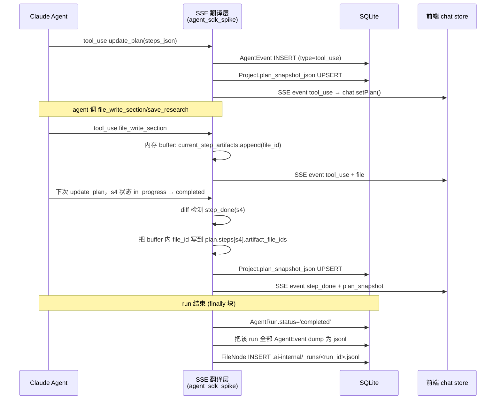

# 断点续作设计 — Plan 级续作 + Artifact 关联 + Run 档案落盘

> 2026-05-14 · 状态：设计稿，待用户确认后实现
>
> 关联：[hld.md §5/§6/§7](../docs/hld.md) · [prd.md §6 信号驱动状态机](../docs/prd.md)

---

## 目标场景

```
昨天小张报门挖到一半，浏览器关了 / 服务重启 / 凭证过期 →
今天小张打开项目，顶部看到「上次进度 6/8 完成 · [续作] [重新挖掘]」 →
点续作 → AI 不重跑已完成的检索/读资料，从 s4 第一个未完成步骤接着干 →
完成后导出 docx。

期间 admin 想复盘小张的全程对话 →
打开项目「.ai-internal/_runs/r-xxx.jsonl」即看完整 event 流。
```

## 设计取舍（已与用户对齐）

| 决策 | 选择 | 不选 |
| --- | --- | --- |
| 续作粒度 | **Plan 级** —— 从下一个未完成 step 接着 | Turn 级太细，意义不大；plan 是天然检查点 |
| Artifact 关联 | **两条都做**：harness 自动归属 + LLM 可显式声明覆盖 | 任一条单独都不够；自动归属省 prompt 负担，显式声明保留 LLM 主权 |
| 对话档案 | **DB 已有 + 文件树查看** —— 每个 run 落盘 `.ai-internal/_runs/<run_id>.jsonl` | 导出按钮额外占 UI；管理后台专属对员工不透明 |

---

## 数据模型变更

### Project 表新加 1 列

```python
# backend/app/models.py
class Project(Base):
    ...
    plan_snapshot_json: Mapped[dict | None] = mapped_column(JSON, nullable=True)
```

存储结构：

```jsonc
{
  "run_id": "r-xxxxxxxx",              // 产生当前 plan 的 run
  "endpoint": "interview",              // interview / mine_full
  "updated_at": "2026-05-14T10:23:00Z",
  "history_event_seq": 142,             // resume 时从 AgentEvent 取 ≤ 此 seq 的对话作为 history
  "steps": [
    {
      "id": "s1",
      "title": "查智慧芽 X.509+智能体 命中量",
      "status": "completed",
      "started_at": "2026-05-13T..",
      "completed_at": "2026-05-13T..",
      "artifact_file_ids": ["f-a1b2", "f-c3d4"],
      "artifact_summary": null            // LLM 显式声明时填，否则 null
    },
    {
      "id": "s4",
      "title": "整理 5 篇 X/Y 文献对照表",
      "status": "in_progress",
      ...
    }
  ]
}
```

**为什么放 Project 而不是 AgentRun**：plan 是项目级状态（跨 run 续作），run 只是某次执行的载体。

### AgentRun / AgentEvent 不变

已有的 `AgentEvent.seq + payload` 已经能完整重放对话。续作时按 `history_event_seq` 截断取前缀即可。

---

## 持久化时机（关键）



### 实现位置

| 代码点 | 改动 |
| --- | --- |
| `agent_sdk_spike._stream_query()` | 维护 `current_step_id` + `current_step_artifacts` buffer；监听 file_write_section/save_research/bq_search_patents/patsnap_search 等返回的 file_id |
| `chat.setPlan()` 后端镜像 | 新加 `app/plan_snapshot.py` 处理 plan diff + artifact 归属 + DB upsert |
| run 结束 finally | dump jsonl + 落盘 FileNode |

---

## update_plan 工具 schema 增强

允许 LLM 在 step 里显式声明 artifact（不强制，自动归属为主）：

```jsonc
{
  "id": "s2",
  "title": "读用户上传 PDF",
  "status": "completed",
  "artifact_files": ["我的资料/无线传感器架构.pdf"],  // ← 新增可选
  "artifact_summary": "提取出 3 个关键技术点：..."     // ← 新增可选
}
```

SYSTEM_PROMPT 加一段：
> 完成某 step 时，**通常不必填** `artifact_files` —— 后端会根据该 step 期间你调用的文件工具自动关联。仅在自动归属不准确（例如你引用了已存在的文件而非新建）时才显式声明。

---

## 续作流程

### 1. 前端检测

```typescript
// ProjectWorkbench.vue onMounted
const snap = project.value?.planSnapshot;
const incomplete = snap?.steps.some(s => s.status !== 'completed' && s.status !== 'failed');
const showResume = !!snap && incomplete && !route.query.fresh;
```

### 2. UI 顶部条

```
┌────────────────────────────────────────────────────────────────┐
│ 项目名  │ 上次进度 5/8 完成 · 当前在「整理对照表」│ [📂 续作] [🔄 重新] │
└────────────────────────────────────────────────────────────────┘
```

### 3. 点续作 → 调端点

```http
POST /api/agent/interview/{pid}/resume
```

后端 `agent_interview.resume_stream()`：

```python
async def resume_stream(project_id: str):
    proj = db.get(Project, project_id)
    snap = proj.plan_snapshot_json
    if not snap:
        raise HTTPException(409, "无续作进度")

    # 1) 取截断到 history_event_seq 的历史对话
    history = db.query(AgentEvent)\
        .filter(AgentEvent.run_id == snap['run_id'])\
        .filter(AgentEvent.seq <= snap['history_event_seq'])\
        .order_by(AgentEvent.seq).all()
    history_text = _condense_events(history)   # 压缩成 turn 摘要

    # 2) 拼 prompt 头
    prompt = f"""## 上次会话已完成进度
{_summarize_completed_steps(snap)}

## 待办步骤
{_summarize_pending_steps(snap)}

## 上次对话摘要
{history_text}

**指令**：从第一个 status≠completed 的步骤开始续作；不要重做已完成步骤；
update_plan 时保留已有 step 的 status 与 artifact_file_ids，仅更新待办部分。
"""
    # 3) 复用 interview_stream 主体，但跳过 "phase thinking 头" 那段
    async for ev in interview_stream(project_id, idea=prompt, is_resume=True):
        yield ev
```

`_condense_events` 把 history 压缩：仅取 user/assistant 文本 + tool 名+小结，丢 tool_result 全文（>30k）；上限 ≤ 8000 tokens 控制 prompt 体积。

### 4. 前端流式接收

前端走和 interview 一样的 SSE 解析。后端会先 fire 一个 `thinking` "📂 续作中：从 s4 开始..." 让用户看到。

---

## .ai-internal/_runs/<run_id>.jsonl 落盘

### 触发点

`AgentRun` 状态变 completed / error / cancelled 时（finally 块）：

```python
def dump_run_to_filenode(db, run_id, project_id):
    events = db.query(AgentEvent).filter(AgentEvent.run_id == run_id)\
        .order_by(AgentEvent.seq).all()
    lines = []
    for ev in events:
        lines.append(json.dumps({
            "seq": ev.seq,
            "ts": ev.created_at.isoformat(),
            "type": ev.type,
            **ev.payload,
        }, ensure_ascii=False))
    content = "\n".join(lines)
    # FileNode 落到 .ai-internal/_runs/<run_id>.jsonl
    runs_folder = _ensure_path(db, project_id, ".ai-internal", "_runs",
                               source="system", hidden=True, readonly=True)
    _insert_filenode(db, project_id, parent=runs_folder.id,
                     name=f"{run_id}.jsonl", source="system",
                     mime="application/x-ndjson",
                     content=content, hidden=True, readonly=True)
```

### 可见性

- 默认 `.ai-internal` 在文件树**对员工不显示**（hidden=True 已生效）
- admin 在文件树看得到（admin 视图忽略 hidden 字段）
- 员工想自查可在「设置」里勾「显示 .ai-internal」开关（P1）

### 格式（jsonl，每行一个 event）

```jsonl
{"seq":1,"ts":"2026-05-14T10:01:23Z","type":"thinking","text":"📋 正在阅读您的报门..."}
{"seq":2,"ts":"2026-05-14T10:01:25Z","type":"tool_use","name":"mcp__patent-tools__update_plan","input":{"steps_json":"..."},"id":"toolu_01..."}
{"seq":3,"ts":"2026-05-14T10:01:25Z","type":"tool_result","tool_use_id":"toolu_01...","text":"计划已更新：6 步..."}
{"seq":4,"ts":"2026-05-14T10:01:26Z","type":"tool_use","name":"mcp__zhihuiya-logic__patsnap_search","input":{"keywords":"..."}}
...
{"seq":142,"ts":"2026-05-14T10:12:00Z","type":"done","stop_reason":"end_turn","total_cost_usd":0.21}
```

---

## 错误与边界处理

| 场景 | 处理 |
| --- | --- |
| 续作时 plan_snapshot 已删 / 无未完成 step | 端点返 409，前端切回「▶ 开始挖掘」按钮 |
| 续作 prompt > token 上限 | `_condense_events` 兜底截断到 ≤ 8000 tokens；早期 events 仅保留 step_done 标题 |
| LLM 不听话重做了已完成 step | 后端 plan diff 强制：已 completed 的 step 在续作 run 内不允许变 in_progress；写入时忽略 |
| jsonl 落盘大于 5MB | 按 1MB 切片成 `r-xxx.part-1.jsonl`、`r-xxx.part-2.jsonl` |
| 同 run 反复 dump（重启续）| 落盘前 UPSERT by FileNode.name，覆盖旧版本 |
| 多 run 并发同项目 | plan_snapshot 只保留**最新** run_id 的快照；老 run 数据仍在 AgentEvent 表，不删 |

---

## 实现步骤拆分

| # | 改动 | 估算 | 依赖 |
| --- | --- | --- | --- |
| 1 | `Project.plan_snapshot_json` 列 + Alembic 幂等 migration | XS | — |
| 2 | `app/plan_snapshot.py` 新模块（diff + artifact 归属 + UPSERT） | S | #1 |
| 3 | `agent_sdk_spike._stream_query()` 接入 #2 | S | #2 |
| 4 | `update_plan` 工具 schema 加 `artifact_files`/`artifact_summary` | XS | — |
| 5 | run 结束 dump 到 `.ai-internal/_runs/<run_id>.jsonl` FileNode | S | — |
| 6 | `POST /api/agent/interview/{pid}/resume` 端点 + `_condense_events` | M | #2 |
| 7 | 前端：`Project.planSnapshot` 类型 + Workbench 顶部「续作」UI | S | — |
| 8 | `Project` schema 序列化 + `/api/projects/{id}` 返 plan_snapshot | XS | #1 |
| 9 | 文档：HLD §6 加续作状态机；user_guide 加「续作」说明 | XS | 全部 |
| 10 | 烟测试：跑一遍中断 + resume 端到端 | S | 全部 |

**总规模**：约 6-8 小时工作量。可分两轮迭代：先 #1-#5（持久化基础）+ #7-#8（前端展示），再 #6（resume 真跑）。

---

## 不在本次范围

- 多人协作续作（不同员工接力同项目）— 远景
- 续作时按 step 选择「这步重做」— P1 后续
- 续作 cost 显示「本次额外消耗 $0.x」— P1
- 历史 run 的 .jsonl 全文搜索 — P2

---

## 接口契约总览

### 后端新增

| 方法 | URL | 入参 | 出参 |
| --- | --- | --- | --- |
| POST | `/api/agent/interview/{pid}/resume` | — | SSE 流（同 interview） |

### 数据字段新增

```typescript
// Project
interface ProjectPlanSnapshot {
  runId: string;
  endpoint: 'interview' | 'mine_full';
  updatedAt: string;
  historyEventSeq: number;
  steps: Array<{
    id: string;
    title: string;
    status: 'pending' | 'in_progress' | 'completed' | 'failed';
    startedAt: string | null;
    completedAt: string | null;
    artifactFileIds: string[];
    artifactSummary: string | null;
  }>;
}

interface Project {
  ...
  planSnapshot: ProjectPlanSnapshot | null;
}
```

### SSE 事件兼容

不新增 SSE event 类型。前端通过现有 `tool_use(update_plan)` + `step_done`（harness 派生）即可绘制最新 plan；`plan_snapshot` 只是后端持久化副本，前端不需重新解析。
