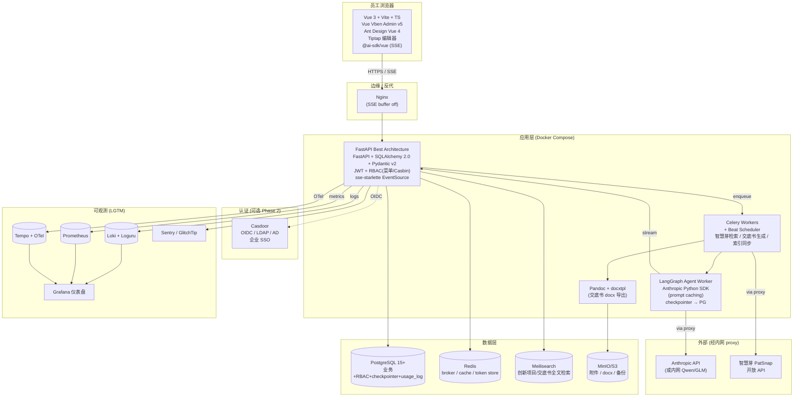

# patent_king v2 — 开源选型深度调研

> v0.1 · 2026-05-07 · 输入：`docs/requirements_v2.md`、CLAUDE.md
> 调研窗口：优先 2025-11 至 2026-05 资料；标记 [近半年] / [经典] / [可能过时]
> 约束：前端 **Vue 3 + Ant Design Vue 锁定**；后端备选 Python / Node / Java；企业内网单租户；4 类角色 RBAC。

---

## TL;DR — 推荐栈一句话

**FastAPI Best Architecture (FBA) + Vue Vben Admin (Antd 适配) + Casdoor (可选 SSO) + LangGraph + sse-starlette + Tiptap + Pandoc + PostgreSQL/Meilisearch + Celery/ARQ + LGTM 可观测 + Docker Compose**。

理由一句话：FBA 已经把 RBAC（菜单+Casbin 双模）、JWT、Celery、OTel、Loki、Grafana、Docker 全部 pre-wire 好；Vben 的 monorepo 适配器允许我们直接挂 Ant Design Vue；其余每环节都有"近半年仍高频更新"的开源可拼，无需自研基础设施。

---

## 1. 后端框架 + ORM

| 候选 | 仓库 | Stars | License | 最近更新 | 评估 |
|---|---|---|---|---|---|
| **FastAPI Best Architecture (FBA)** | [fastapi-practices/fastapi-best-architecture](https://github.com/fastapi-practices/fastapi-best-architecture) | ~2.2k | MIT | [近半年] 2026-04 v1.13 | 中文社区企业脚手架，FastAPI + SQLAlchemy 2.0 + Pydantic v2 + Celery + Casbin 全家桶；伪三层架构；自带插件机制 |
| full-stack-fastapi-template | [fastapi/full-stack-fastapi-template](https://github.com/fastapi/full-stack-fastapi-template) | ~38.6k | MIT | [近半年] | tiangolo 官方，但前端是 React，对我们价值低；后端干净但 RBAC 要自实现 |
| fastapi-amis-admin | [amisadmin/fastapi-amis-admin](https://github.com/amisadmin/fastapi-amis-admin) | ~2k | Apache-2.0 | [近半年] | django-admin 风格，前端 amis（百度），与我们 antd-vue 冲突 |
| NestJS + Prisma | [nestjs/nest](https://github.com/nestjs/nest) | ~70k | MIT | [近半年] | TS 双端，DI/装饰器企业感强；缺点：与 Anthropic Python SDK + LangGraph 生态距离远，团队需切语言 |
| Spring Boot | — | — | Apache | — | [可能过时] 重量级，对小团队 MVP 过载，不推荐 |

**推荐：FBA（fastapi_best_architecture）**

- 1 行理由：项目已有 `pk/` Python 代码 + Anthropic Python SDK + 智慧芽 SDK 都是 Python，**沿用 Python 是最低摩擦路径**；FBA 把企业脚手架 80% 的胶水代码都写好了。
- ORM：**SQLAlchemy 2.0（FBA 默认）+ Pydantic v2**；不用 SQLModel，因为 FBA 没用，且复杂查询 SQLModel 性能稍弱（[Medium 2025](https://medium.com/@sparknp1/10-sqlmodel-vs-sqlalchemy-choices-with-real-benchmarks-dde68459d88f)）。

**反对：NestJS / Spring Boot**

- 团队割裂语言成本 ≫ 框架收益；Anthropic + LangGraph 在 Python 端最成熟。

**陷阱预警**

- FBA 文档主要中文 + 部分英文，伪三层架构（api / service / crud）有学习曲线
- FBA 1.x 与 0.x ORM 写法有 break；锁定 v1.13+
- FBA 自带 fastapi-admin 风格 admin，不是 Vue 项目；我们要丢弃其 admin 前端，只用其 API + RBAC + Celery 内核

---

## 2. 认证与权限（RBAC + 部门）

| 候选 | 仓库 | Stars | License | 评估 |
|---|---|---|---|---|
| **Casdoor** | [casdoor/casdoor](https://github.com/casdoor/casdoor) | ~10k+ | Apache-2.0 | [近半年] OIDC/SAML/CAS/LDAP/SCIM/MFA 全；Go 后端 + 自带 UI；多组织/多应用一应用一 client_id |
| Authentik | [goauthentik/authentik](https://github.com/goauthentik/authentik) | ~14k+ | MIT | [近半年] Python/Django + Go；现代 UI；flow-based |
| Keycloak | [keycloak/keycloak](https://github.com/keycloak/keycloak) | ~25k | Apache-2.0 | [经典] RH 系最成熟，但 JVM 重，realm 模型陡 |
| Authelia | [authelia/authelia](https://github.com/authelia/authelia) | ~22k | Apache-2.0 | 偏 reverse-proxy 前置鉴权，做 SSO 企业不合 |
| **fastapi-users + Casbin（应用内）** | [fastapi-users/fastapi-users](https://github.com/fastapi-users/fastapi-users) + [casbin/pycasbin](https://github.com/casbin/pycasbin) | 4.6k + 2.8k | MIT/Apache | [近半年] Casbin 是 RBAC 的事实标准；FBA 已集成 |

**推荐：双层方案**
1. **应用内**：FBA 默认的 **JWT + 菜单/角色 RBAC（默认）+ Casbin 插件（可选 ABAC/数据权限）**——MVP 直接用菜单 RBAC 就够 4 角色。
2. **企业 SSO 接入（Phase 2）**：**Casdoor**——单二进制 + 自带 UI + 支持 LDAP/AD/OIDC，对 CN 内网部署最友好；FBA 通过 OIDC 接入 Casdoor 做联邦登录。

**反对：Keycloak**——JVM 启动慢、realm 配置陡峭、UI 老旧；除非企业已有 Keycloak。

**反对：纯 fastapi-users 自研**——重复造轮子，FBA 已经做完。

**陷阱预警**

- Casdoor 历史有过 SQL 注入 CVE-2022-24124，部署需锁版本 + 内网；不要直接暴露管理端口
- Casbin 策略文件（model.conf）写法是 RBAC 学习成本大头；用 FBA 提供的范式起步
- 部门维度：FBA 自带 `dept` 表（参考阿里的 RuoYi 风格），不需要在 Casbin 里建模——这是合并 RBAC + 部门权限的常见陷阱

---

## 3. 前端脚手架

| 候选 | 仓库 | Stars | License | UI | 评估 |
|---|---|---|---|---|---|
| **Vue Vben Admin v5** | [vbenjs/vue-vben-admin](https://github.com/vbenjs/vue-vben-admin) | ~31.8k | MIT | 多 UI 适配器（Antd Vue / Element / Naive / Shadcn） | [近半年] 2026-03 仍日活；monorepo + 适配器是杀手级能力 |
| Soybean Admin | [soybeanjs/soybean-admin](https://github.com/soybeanjs/soybean-admin) | ~12k | MIT | NaiveUI（不可换） | 设计漂亮但锁 NaiveUI，**与我们 Antd Vue 锁定冲突，淘汰** |
| antdv-pro | [antdv-pro/antdv-pro](https://github.com/antdv-pro/antdv-pro) | ~2k | MIT | Antd Vue 4 | [近半年] 专为 antd-vue 做的 pro 版，模仿 React 版 antd-pro；规模/活跃度小于 Vben |
| Ant Design Pro Vue（官方） | [vueComponent/ant-design-vue-pro](https://github.com/vueComponent/ant-design-vue-pro) | ~9k | MIT | Antd Vue 1（Vue2） | [可能过时] **Vue 2，不能用** |
| TDesign Starter | [Tencent/tdesign-vue-next-starter](https://github.com/Tencent/tdesign-vue-next-starter) | ~3k | MIT | TDesign（不可换） | 锁 TDesign，淘汰 |

**推荐：Vue Vben Admin v5（Antd Vue 适配器）**

- 理由：(a) 用户已锁 Antd Vue，Vben 是唯一原生支持 Antd Vue 的一线脚手架；(b) RBAC 路由权限/按钮权限/动态菜单全部内置；(c) i18n、暗色模式、表单生成器、CRUD 模板齐全；(d) 文档中文；(e) 与 FBA 的 RBAC 模型（角色-菜单）天然对应。
- 备选：antdv-pro（更轻量，若觉得 Vben 过重）。

**反对：自己 Vite + Vue 3 从零搭** —— 浪费 2-3 周写权限路由/菜单/布局，毫无收益。

**陷阱预警**

- Vben v5 是 monorepo，CI/CD 要适配 pnpm workspaces
- Antd Vue 4 与 5 API 有 break；锁定 4.x 与 Vben 适配器版本一致
- Vben 默认接的后端 mock 是 NestJS 风格，对接 FBA 需要改 axios 拦截器/响应包装格式

---

## 4. 流式对话 / SSE

| 后端候选 | 评估 |
|---|---|
| **sse-starlette** ([sysid/sse-starlette](https://github.com/sysid/sse-starlette)) | [近半年] 事实标准，FastAPI 0.135+ 也开始内置 EventSourceResponse |
| FastAPI 0.135+ 内置 `fastapi.sse.EventSourceResponse` | [近半年] 性能更好（Rust 序列化），但需 FBA 依赖 FastAPI 版本对齐 |
| StreamingResponse 裸写 | 能用但要自己处理 `event:`/`data:`/keep-alive，不推荐 |

| 前端候选 | 评估 |
|---|---|
| **@ai-sdk/vue**（Vercel AI SDK） | [近半年] v3.0+ 已正式支持 Vue；AI SDK 5/6 用 SSE 标准化；提供 `useChat`/`useCompletion` |
| @microsoft/fetch-event-source | [经典] 修复浏览器原生 EventSource 不能加 header 的问题，万金油 |
| 原生 EventSource | 不能带 Authorization header，**与 JWT 不兼容**，淘汰 |

**推荐：后端 sse-starlette + 前端 @ai-sdk/vue**

- 理由：AI SDK 协议是当前事实标准；@ai-sdk/vue 的 `useChat` 可一行接入，包括工具调用渲染、增量 token 渲染、停止/重试。后端只需 yield AI SDK 兼容的 SSE chunks。
- 备选：若不想引入 Vercel SDK，前端用 `@microsoft/fetch-event-source` 自写 hook，工作量约 1 天。

**陷阱预警**

- Nginx 反代必须关 buffer：`proxy_buffering off;` `proxy_cache off;` 否则前端会等所有 token 才一次显示
- 长连接：要设置 `proxy_read_timeout 1h;`
- LLM 内网 proxy 也要确认是流式转发（不要中间结点把流缓成整段）
- AI SDK 5→6 的 stream 协议有 break，锁版本

---

## 5. Agent 编排

| 候选 | 评估 |
|---|---|
| **LangGraph**（Python） | [近半年] 2026 仍是图编排事实标准；checkpointer（in-mem/SQLite/Postgres）做多轮持久化；time-travel/重放/分支天然 |
| 裸 Anthropic SDK + 自写状态机 | 简单 agent 可行；多轮+分支+恢复需要自实现，3 周起 |
| Pydantic-AI | 类型化 agent，文档好，但生态新；多 agent 协作弱于 LangGraph |
| LlamaIndex Agents | 偏 RAG，不匹配 |
| CrewAI | role-based 多 agent，过度抽象，不适合"问答树+调用工具"场景 |

**推荐：LangGraph + Anthropic SDK（已有）+ Postgres checkpointer**

- 理由：项目核心是"问答树（5-Why、What-if、上下位）+ 工具（智慧芽 API）"，正是 LangGraph 的甜点；Postgres checkpointer 让会话可恢复，对企业用户必须；可与 FBA 共享 Postgres 实例。
- 短期记忆：thread_id（一次创新挖掘会话）的 checkpointer
- 长期记忆：PostgreSQL store API（员工历史偏好/术语表）

**反对：裸 SDK** —— v2 需要 4 阶段（报门→引导→检索→交底书）状态机，自写状态恢复成本高。

**陷阱预警**

- LangGraph 0.2 → 0.3 API 有 break；锁版本
- Anthropic Python SDK 的 streaming 与 LangGraph 的 stream 模式（values/updates/messages）需要对齐，否则前端拿不到 token
- 内网 proxy 要透传 `anthropic-version` header；prompt caching 要确认 proxy 支持 `cache_control` 块
- prompt caching 必开（Sonnet 4.6/4.7 系统提示+工具定义可省 90% 成本）

---

## 6. 文档生成与导出

### 6.1 Markdown → docx

| 候选 | 评估 |
|---|---|
| **Pandoc** | [经典+长青] 仅一条命令 + `--reference-doc=tpl.docx` 套企业模板；中文支持好（需中文字体）；输出格式最规范 |
| python-docx | 太低层，要自己实现 md→docx 映射，工作量大 |
| docxtpl | Jinja 模板填空，适合**结构固定的交底书**（占位符 `{{ tech_field }}`），与 Pandoc 互补 |
| markdown2docx | 小众包装库，价值不大 |

**推荐：双轨**
- **交底书主文档** → docxtpl（jinja2 占位符 + IP 部门提供的 .docx 模板，保证页眉/页脚/字体/编号一致）
- **检索报告/附录** → Pandoc（md→docx，引用 reference.docx 拿样式）

理由：交底书格式严格（GB/T 19011 风格 + 企业内部模板），docxtpl 才能 1:1 还原；Pandoc 更适合自由格式报告。

**陷阱预警**

- 中文字体：Docker 镜像要 `apt install fonts-noto-cjk` 或装宋体/黑体
- python-docx 不能合并 .docx 子文档，docxtpl 的 `subdoc` 是必经路径
- Pandoc 在 Alpine 镜像有兼容问题，用 debian-slim
- 表格嵌套、公式渲染：MathJax→docx 需要 Pandoc + LaTeX，慎用

### 6.2 富文本编辑器（员工编辑交底书草稿）

| 候选 | 评估 |
|---|---|
| **Tiptap (vue-3)** | [近半年] ProseMirror 头部包装；headless；MIT；扩展生态最强；适合做 AI 协作（建议块/批注/diff） |
| wangEditor 5 | [近半年] 国内常见，开箱即用，UI 已成型，扩展能力弱于 Tiptap |
| Toast UI Editor | [可能过时] 仓库 2024 后较冷 |
| ProseMirror 裸 | 学习曲线陡，无必要 |

**推荐：Tiptap + Vue 3**

- 理由：Anthropic agent 需要往编辑器里插入"AI 建议块/可接受的 diff"，Tiptap 的 mark + decoration API 就是为此而生；headless 可与 Antd Vue 自然融合；MIT。
- 备选：若团队希望"开箱用"，wangEditor 5 也可接受，但失去 AI 内联建议能力。

**陷阱预警**

- Tiptap Pro（协同/历史）要钱，社区版功能足够 MVP
- 中文输入法（IME）兼容：所有富文本都要测；Tiptap 已修复主流 IME bug
- 复制 Word 内容粘贴 → 干净 HTML：用 Tiptap 的 paste rules，不要直接 innerHTML

---

## 7. 数据库 + 全文检索

### 7.1 OLTP

- **MVP**：SQLite（已在 requirements_v2 写明）→ **Phase 2 PostgreSQL 15+**
- **ORM**：SQLAlchemy 2.0（FBA 默认）

### 7.2 全文检索（搜创新项目、搜历史交底书）

| 候选 | 评估 |
|---|---|
| **Meilisearch** | [近半年] **原生中文分词**（Charabia 分词器）；轻量（单二进制 + RocksDB）；typo-tolerance；admin UI 好；Apache-2.0 后改 MIT；< 1M 文档场景甜点 |
| Postgres `tsvector` + `pg_jieba` | 能搜中文但要自装 jieba 扩展；Postgres 官方分词器无中文 |
| OpenSearch / Elasticsearch | 重量级，企业内网部署起步 4G 内存；过载 |
| Typesense | 与 Meili 类似，但 Meili 中文支持 + 中文文档更好 |

**推荐：Meilisearch（创新项目库 < 50 万级别都够）**

- 理由：requirements 中"全文检索创新项目"需求量级有限，且都是中文；Meilisearch 一个二进制 + Docker 单容器即可，运维零成本。

**反对：Postgres tsvector**——中文分词非内置，pg_jieba 编译麻烦，搜索质量差于 Meili。

**反对：OpenSearch**——杀鸡用牛刀；Java 生态 + 内网运维负担。

**陷阱预警**

- Meilisearch 数据要做主备份（不是主存储，但索引重建慢）
- 索引同步：DB → Meili 需要 outbox/event 模式或定时增量；FBA 的 Celery 直接做 task

---

## 8. 任务队列

| 候选 | 评估 |
|---|---|
| **Celery + Redis**（FBA 默认） | [经典+长青] 重，但 FBA 已集成（含 DatabaseScheduler 持久化定时任务）；配 flower UI |
| ARQ | [近半年] 纯 asyncio，适合 FastAPI；但社区小、UI 弱、负载测试性能不及 Dramatiq |
| Dramatiq | [近半年] 简洁现代、性能好；缺：FBA 没集成，要自己接 |
| RQ | 简单但功能弱，无定时 |
| FastAPI BackgroundTasks | 同进程，不能跨 worker，**不能用**（员工触发智慧芽检索可能 30s+） |

**推荐：直接用 FBA 自带的 Celery + Redis**

- 理由：智慧芽检索（可能 30-60s）+ 交底书生成（LLM streaming 但任务总时长可达 1-2 分钟）+ 定时任务（配额日报/索引重建）都需要 worker；FBA 已经把 broker/result backend/scheduler/Sentry 都接好了；零自研。
- 升级路径：MVP Redis 单机 → Phase 2 切 RabbitMQ。

**反对：BackgroundTasks**——超时风险高、不能恢复、不能横向扩。

**陷阱预警**

- Celery 6 默认 prefork（同步），LLM 调用是 IO 密集，配 `--pool=gevent` 或 `--pool=threads` 提升吞吐
- LangGraph + Celery：建议 LangGraph 自己跑在 Celery task 里，state 写 Postgres checkpointer；不要尝试在 web worker 里同步跑

---

## 9. 监控 / 日志 / 配额

| 候选 | 评估 |
|---|---|
| **LGTM 栈（Loki/Grafana/Tempo/Mimir）+ OpenTelemetry** | [近半年] FBA 已集成 Loguru → Loki + Prometheus + OTel + Grafana 仪表盘 |
| Sentry（自托管） | [近半年] 错误监控，与 LGTM 互补；可自建或用 GlitchTip（更轻） |
| ELK | 重 |
| 纯 structlog + 文件 | 不够企业 |

**推荐：FBA 默认 LGTM + Sentry/GlitchTip 自托管**

- 日志：Loguru / structlog → Loki
- 指标：Prometheus（HTTP/Celery/LLM token/智慧芽配额）
- Tracing：OTel → Tempo
- 错误：Sentry（自托管）/ GlitchTip
- 仪表盘：Grafana

**配额追踪：**
- LLM token/调用数 → Prometheus counter（按 user_id label）+ 落 Postgres（`usage_log` 表，做月度账单）
- 智慧芽 API 配额 → Postgres + Prometheus，超阈值前 Slack 告警
- 双写：Prometheus 适合查询近期，Postgres 适合审计 + 出账

**陷阱预警**

- Prometheus 高基数 label 爆内存；user_id 千以下没问题，超 1 万要换 Mimir 或聚合
- Loki 本地存储扩容快，要配保留策略 + S3/MinIO 后端

---

## 10. 部署

| 候选 | 评估 |
|---|---|
| **Docker Compose** | [近半年] 单机/小集群（5 服务以下）首选，企业内网最常见；运维零门槛 |
| K3s + Helm | 多节点 + HA + 滚动 + GitOps 才上；MVP 阶段过载 |
| K8s 完整版 | 杀鸡用牛刀 |
| Podman Compose | 适合 RHEL 系企业（无 Docker license） |
| 裸金属 systemd | 不推荐 |

**推荐：Docker Compose（MVP）→ K3s + Helm（Phase 3 多节点）**

- 理由：CN 企业内网最普遍是 1-2 台服务器 + 离线镜像 tar；Compose 配 Watchtower/Diun 做滚动更新足够；切换到 K3s 只在多节点 HA 需求出现时。

**反向代理**：**Nginx**（不是 Traefik）。理由：CN 企业运维更熟悉、文档多、SSE 调优经验足；Traefik 对 ACME 自动化对内网无价值。

**数据库备份**：
- PostgreSQL：`pgBackRest` 或 `pg_dump` + cron + S3/MinIO；推 pgBackRest（增量+PITR）
- Meilisearch：定时 `dumps` API 落对象存储
- 配置：Git 管 docker-compose.yml + .env.encrypted（sops/age）

**陷阱预警**

- 离线镜像：内网不能 docker pull，必须 `docker save` → tar → 内网 `docker load`；建议 Harbor 内网 registry
- 字符集：PG locale 必须 zh_CN.UTF-8 + initdb 时配置（中文排序）
- SQLite → Postgres 迁移：用 pgloader，但建议 v2 直接 PG，避免迁移
- 时区：容器默认 UTC，要 `TZ=Asia/Shanghai` + 数据库 timezone 配置一致

---

## 11. 开源参考实现

| 项目 | 仓库 | Stars | License | 评估 |
|---|---|---|---|---|
| **phpIP** | [jjdejong/phpip](https://github.com/jjdejong/phpip) | ~52 | AGPL-3.0 | [近半年] 2026-04 更新；PHP 8 + Laravel 11；专利律所 portfolio/docketing；与我们"创新挖掘+交底书"目标**不同**——它是已申请后的管理 |
| OpenideaL | [linnovate/openideal](https://github.com/linnovate/openideal) | ~200 | GPL-2.0 | [可能过时] Drupal 系，社区评议风格，与企业内部"挖掘+交底书"流程不匹配 |
| Patexia / Innojam / IPlytics | — | — | 闭源 | 商业，参考交互不参考代码 |
| 智慧芽 PatSnap UI | — | — | 闭源 | 检索 UI 可参考 |
| Anthropic claude-cookbooks | [anthropics/anthropic-cookbook](https://github.com/anthropics/anthropic-cookbook) | ~8k+ | MIT | [近半年] tool-use / streaming / caching 范式直接拿 |
| LangGraph examples | [langchain-ai/langgraph](https://github.com/langchain-ai/langgraph) | ~10k+ | MIT | [近半年] customer-support / chatbot 样本可改造为"问答树挖掘" |
| FBA 演示项目 | [fastapi-practices/fastapi-best-architecture](https://github.com/fastapi-practices/fastapi-best-architecture) | ~2.2k | MIT | 直接 fork 起步 |

**结论：没有现成"企业内部专利挖掘+交底书"的开源完整方案**。phpIP 是 portfolio 管理（已申请后）；OpenideaL 是社区式 idea voting，都不匹配。**核心业务逻辑（4 阶段挖掘流程、智慧芽对接、CN 实务交底书生成）必须自研**，但所有基础设施（auth/RBAC/scaffold/SSE/queue/observability）都可 100% OSS。

---

## 推荐栈架构图



---

## 必须自研 vs 100% OSS 一览

| 类别 | 状态 | 说明 |
|---|---|---|
| 后端框架 / RBAC / Celery / 可观测 | **100% OSS** | FBA fork 即起步 |
| 前端脚手架 / 路由权限 / 布局 / 表单 | **100% OSS** | Vben + Antd Vue 适配器 |
| SSE 流式 / agent 状态 / checkpointer | **100% OSS** | sse-starlette + LangGraph + PG |
| 富文本编辑 / 文档导出 | **100% OSS** | Tiptap + Pandoc + docxtpl |
| 全文检索 / 任务队列 / 部署 / 备份 | **100% OSS** | Meilisearch + Celery + Compose + pgBackRest |
| 企业 SSO（Phase 2） | **100% OSS** | Casdoor |
| **4 阶段挖掘流程编排**（报门→引导→检索→交底书） | **必须自研** | LangGraph 节点/边 + 提示词 + 状态机 |
| **5-Why / What-if / 上下位 / 效果矩阵 提示词模板** | **必须自研** | CN 实务知识 + 拆解策略 |
| **智慧芽 API 客户端 + 同族过滤 + 检索报告生成** | **必须自研** | PatSnap SDK 封装 + 业务逻辑 |
| **新颖性/创造性 LLM 初判逻辑** | **必须自研** | CN 实务标准（X/Y/A 标注） |
| **CN 实务交底书 docxtpl 模板**（多档独权概括度） | **必须自研** | 模板 + 渲染编排 |
| **配额 / 计费 / 审计仪表盘**（业务侧） | **半自研** | Grafana 面板可复用，业务指标自建 |

---

## 版本锁定建议（写入 pyproject.toml / package.json）

```
# Python
python = "^3.11"
fastapi = "^0.115"
sqlalchemy = "^2.0"
pydantic = "^2.9"
celery = "^5.4"
redis = "^5.0"
sse-starlette = "^2.1"
langgraph = "^0.2.60"
langgraph-checkpoint-postgres = "^2.0"
anthropic = "^0.40"
casbin = "^1.36"
loguru = "^0.7"
opentelemetry-distro = "^0.48b"
docxtpl = "^0.18"
# Pandoc 装系统包，不锁

# Node
vue = "^3.5"
ant-design-vue = "^4.2"
@vben/* = (跟 vben v5 monorepo)
@ai-sdk/vue = "^3.0"
@tiptap/vue-3 = "^2.10"
vite = "^5.4"
typescript = "^5.5"
```

---

## 决策清单（给 Phase 1 启动会用）

- [x] 后端：fork **fastapi_best_architecture v1.13+**
- [x] 前端：fork **vue-vben-admin v5**，启用 antd 适配器
- [x] LLM 编排：**LangGraph + Anthropic Python SDK + PG checkpointer**
- [x] 流式：**sse-starlette + @ai-sdk/vue**
- [x] 编辑器：**Tiptap vue-3**
- [x] 导出：**docxtpl（交底书）+ Pandoc（报告）**
- [x] DB / 检索：**PostgreSQL 15 + Meilisearch**（MVP 期 SQLite 也可，但建议直接 PG 省迁移）
- [x] 队列 / 调度：**Celery + Redis（FBA 默认）**
- [x] 可观测：**LGTM + Sentry/GlitchTip**
- [x] 部署：**Docker Compose + Nginx + pgBackRest**
- [ ] SSO：Phase 2 接 **Casdoor**（MVP 用 FBA 自带 JWT 登录）
- [ ] CI：GitHub Actions（外网仓库）+ 内网 Harbor + 离线 tar 投递（待企业 IT 确认通道）

---

## 引用与来源

- [fastapi-practices/fastapi-best-architecture](https://github.com/fastapi-practices/fastapi-best-architecture)
- [FBA RBAC 文档](https://deepwiki.com/fastapi-practices/fastapi_best_architecture/3.2-rbac-system)
- [vbenjs/vue-vben-admin](https://github.com/vbenjs/vue-vben-admin)
- [casdoor/casdoor](https://github.com/casdoor/casdoor)
- [fastapi-users/fastapi-users](https://github.com/fastapi-users/fastapi-users)
- [casbin/pycasbin](https://github.com/casbin/pycasbin)
- [sysid/sse-starlette](https://github.com/sysid/sse-starlette)
- [@ai-sdk/vue (npm)](https://www.npmjs.com/package/@ai-sdk/vue)
- [Vercel AI SDK 6](https://vercel.com/blog/ai-sdk-6)
- [LangGraph memory docs](https://docs.langchain.com/oss/python/langgraph/add-memory)
- [tiptap vue-3 docs](https://tiptap.dev/docs/editor/getting-started/install/vue3)
- [Meilisearch vs PG FTS](https://www.meilisearch.com/docs/resources/comparisons/postgresql)
- [Celery vs ARQ vs Dramatiq](https://judoscale.com/blog/choose-python-task-queue)
- [FastAPI observability (LGTM)](https://github.com/blueswen/fastapi-observability)
- [phpIP](https://github.com/jjdejong/phpip)
- [OpenideaL](https://github.com/linnovate/openideal)
- [Authentik vs Authelia vs Keycloak (2026)](https://aicybr.com/blog/authentik-vs-authelia-vs-keycloak-sso-guide)
- [Best Keycloak Alternatives (osohq)](https://www.osohq.com/learn/best-keycloak-alternatives-2025)
- [Docker Compose vs K3s 2026](https://tech-insider.org/docker-vs-kubernetes-2026/)
- [Pandoc Manual](https://pandoc.org/MANUAL.html)
