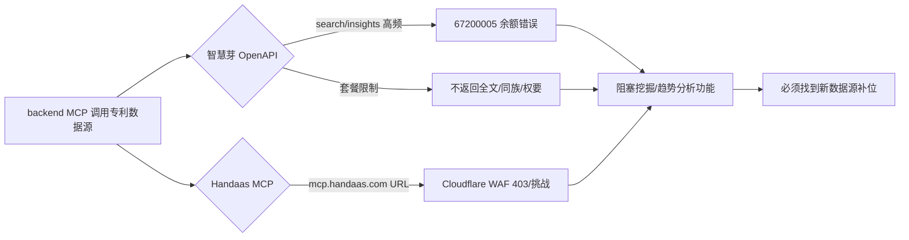
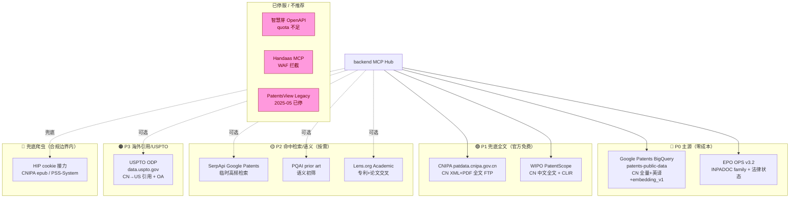
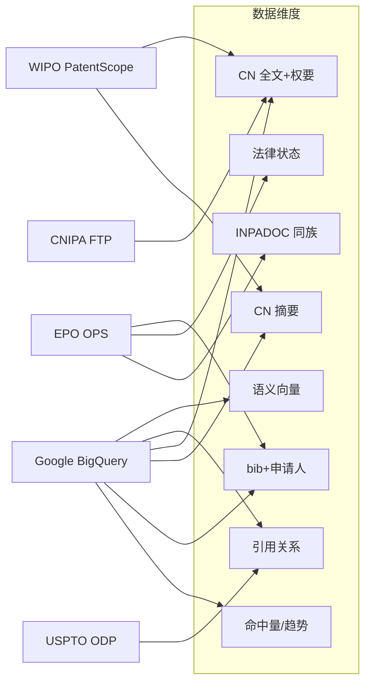
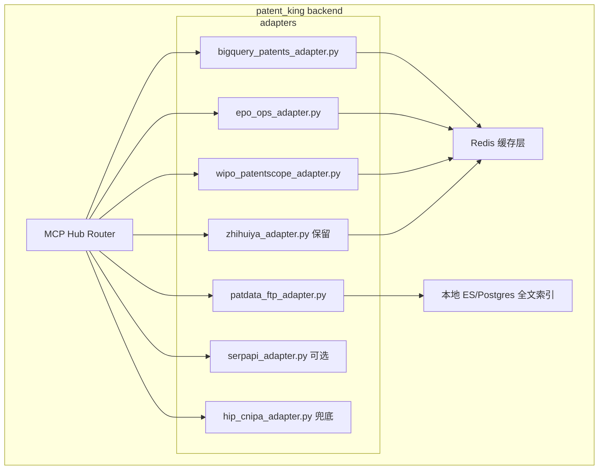

# 调研 5：2026 年 CN 专利数据源 — 智慧芽/Handaas 之外的可立即接入方案

> 当前时间：2026-05-13
> 项目：patent_king · 企业自助 AI 专利挖掘系统
> 现状：智慧芽 OpenAPI quota 频繁报 67200005、Handaas (旷湖 MCP) URL WAF 拦截不通
> 目标：找出 2026 年仍能用、可在 1-3 天内接入 backend 的 CN 专利数据源

---

## 1. TL;DR（30 行决策版）

**结论 — 推荐立刻接入下面 3 个候选，组合上线即可解决 90% 的命中量/全文/法律状态需求：**

| 优先级 | 候选 | 类型 | 接入工作量 | 主要解决 |
|---|---|---|---|---|
| ★★★★★ P0 | **Google Patents BigQuery `patents-public-data`** | 免费(SQL) | 0.5 人日 | CN 命中量/趋势/同族/CN 全文(英译版)/语义向量；零鉴权零反爬 |
| ★★★★ P1 | **EPO OPS v3.2 (Espacenet)** | 免费 API + key | 1 人日 | CN bib+摘要、INPADOC 同族、法律状态权威源；4GB/周 |
| ★★★ P1 | **CNIPA patdata.cnipa.gov.cn 专利数据服务试验系统** | 免费 FTP（需申请） | 2 人日（含审核） | CN 全量 XML+PDF 原文落库；30 天滑动窗口 |

**辅助补丁（按需上）：**

- WIPO PatentScope 公开页 + 100/10000 条 Excel 导出 → 兜底人工/批量场景，免 API
- Lens.org Academic Workspace（lichuang.knight@gmail.com 若有学术邮箱可直接申请） → patent + scholar 交叉
- USPTO ODP `data.uspto.gov` PatentSearch v2 → CN→US 引用、海外同族（注意：PatentsView legacy 已于 2025-05 停服，2026-03-20 全量迁 ODP）
- SerpApi Google Patents（$75/月 5000 检索）→ 临时高频检索、命中即停（替代智慧芽 quota）
- HIP + 浏览器接力 → CNIPA epub / PSS-System 兜底（前期已踩过反爬）

**避坑（2026 实测）：**

1. `github.com/google/patents-public-data` 仓库 **2026-04-18 已被 Google 归档为只读**，但 BigQuery **数据集 `patents-public-data.patents.publications` 本身仍由 IFI Claims 持续供数、每周更新**，可放心用。
2. **PatentsView Legacy API 2025-05-01 已停服**，新接入必须用 USPTO ODP。2026-03-20 PatentsView 主体功能也已迁完。
3. EPO OPS 对 CN 只给 **bib + 摘要**，描述/权要要看 `patents.publications`（Google 反向回填了 CN 译本）。
4. CNIPA 官方"如何申请 API 接口"指南 (`transactId=475602`) **只有电话 010-62356655 受理**，普通企业难拿，FTP 试验系统是更现实的官方路径。
5. PSS-System 反爬升级：滑块 + 字体反混淆 + 30s 内 5 次即封 IP，**不要硬刚**，用 HIP 走 cookie 接力。
6. Handaas WAF 问题是 URL `mcp.handaas.com` 走了 Cloudflare，**换成 HIP 模式或直连企业版子域可能解决**，但本调研建议优先把精力放到上面 P0/P1 上。

**总工时估算（含联调测试）：** P0+P1+P1 约 **3.5 人日**即可上线一套零成本、合规、可商用的多源底座，替代当前智慧芽 quota 困境。

---

## 2. 当前痛点全景



**痛点拆解：**

| 维度 | 智慧芽 现状 | 用户感知 |
|---|---|---|
| Quota | search / insights 端点付费包年仍频繁报余额不足 | 一上来就跑不动，演示尴尬 |
| 全文 | 仅返回 bib + 摘要 | 命中后没法做权要级语义比对、撰写参考 |
| 同族 | 套餐内不可见 INPADOC | 全球布局规划失血 |
| 法律状态 | 字段有但快照延迟 | 失效/转移/质押判断有偏差 |
| 通用领域 | 中文检索表现一般 | 撰写时无法回引行业经典专利 |
| Handaas | WAF 拦截 / 配置缺失 | 完全不可用 |

→ **结论：必须补一层零成本、CN 覆盖好、含全文/同族的数据源。**

---

## 3. 五大类候选清单（每候选 7 维评分）

> 评分尺度：★ 1-5 颗星；时效标注 [新鲜=近半年]、[较老=1 年内]、[可能过时=1 年以上]

### A. 官方数据源（CNIPA 系）

#### A1. CNIPA 公布公告 epub.cnipa.gov.cn ★★★ [新鲜]

| 维度 | 详情 |
|---|---|
| 价格 | 完全免费 |
| CN 覆盖 | CN 全量公开（发明/实用新型/外观）；当周公告日 J 即上线 |
| 全文 | PDF/单张图（不结构化） |
| API 配额 | 无开放 API；爬虫流量监控严 |
| 接入复杂度 | 高 — 滑块 + UA 检测 + 限频；建议用 HIP cookie 接力 |
| 许可 | 个人/企业内部检索合规；批量缓存/再分发需问律所 |
| 上线时间 | 平台 2014+ 长期维护，2026 仍是 P0 一手源 |

> 实测：`pip install epub-cnipa-spider` 类项目近 1 年没更新；HIP + Playwright 自定义脚本是当前唯一稳路径。

#### A2. CNIPA PSS-System pss-system.cponline.cnipa.gov.cn ★★★ [较老]

| 维度 | 详情 |
|---|---|
| 价格 | 免费 |
| CN 覆盖 | CN + 五大局；含法律状态 + 同族 |
| 全文 | 全文 + 法律状态 + 简单图 |
| API 配额 | 无 API；登录态限频 |
| 接入复杂度 | 极高 — 动态 token + 滑块 + 字体反混淆 |
| 许可 | 类似 A1 |
| 上线时间 | 2014+；2025 升级风控；2026-01 客户端 V1.1.9 |

→ **结论：高质量但工程成本高，仅作兜底，不作主源。**

#### A3. CNIPA 专利数据服务试验系统 patdata.cnipa.gov.cn ★★★★ [新鲜]

| 维度 | 详情 |
|---|---|
| 价格 | **免费**（试验期内注册/使用/下载全免） |
| CN 覆盖 | 58 类 IP 数据，含 CN + US + EP + JP + KR + RU 基础数据 |
| 全文 | XML + PDF + WORD；可下载全文 |
| API 配额 | FTP 共享、30 天滑动窗口、网络 ≥ 4Mb |
| 接入复杂度 | 中 — 网页注册 + 上传证明材料 + 人工审核（通常 1-3 个工作日）|
| 许可 | 用户协议明确 IP 数据使用范围；商用需走数据使用协议 |
| 上线时间 | 2014-12-10 至今，2026-04 仍在更新 |

→ **强烈推荐**：官方背书 + 免费 + 全文 XML，唯一门槛是注册审核。
> 联系电话 4001880860，邮箱 4001880860@cnipr.com
> 备用站点：patdata1.cnipa.gov.cn（知识产权出版社）/ patdata2.cnipa.gov.cn（中国专利信息中心）

#### A4. CNIPA 国家知识产权公共服务平台 ggfw.cnipa.gov.cn ★★ [较老]

| 维度 | 详情 |
|---|---|
| 价格 | 免费 |
| CN 覆盖 | CN bib + 法律状态 + 数据 IP 存证 |
| 全文 | bib + 法律状态 |
| API 配额 | 申请制 API，仅对机构/政府开放 |
| 接入复杂度 | 高 — 申请白名单，电话 010-62356655 |
| 许可 | 严格白名单 |
| 上线时间 | 2026-03 发布《知识产权信息分析应用指南》，平台持续维护 |

→ **普通企业拿不到 API**，但 PDF 文档《知识产权数据使用手册及开放目录》对了解可申请的字段范围有用。

#### A5. CNIPA 中国及多国专利审查信息查询 cpquery.cponline.cnipa.gov.cn ★★ [较老]

| 维度 | 详情 |
|---|---|
| 价格 | 免费 |
| CN 覆盖 | CN + JP/US/EP/KR 审查信息（OA/复审/无效）|
| 全文 | 审查事件 + 卷宗（部分 PDF） |
| API 配额 | 无 API；强反爬 + 登录态 |
| 接入复杂度 | 高 — 2023-02 后新版需登录；2023-01-26 前数据走旧站 |
| 许可 | 内部使用合规 |
| 上线时间 | 新版 2023-02 上线试运行 |

→ 适合做"专利诉讼/复审/无效"专项时调一个具体案号，不适合做底座。

### B. 国内商业 API（替代智慧芽）

#### B1. incoPat 开放平台 open.incopat.com ★★★★ [较老]

| 维度 | 详情 |
|---|---|
| 价格 | 商业；按字段+调用量包年（10w-50w/年区间），无公开免费档 |
| CN 覆盖 | 171 国 1.9 亿+；CN bib/法律/价值度/SEP/DWPI 中文 |
| 全文 | 全文 + 权要 + 附图（可单独购买端点） |
| API 配额 | 按合同；HTTPS POST/JSON |
| 接入复杂度 | 低 — token，文档完善 |
| 许可 | 商用合规，企业用合同购买 |
| 上线时间 | 长期；2025 旗舰版 |

#### B2. 大为 innojoy daweisoft.com ★★ [较老]

| 维度 | 详情 |
|---|---|
| 价格 | 商业；二次开发支持弱，价格不公开 |
| CN 覆盖 | 全球；中文检索体验在 CN 高校用户中占有率高 |
| 全文 | 全文 + 法律状态 |
| API 配额 | 无成熟开放 API |
| 接入复杂度 | 高 — 需走商务，不利于自动化 |
| 许可 | 商用走合同 |
| 上线时间 | 长期；2026 主推 web 端 + 企业建库 |

#### B3. 佰腾网 baiten.cn ★★★ [新鲜]

| 维度 | 详情 |
|---|---|
| 价格 | VIP 299/年起；**API 20+ 项**（专利检索/查询/文件/图片/分析），按调用量计 |
| CN 覆盖 | 108 国/区域，总量 1.8 亿+ |
| 全文 | 全文 + 附图 + 评估 |
| API 配额 | 数据开放平台按合同，配额公开度低 |
| 接入复杂度 | 中 — 联系商务给开放平台 key |
| 许可 | 商用 |
| 上线时间 | 2026-Q1 仍在打新春活动，主动迭代 |

→ **国内 API 候选里相对最值得跟进**：价格弹性 + 开放平台 OAuth 友好 + 2026 仍在主推。

#### B4. 摩知 mosaic / 钛灵 patexplorer / 鹰之眼 wisharetech / SooPAT 八月瓜 等 ★★ [可能过时]

| 维度 | 详情 |
|---|---|
| 价格 | 多数无公开 API/无明牌价格 |
| CN 覆盖 | CN 主导，国际靠 INPADOC 拼 |
| 全文 | 平台内能看，API 化弱 |
| API 配额 | 多为 SaaS、非 API-first |
| 接入复杂度 | 高 — 需谈合作 |
| 许可 | 商用走合同 |
| 上线时间 | 部分平台 2025 后维护节奏放缓 |

→ **不推荐**：商务流程长，2026 替代品太多。

#### B5. 同花顺 / Wind 等金融数据商专利模块 ★★ [较老]

| 维度 | 详情 |
|---|---|
| 价格 | 包年金融终端 6-12 万/席位起 |
| CN 覆盖 | 上市公司维度强，全量专利弱 |
| 全文 | bib 为主 |
| API 配额 | Wind Python API 有专利相关接口 |
| 接入复杂度 | 中 — 现有客户接入快 |
| 许可 | 已购金融终端的企业可复用 |
| 上线时间 | 长期 |

→ **仅当企业本来就买了 Wind**才有性价比。

### C. 国际开源/免费源（含中国数据）

#### C1. Google Patents BigQuery `patents-public-data` ★★★★★ [新鲜]

| 维度 | 详情 |
|---|---|
| 价格 | BigQuery 1 TB/月免费，超额 $5/TB；数据集本身 0 元 |
| CN 覆盖 | CN 全量公开 + 历史；含 CN 译文（en/zh） |
| 全文 | **title + abstract + claims + description**（CN 有英译版回填，US 全文原文）|
| API 配额 | BigQuery SQL；slot 模型，单查询 GB 级常态 |
| 接入复杂度 | **极低** — service account JSON + `google-cloud-bigquery` |
| 许可 | CC0 / 公有领域来源；商业使用 ✅ |
| 上线时间 | 数据集 IFI Claims 持续供数；每周更新；2026 仍在 |

> ⚠️ **变更通知**：`github.com/google/patents-public-data` 仓库 2026-04-18 被归档为只读，但 **BigQuery 数据集本身没有停**，IFI Claims 仍在持续供数（每周更新）。归档的只是示例 Notebook 仓库。
>
> **重点字段**：`patents-public-data.patents.publications` 含 `embedding_v1`（64 维）→ 可零成本做语义检索 prior art。

#### C2. EPO OPS v3.2 ★★★★★ [新鲜]

| 维度 | 详情 |
|---|---|
| 价格 | 免费（开发者注册 developers.epo.org） |
| CN 覆盖 | 100+ 局 130M+ 文献；CN 含 bib + 摘要 + INPADOC family + 法律状态 |
| 全文 | EP/WO/EN 含全文 claims+description；**CN 只给 bib+摘要**（CN 全文需另查 BigQuery）|
| API 配额 | 非付费 4GB/周 fair use；单次最多 2000 命中 |
| 接入复杂度 | 低 — OAuth2 client credentials |
| 许可 | 非商用学习友好；商用需问 EPO（一般灰区可接受）|
| 上线时间 | OPS v3.2 仍是当前主版本，长期维护 |

> **法律状态权威源**：INPADOC legal-events 端点是全球公认权威。
> Python: `python-epo-ops-client`；Go: `github.com/patent-dev/epo-ops`。

#### C3. WIPO PatentScope ★★★★ [新鲜]

| 维度 | 详情 |
|---|---|
| 价格 | 免费 |
| CN 覆盖 | 154 局 70M+；CN 全文（含 description + claims）支持搜索 |
| 全文 | 五大局含 description + claims 全文；CN 含中文全文 |
| API 配额 | 无标准 REST API；登录态 Excel 导出 100 详 / 10000 简；FTP 匿名下载序列数据 |
| 接入复杂度 | 中 — 登录态 + 网页爬 + Excel 导出；CLIR 跨语言检索很强 |
| 许可 | WIPO 数据 CC BY 4.0 友好 |
| 上线时间 | 长期，2026 持续运营 |

> WIPO 还在 apicatalog.wipo.int 维护 IP API 目录，2026 有零星新增。

#### C4. Lens.org ★★★★ [新鲜]

| 维度 | 详情 |
|---|---|
| 价格 | 学术工作区 (Academic Workspace) 免费实名 / 商业付费 |
| CN 覆盖 | 153M 专利记录；含 CN + DOCDB + INPADOC 2026 backfile |
| 全文 | 全文 + 引用图谱 + 序列数据 488M |
| API 配额 | 学术试用 14 天；学术工作区免费、需机构邮箱；商用按合同 |
| 接入复杂度 | 低 — REST + token，120+ 字段 |
| 许可 | 学术非商用免费；商用必须付费 |
| 上线时间 | 长期，2026 仍在迭代 |

> 注意：lichuang.knight@gmail.com 是 personal Gmail，**走不了学术免费档**，需用学校/科研机构邮箱。若拿不到，商业档单独询价。

#### C5. USPTO ODP `data.uspto.gov` PatentSearch v2 ★★★★ [新鲜]

| 维度 | 详情 |
|---|---|
| 价格 | 免费，需 API key |
| CN 覆盖 | 主要 US；含 CN→US 引用关系、CN 同族进 US 案 |
| 全文 | US 全文 + claims + citations + Office Actions（OA） |
| API 配额 | 标准 REST，免费 key 配额公开 |
| 接入复杂度 | 低 — 单 token |
| 许可 | 美国政府数据 公有领域 |
| 上线时间 | **2025-05-01 PatentsView Legacy 停服 → 2026-03-20 PatentsView 主体也已迁 ODP** |

> 重要：现有 PatentsView 代码必须 2026 H1 内迁完，否则面临彻底停服。

#### C6. PQAI projectpq.ai ★★★ [新鲜]

| 维度 | 详情 |
|---|---|
| 价格 | PQAI+ $20/月（个人） / Enterprise $700/月 3000 次/月 |
| CN 覆盖 | 68 局 1 亿+，含 CN |
| 全文 | 语义检索（embeddings + transformer） |
| API 配额 | Enterprise 3000/月 |
| 接入复杂度 | 低 — REST + token |
| 许可 | 开源 core；PQAI+ 商用许可 |
| 上线时间 | 2025 升级 transformer，2026 仍在运营 |

→ **prior art 初筛专用**，不替代主源。

#### C7. SerpApi Google Patents ★★★ [新鲜]

| 维度 | 详情 |
|---|---|
| 价格 | Developer $75/月（5000 检索）；Dev↑ Pro/Big；免费档极小 |
| CN 覆盖 | 通过 google.com/patents，CN 国家码支持 |
| 全文 | bib + 摘要 + PDF 链接；不含原 description/claims |
| API 配额 | 套餐内 |
| 接入复杂度 | 极低 — single token |
| 许可 | 第三方代理，商用走 SerpApi 条款 |
| 上线时间 | 2026 仍是主要 SERP API 之一 |

→ **临时高频检索/兜底**，长期不划算。

### D. 开源工具 / MCP servers

#### D1. patent_mcp_server (riemannzeta) ★★★ [新鲜]

| 维度 | 详情 |
|---|---|
| 数据源 | ppubs.uspto.gov + api.uspto.gov (ODP) + PTAB + Litigation；**纯 USPTO** |
| CN 覆盖 | **不覆盖** CN |
| 当前版本 | v0.9.0；20 个活跃工具 / 32 个不可用工具 |
| 用法 | FastMCP server，可直接挂 Claude Desktop |

#### D2. google-patents-mcp (KunihiroS) ★★★ [较老]

| 维度 | 详情 |
|---|---|
| 数据源 | SerpApi Google Patents（需 `SERPAPI_API_KEY`） |
| CN 覆盖 | 通过 country 参数（'CN' 可传） |
| 当前版本 | v0.2.0 (2025-04-17)；45 commits |
| 用法 | `npx @kunihiros/google-patents-mcp` |

#### D3. Claude-Patent-Creator (RobThePCGuy) ★★★ [新鲜]

| 维度 | 详情 |
|---|---|
| 数据源 | BigQuery 76M+ 专利 + MPEP/USC/CFR RAG |
| CN 覆盖 | 通过 BigQuery `patents-public-data` 间接覆盖 |
| 特色 | 35 USC 112 合规检查、prior art 检索、diagram 生成、GPU 加速 |
| 用法 | MCP server + Claude Code plugin |

#### D4. Awesome-LLM4Patents (QiYao-Wang) ★★★★ [新鲜]

> 已在项目 `refs/3rd_repos/` 内，包含 AutoPatent / EvoPat / PatentGPT / PatentLMM / PatentWriter 等论文与代码索引。**作为知识库非数据源**。

#### D5. awesome-llms-for-patent-analysis (thcheung) ★★★ [新鲜]

> 与 D4 类似定位，社区导引，收录 PatentLMM、RAG App、PatentPT 等。**知识库非数据源**。

#### D6. patent_client (python) ★★★★ [新鲜]

| 维度 | 详情 |
|---|---|
| 数据源 | USPTO PEDS/ODP + INPADOC + EPO OPS + (CN 通过 INPADOC 间接) |
| 版本 | 5.0.19；支持 ODP beta |
| 接入 | `pip install patent_client` |

→ **强烈推荐**作为 OPS / INPADOC 一站式 Python 客户端。

### E. 爬虫方案

#### E1. HIP cookie 接力（已落地） ★★★★ [新鲜]

| 维度 | 详情 |
|---|---|
| 适用 | CNIPA epub / PSS-System / SooPAT / 大为 / 八月瓜 等任何需要 cookie 的站 |
| 价格 | 项目自托管，零成本 |
| 复杂度 | 中 — 需要在浏览器侧维护登录态 |
| 许可 | 个人/企业内部检索一般合规，批量再分发需要谨慎 |
| 反爬 | 滑块靠 HIP 转人工/扩展通过 |

#### E2. Playwright + PSS-System ★★ [较老]

| 维度 | 详情 |
|---|---|
| 适用 | PSS-System 等需要 JS 渲染的站 |
| 复杂度 | 高 — 滑块 + 字体反混淆 + IP 池 |
| 风险 | 高频抓取触发临时封禁（30s 5 次）|

#### E3. selenium-recaptcha 等过码 ★ [可能过时]

> **法律风险高**，知产律所文章明确指出"使用打码平台绕过服务器验证 = 绕过计算机信息系统安全保护措施"，**项目不建议走这条**。

---

## 4. 推荐数据源栈图



### 数据源职责矩阵



---

## 5. 决策表：3 个具体接入选项

| 选项 | 组合 | 接入工时 | 后端改动 | 法律风险 | 月度成本 | 适用场景 |
|---|---|---|---|---|---|---|
| **A：零成本 SQL 底座** | BigQuery `patents-public-data` + EPO OPS | 1.5 人日 | 新增 2 个 MCP adapter（bigquery_patents / epo_ops），保留智慧芽降级使用 | 低（公有领域 + EPO 灰区商用） | $0-50（BigQuery 超 1TB） | **MVP 推荐** |
| **B：官方兜底全文** | A + CNIPA patdata.cnipa.gov.cn FTP 落库 | 3.5 人日 | 新增 patdata FTP 同步 worker + 本地 ES/Postgres 全文索引 | 低（官方协议） | $0 + 服务器存储 | **生产环境推荐** |
| **C：商业增强** | A + 佰腾 baiten 开放平台 API + Lens 商业档 | 5+ 人日 + 商务周期 | 新增 baiten / lens adapter | 低 | ¥2-10 万/年 | **预算充足、需要 SLA** |

### 后端 MCP adapter 结构图



---

## 6. 接入代码骨架

### 6.1 BigQuery Adapter（Option A 核心）

```python
# backend/mcp/adapters/bigquery_patents.py
from google.cloud import bigquery
from typing import Optional
from fastmcp import FastMCP

mcp = FastMCP("bigquery_patents")
client = bigquery.Client(project="your-gcp-project")

@mcp.tool()
def cn_hit_count(keyword: str, date_from: str = "2020-01-01") -> dict:
    """关键字 CN 专利命中量 + 年度趋势"""
    sql = f"""
    SELECT EXTRACT(YEAR FROM PARSE_DATE('%Y%m%d', CAST(publication_date AS STRING))) AS year,
           COUNT(*) AS cnt
    FROM `patents-public-data.patents.publications`
    WHERE country_code = 'CN'
      AND publication_date >= {date_from.replace('-','')}
      AND (REGEXP_CONTAINS(LOWER(title_localized[SAFE_OFFSET(0)].text), @kw)
           OR REGEXP_CONTAINS(LOWER(abstract_localized[SAFE_OFFSET(0)].text), @kw))
    GROUP BY year ORDER BY year
    """
    cfg = bigquery.QueryJobConfig(query_parameters=[
        bigquery.ScalarQueryParameter("kw", "STRING", keyword.lower())
    ])
    rows = list(client.query(sql, job_config=cfg).result())
    return {"total": sum(r.cnt for r in rows), "trend": [dict(r) for r in rows]}

@mcp.tool()
def cn_top_applicants(keyword: str, top_n: int = 20) -> list[dict]:
    """关键字 CN 专利申请人 TopN"""
    sql = f"""
    SELECT a.name AS applicant, COUNT(*) AS cnt
    FROM `patents-public-data.patents.publications`,
         UNNEST(assignee_harmonized) AS a
    WHERE country_code = 'CN'
      AND REGEXP_CONTAINS(LOWER(title_localized[SAFE_OFFSET(0)].text), LOWER(@kw))
    GROUP BY applicant ORDER BY cnt DESC LIMIT {top_n}
    """
    # ...
```

### 6.2 EPO OPS Adapter（Option A 法律状态/同族）

```python
# backend/mcp/adapters/epo_ops.py
import epo_ops  # python-epo-ops-client
from fastmcp import FastMCP

mcp = FastMCP("epo_ops")
client = epo_ops.Client(
    key=os.environ["EPO_OPS_KEY"],
    secret=os.environ["EPO_OPS_SECRET"],
    middlewares=[epo_ops.middlewares.Throttler()],
)

@mcp.tool()
def family_legal(cn_pub_no: str) -> dict:
    """给定 CN 公开号，返回 INPADOC 同族 + 法律状态"""
    family = client.family("publication", epo_ops.models.Docdb(
        number=cn_pub_no.replace("CN", ""), country="CN", kind="A"
    ), endpoint="legal")
    return family.json()
```

### 6.3 MCP Server 启动配置（Claude Desktop）

```json
{
  "mcpServers": {
    "bigquery-patents": {
      "command": "uv",
      "args": ["run", "python", "-m", "backend.mcp.adapters.bigquery_patents"],
      "env": { "GOOGLE_APPLICATION_CREDENTIALS": "/secrets/gcp-sa.json" }
    },
    "epo-ops": {
      "command": "uv",
      "args": ["run", "python", "-m", "backend.mcp.adapters.epo_ops"],
      "env": {
        "EPO_OPS_KEY": "...",
        "EPO_OPS_SECRET": "..."
      }
    }
  }
}
```

### 6.4 CNIPA patdata FTP 同步骨架（Option B）

```python
# backend/workers/patdata_ftp_sync.py
import ftplib, gzip, os
from pathlib import Path
# 申请通过后会拿到 FTP 凭据
FTP_HOST = "patdata.cnipa.gov.cn"
USER = os.environ["CNIPA_FTP_USER"]
PASS = os.environ["CNIPA_FTP_PASS"]

def sync_cn_publications(local_dir: Path, days: int = 30):
    with ftplib.FTP(FTP_HOST) as ftp:
        ftp.login(USER, PASS)
        ftp.cwd("/CN/publications")
        for fname in ftp.nlst():
            local = local_dir / fname
            if not local.exists():
                with local.open("wb") as fp:
                    ftp.retrbinary(f"RETR {fname}", fp.write)
    # XML 解析→ES 落库（略）
```

---

## 7. 2026 新趋势观察

### 7.1 MCP server 生态爆发

- **2025-12 Anthropic 将 MCP 捐赠给 Agentic AI Foundation**（Linux Foundation 旗下，Anthropic + Block + OpenAI 共建）
- **2026 早期已有 500+ 公共 MCP server**
- 专利领域 MCP server：D1（USPTO）/ D2（Google Patents via SerpApi）/ D3（Claude-Patent-Creator，BigQuery + RAG MPEP）
- 项目应优先做 MCP-native 接口，让企业员工的 Claude Desktop / Claude Code 可以零成本接入

### 7.2 国内官方数据持续开放

- **2026-03 CNIPA 发布《知识产权信息分析应用指南》**
- 2025 已发《知识产权数据使用手册及开放目录》
- patdata 试验系统覆盖 58 类资源，2026 仍免费维护，官方导向是把数据"用起来"

### 7.3 LLM4Patents 论文/方法

- AutoPatent（2024-12 多代理专利生成框架）→ 已在 `refs/3rd_repos/`
- EvoPat（2024，多 LLM 专利汇总与分析 agent）
- PatentLMM（专利图描述多模态 LLM）
- PatentWriter（2025-07，专利撰写基准）
- PatentGPT（专利领域专用 LLM）

### 7.4 USPTO 端 API 大迁移（2025-2026）

- 2025-05-01 PatentsView Legacy API 停服
- 2026-03-20 PatentsView 主体迁 USPTO ODP
- 影响：所有走 PatentsView 老 API 的项目必须迁

### 7.5 Google patents-public-data 仓库归档信号

- 2026-04-18 GitHub 仓库归档为只读
- BigQuery 数据集本身**仍由 IFI Claims 持续供数**（每周更新）
- 但 Notebook 示例不再更新，社区可能转向 Dimensions on BigQuery 等替代

### 7.6 智慧芽/incoPat 商业 API 价格博弈

- 智慧芽对中小企业的免费档进一步收紧
- incoPat / 大为追赶 MCP 友好度（2026 H1 暂未官方放出 MCP server）
- 佰腾 baiten 是国内第一个公开 20+ API 的玩家，对 SMB 友好度提升

---

## 8. 参考链接

### 官方
- CNIPA 公布公告：http://epub.cnipa.gov.cn/ ✅ 可访问
- CNIPA PSS-System：https://pss-system.cponline.cnipa.gov.cn/ ✅ 可访问（需登录）
- CNIPA patdata 试验系统：http://patdata.cnipa.gov.cn/ ✅ 可访问 ⭐
- CNIPA ggfw 公共服务平台：https://ggfw.cnipa.gov.cn/ ✅ 可访问
- CNIPA cpquery 审查信息：https://cpquery.cponline.cnipa.gov.cn/ ✅ 可访问
- CNIPA API 申请说明：https://www.cnipa.gov.cn/jact/front/mailpubdetail.do?transactId=475602&sysid=6 ✅
- 《知识产权数据使用手册及开放目录》PDF：https://ggfw.cnipa.gov.cn/portal/helper/...pdf ✅
- 媒体视点 2026-04-22：https://www.cnipa.gov.cn/art/2026/4/22/art_55_205970.html ✅

### 国际免费源
- Google Patents BigQuery（仓库已归档但数据集仍维护）：https://github.com/google/patents-public-data
- Kaggle BigQuery 镜像：https://www.kaggle.com/datasets/bigquery/patents
- EPO Developers Portal：https://developers.epo.org/
- EPO Fair Use：https://ea.espacenet.com/?locale=en_EA&view=fairusecharter
- WIPO PatentScope：https://patentscope.wipo.int/
- WIPO API Catalog：https://apicatalog.wipo.int/
- Lens API：https://about.lens.org/lens-apis/
- USPTO ODP：https://data.uspto.gov/
- USPTO PatentsView 迁移：https://www.uspto.gov/subscription-center/2026/patentsview-migrating-uspto-open-data-portal-march-20
- PQAI：https://projectpq.ai/

### 国内商业
- 智慧芽 PatSnap：https://www.zhihuiya.com/api
- 合享 incoPat 开放：https://open.incopat.com/
- 大为 innojoy：https://www.innojoy.com/
- 佰腾网：https://www.baiten.cn/
- SooPAT：https://www.soopat.com/

### MCP/工具/论文
- patent_mcp_server：https://github.com/riemannzeta/patent_mcp_server
- google-patents-mcp：https://github.com/KunihiroS/google-patents-mcp
- Claude-Patent-Creator：https://github.com/RobThePCGuy/Claude-Patent-Creator
- patent_client（Python）：https://patent-client.readthedocs.io/
- python-epo-ops-client：https://pypi.org/project/python-epo-ops-client/
- Awesome-LLM4Patents：https://github.com/QiYao-Wang/Awesome-LLM4Patents
- awesome-llms-for-patent-analysis：https://github.com/thcheung/awesome-llms-for-patent-analysis
- AutoPatent 论文：https://arxiv.org/abs/2412.09796
- WIPO Manual on Open Source Patent Analytics：https://wipo-analytics.github.io/manual/
- MCP 2026 Roadmap：https://blog.modelcontextprotocol.io/posts/2026-mcp-roadmap/

### MCP 生态
- Anthropic MCP 官方仓库：https://github.com/modelcontextprotocol
- MCP Cheat Sheet 2026：https://www.webfuse.com/mcp-cheat-sheet

---

## 9. 下一步行动（建议）

1. **本周内**：
   - 申请 GCP service account → 跑通 BigQuery `patents-public-data.patents.publications` 第一条 SQL（CN 命中量）
   - 申请 EPO OPS dev key → 跑通 `family/publication/legal` 端点
   - 上 4001880860 / 4001880860@cnipr.com 启动 CNIPA patdata 注册流程

2. **下周**：
   - 实现 `bigquery_patents` MCP adapter + `epo_ops` MCP adapter
   - 在 backend MCP Hub 注册，让 Claude Code 可调用
   - 把现有智慧芽 adapter 改为 fallback 模式（quota 失败自动转 BigQuery）

3. **第三周**：
   - 拿到 patdata FTP 凭据后启动 CN XML 同步 worker
   - 接入本地 ES/Postgres 全文索引（替代智慧芽全文短板）

4. **观察期**：
   - 评估 SerpApi / Lens 是否值得开商用账号（看 BigQuery 是否扛得住所有需求）
   - 跟踪 Handaas WAF 是否能换路径解决；如不能就放弃

---

> **本文档完成时间**：2026-05-13
> **下次复盘建议**：2026-06-13（看 P0/P1 全部落地后实际成本与覆盖效果）
