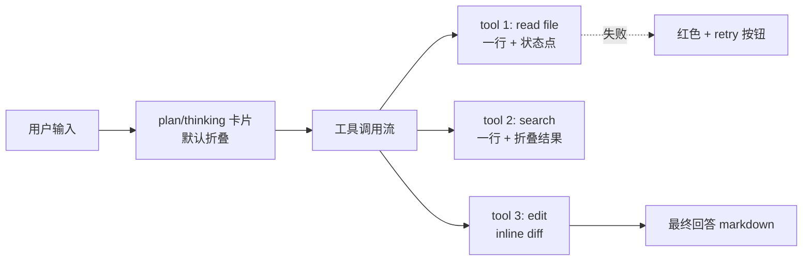

# 业界 AI Agent "工作活动流" 展示模式调研与 patent_king 落地建议

> 调研日期：2026-05-11
> 调研者：Claude (subagent)
> 目标：为 patent_king 前端 (Vue3 + AntDV) 选定一套"AI 进行中工作"的可视化方案，对齐 Cursor / Claude Code CLI / Devin 的透明度水准
> 时效标注约定：[新鲜] = 2025-11 ~ 2026-05；[较老] = 2024 或更早；[经典] = 仍被广泛引用的奠基方案

---

## 一、摘要 (TL;DR)

| 维度 | 结论 |
|---|---|
| 业界主流形态 | **可折叠时间线 + 内联工具卡片** 是最大公约数 (Cursor / Devin / OpenHands / v0 / Lovable 都用) |
| 粒度共识 | **文本流式逐字** + **工具调用整段卡片** 混合；thinking 默认折叠成"一行预览" |
| Vue 生态最佳现成轮子 | **Ant Design X Vue (非官方) 的 `ThoughtChain` + `Bubble`** — 几乎专为本场景设计；fallback 用 `a-timeline` + `a-collapse` 自己拼 |
| 协议层 | 后端可考虑实现 **AG-UI Protocol** 的事件子集，前后端解耦、未来换 agent 不动前端 |
| 推荐落地路径 | **MVP 用 ThoughtChain Vue 实现"折叠时间线 + 工具卡片"**；二期再上 Devin 风格的 "Workspace 多 Tab"（Files/Shell/Browser） |

---

## 二、各工具横评

### 1. Cursor IDE — Composer / Agents Window [新鲜 2026-04]

- **形态**：右侧 Sidebar，按"轮次"(turn) 组织。每轮 = 用户消息 + 一连串"动作卡片"(read file / edit / run command / search)。Cursor 3.0 把 Composer 升级为独立 **Agents Window**，可并行多 agent，配套 **Mission Control** 全屏 grid 视图
- **粒度**：文本 token-by-token 流；工具调用按"块"显示（一个 edit = 一张 diff 卡片，一个 grep = 一行 + 折叠的结果列表）；不显示 thinking
- **工具卡片字段**：name (icon)、target (文件名/命令)、status (running / done / error)、duration、可点开看 full diff/output
- **折叠**：每张卡片默认折叠为单行；用户点击展开。整个 turn 也可整体折叠
- **失败/重试**：红色边框 + "Retry" 按钮内联在卡片内；agent 自动重试时显示 "Retrying (2/3)..."
- **OSS 复用度**：闭源，但 UX 模式可仿
- **关键洞察**：**diff 必须 inline 在时间流里**，不能只放在文件树侧；用户要能在"对话流"里直接 Accept/Reject hunk

### 2. Devin (Cognition) — Devin 2.0 IDE [新鲜 2025-04]

- **形态**：左侧聊天 + 右侧 **4 Tab Workspace** (Planner / Shell / Editor / Browser)，"Following" 开关让右侧自动跟随当前动作
- **粒度**：左侧聊天 = "Devin 的播报" (自然语言)；中间动作 = pulsating UI 元素 + 一行 "I'm doing X"；右侧 = 实时 shell/browser 屏幕
- **Planner**：显式的 step list (TODO 风格)，每步可展开 accordion 看 work log
- **失败/重试**：planner 里的 step 标红，附带 self-critique 文本
- **OSS 复用度**：闭源
- **关键洞察**：**对话流和工作流分离**——聊天保持轻量，重型可视化（terminal/browser）放右侧 tab；用户精力可在两者间切换

### 3. Bolt.new (StackBlitz) [较老 2024-2025 主体]

- **形态**：左对话 + 右 WebContainer 实时预览 + 底部 terminal log。AI 生成文件时左侧消息内嵌**文件操作清单**（create app.tsx / install react / run dev）
- **粒度**：文本流式；文件操作整段；terminal output 实时滚动
- **OSS 复用度**：**bolt.diy** (社区 fork) 完全开源，可直接看实现 — Remix + Vercel AI SDK
- **关键洞察**：**操作清单 inline 在消息里**比独立 panel 更易理解上下文

### 4. Vercel v0 [新鲜 2026-02]

- **形态**：聊天 + 右侧 **代码编辑器 + diff view + Git panel**。2026 升级为 agentic，每次响应包含"plan → execute → verify"三段
- **粒度**：文本流式；plan 用 markdown checkbox；tool calls 通过 **AI Elements** (shadcn 衍生组件库) 展示成结构化卡片
- **OSS 复用度**：**AI Elements** 开源 (React/shadcn)，包含 `Tool`, `Reasoning`, `Source`, `Task` 等开箱组件 — 是目前 React 生态最完整的 agent UI 组件
- **关键洞察**：**plan/reason/tool/result 应有不同视觉语言**，不要全堆在一个 bubble 里

### 5. Lovable.dev [新鲜 2025-08 起 Agent Mode 默认]

- **形态**：单聊天主界面 + 右侧实时预览。AI 工作时显示**滚动状态行**（"Reading config.ts..."、"Searching web for X..."），工作完成后压缩成一段 summary
- **粒度**：进行中只显示"当前动作"一行；完成后才出消息卡片
- **关键洞察**：**进行中 vs 完成 用不同视觉**——进行中是"流水"、完成是"卡片"；这点对降低视觉噪音帮助极大

### 6. Claude Code CLI [新鲜 2026-Q1]

- **形态**：终端，纯文本流。文本逐字打印；tool use 用 `⏺ ToolName(args)` 一行 + 缩进的 result 展示
- **粒度**：文本 token-by-token；tool 整段（args 一行 / result 折叠或截断）
- **Thinking 显示**：默认丢弃 thinking token；社区强烈要求"折叠 + Ctrl-O 展开"模式 (issue #36006，热议中)
- **失败/重试**：红色 ✗ + 错误简短描述；agent 自决定是否重试
- **关键洞察 (对标杆)**：**最小信息密度但保留可追溯性**——每个工具调用单行可扫读，详情按需展开。这是 web UI 最该学的"信噪比"

### 7. OpenHands (OSS) [新鲜 2026 v1.0]

- **形态**：React SPA，左侧 conversation，右侧 multi-tab (Code Editor / Jupyter / Browser / VS Code embed)。**event stream** 是核心架构概念 — 所有 action/observation 都是同一条流上的事件
- **粒度**：每个 action (CmdRunAction / FileEditAction / BrowseInteractiveAction) 都是独立卡片；observation (CmdOutput / FileContent) 跟在 action 后面
- **OSS 复用度**：**MIT License，前端是 React + TailwindCSS** — 可借鉴架构但代码不能直接搬到 Vue
- **关键洞察**：**event stream 应该是后端的一等公民**，前端只是订阅渲染；这样 replay / debug / 多端同步都好做

### 8. Open Interpreter [较老 2024]

- **形态**：CLI 优先，web UI (Open WebUI / Continue.dev 集成) 显示流式代码 + 高亮当前正在执行的行
- **粒度**：代码 + 输出双向流；正在执行的行用色块标记
- **关键洞察**：**对"正在做的具体那一行"用强视觉**比泛泛的 spinner 有用得多

### 9. Continue.dev [新鲜 2025-2026]

- **形态**：IDE 侧边栏，Agent Mode 把 tool calls 用 XML 格式包在响应里，前端 parse 后渲染为卡片
- **OSS 复用度**：MIT，VSCode/JetBrains 插件，UI 是 React
- **关键洞察**：**tool call 协议层最好是结构化 (JSON/XML)**，便于前端 deterministic 渲染

### 10. Anthropic Console / claude.ai Agent [新鲜 2026-Q1]

- **形态**：claude.ai 内 agent 任务（含 computer use）显示**屏幕截图缩略图序列** + 每步说明文字
- **粒度**：每个 computer action 一张截图卡片
- **关键洞察**：**视觉证据 (截图)** 对人机协作 trust 极重要；专利场景虽不用截图，但调研报告可以截关键页面或表格

---

## 三、共性与发散 — 业界共识抽象



**共识**：
1. **三层粒度**：thinking (折叠) / tool (单行+可展开) / final (完整 markdown)
2. **状态点** (loading / success / error / aborted) 是必备，颜色编码统一
3. **耗时**显示在工具卡片角标
4. **整轮可折叠**到只剩"summary 一行"

**分歧点**：
- 进行中是否显示 thinking 内容（Cursor/Lovable 不显示，Claude Code CLI 默认不显示但社区呼吁要，OpenHands 显示）
- workspace 是否独立 tab（Devin/OpenHands 是；Lovable/Cursor 把 workspace 嵌入对话流）

---

## 四、关键基础设施：协议层

### AG-UI Protocol [新鲜 2025-2026, CopilotKit 推动]

- 定义了 agent → frontend 的 **typed event** 流：`MESSAGE_START` / `TEXT_DELTA` / `TOOL_CALL_START` / `TOOL_CALL_ARGS` (incremental JSON) / `TOOL_CALL_END` / `STATE_DELTA` / `ERROR`
- 走 SSE，避免自己造轮子
- **patent_king 强烈建议对齐**：未来换 agent 引擎（claude-agent-sdk → 自研 / OpenHands / langgraph）前端零改动

### Claude Agent SDK 流式事件映射

| SDK 事件 | UI 渲染目标 |
|---|---|
| `content_block_delta` (text_delta) | bubble 增量 markdown |
| `content_block_start` (tool_use) | 新增 ThoughtChain.Item，status=loading |
| `content_block_delta` (input_json_delta) | 卡片内"参数预览"流式更新 |
| `content_block_stop` (tool_use) | 卡片 status=success/error，显示 duration |
| `message_stop` | 整轮完成，可折叠 |

> SDK 必须开 `include_partial_messages=True` 才能拿到细粒度 StreamEvent，否则只能拿到块级别

---

## 五、Vue3 + AntDV 生态可用组件清单

| 组件 / 库 | 类型 | 适配度 | 备注 |
|---|---|---|---|
| **`@ant-design/x-vue`** (社区移植) | 专为 AI agent UI 设计 | 极高 | `ThoughtChain` 几乎正中需求；`Bubble` 支持 loading/typing/collapsible；`useXChat` 抽象消息流；非官方但活跃维护 |
| **`ant-design-vue` 4.x** 自带 | 通用 | 中 | `a-timeline` (无 collapsible)、`a-steps` (适合 plan 不适合动态流)、`a-collapse` (可手动拼)、`a-tag` (status) — 可拼但要写不少 glue 代码 |
| **`vue-virtual-scroller`** (Akryum, MIT) | 虚拟滚动 | 高 | 长 timeline 性能必备；支持动态高度 (`DynamicScroller`) 和滚到底部 |
| **`@vueuse/core`** `useEventSource` | SSE 客户端 | 高 | 接 AG-UI / 自研 SSE 都用得上 |
| **`v-md-editor`** / **`md-editor-v3`** | Markdown 流式渲染 | 中高 | 工具结果如果含 markdown 用得上；纯 markdown 渲染 `markdown-it` + 自研也可 |
| **AI Elements (Vercel)** | React only | 不适配 | 设计模式可参考 (Tool / Reasoning / Source / Task 卡片分类) |
| **CopilotKit Vue 适配** | AG-UI 客户端 | 待观察 | 主要是 React，Vue 支持还在社区 PR |

**结论**：`a-timeline` + `a-steps` **不够用**——它们都是静态展示，不支持流式增量、不支持工具卡片折叠、不支持 status 颜色编码。**必须**：要么上 ThoughtChain Vue，要么自己用 `a-collapse` + 自定义渲染拼。

---

## 六、推荐 UX 模式（带 mockup + 评分）

### 模式 A：单流时间线 + 内联工具卡片【推荐 ★★★★★】

```
┌─ 用户：帮我挖掘"低空经济无人机配送"专利方向 ─────┐
│                                                     │
├─ 🤖 思考中... [▶ 展开 12 行]                        │
│                                                     │
├─ 🔧 智慧芽搜索 · 关键词:["低空配送","无人机..."] ✓ 1.2s │
│   └─ [▶ 看 40 条结果]                                 │
│                                                     │
├─ 🔧 CNIPA 检索 · IPC=B64C39 ⏳ running...           │
│                                                     │
├─ 🔧 网页抓取 · uav-news.com ✗ 403 [Retry]           │
│                                                     │
├─ 🔧 聚类分析 · 40 篇 → 6 簇 ✓ 3.1s                  │
│   └─ [▶ 看簇心关键词]                                │
│                                                     │
├─ 📝 综合分析 (流式 markdown)                        │
│   ## 一、技术现状...                                 │
│   ## 二、空白点...                                   │
└─────────────────────────────────────────────────────┘
```

- **实现成本**：低 (用 ThoughtChain Vue 1-2 天)
- **效果**：高，覆盖 Cursor/Lovable/v0 共同体验
- **patent_king 适配度**：极高，专利挖掘几乎全是"工具序列 + 最终报告"

### 模式 B：左对话 + 右 Workspace 多 Tab【二期 ★★★★】

```
┌─ Conversation ──────┬─ Workspace ────────────────┐
│ 用户：调研...         │ [Plan][Search][Files][Diagram]│
│ 🤖 已搜索 3 库         ├──────────────────────────┤
│ 🤖 找到 156 篇        │ Plan:                     │
│ 🤖 正在画技术分布图... │  ✓ 关键词扩展             │
│                      │  ✓ 智慧芽检索 (156)       │
│                      │  ✓ CNIPA 检索 (89)        │
│                      │  ⏳ 聚类分析               │
│                      │  ○ 写报告                  │
└──────────────────────┴──────────────────────────┘
```

- **实现成本**：中-高 (3-5 天，需要 splitter + 多组件协调)
- **效果**：极高，对标 Devin / OpenHands；适合长任务
- **patent_king 适配度**：高，但 MVP 不必，二期再上

### 模式 C：折叠 Phase + 内嵌时间线【★★★】

```
┌─ Phase 1: 检索 (5 工具，12.3s) ✓        [▼]         │
│   └─ 内嵌时间线...                                  │
├─ Phase 2: 分析 (3 工具, 8.1s) ✓         [▼]         │
├─ Phase 3: 写作 (流式...)                            │
└─────────────────────────────────────────────────────┘
```

- **实现成本**：中
- **效果**：长会话很清爽，但需要 agent 显式输出 phase 边界（提示词约束）
- **patent_king 适配度**：高，专利挖掘天然有"检索→分析→撰写"阶段，可作为 A 模式的增强

### 模式 D：极简状态行（Lovable 风）【备选 ★★】

仅显示当前一行 "Searching CNIPA for B64C39..."，工作完才出 summary 卡片。
- **实现成本**：极低
- **效果**：透明度低，**不推荐**作为主模式，可作为"专注模式"切换

---

## 七、推荐落地路径（patent_king 专属）

### Phase 0 — 后端协议先行（1-2 天）
1. claude-agent-sdk 开 `include_partial_messages=True`
2. 后端 SSE endpoint 输出**对齐 AG-UI 子集**的事件：
   ```
   event: text_delta       data: {turn_id, delta}
   event: tool_start       data: {tool_id, name, args_preview}
   event: tool_args_delta  data: {tool_id, json_chunk}
   event: tool_end         data: {tool_id, status, duration_ms, result_preview}
   event: phase            data: {phase: "search"|"analyze"|"write"}
   event: error            data: {tool_id?, message, retryable}
   ```
3. 前端 `useEventSource` 订阅 → Pinia store 增量更新

### Phase 1 — MVP UX (2-3 天)
- 引入 **`ant-design-x-vue`** (社区版)，用 `ThoughtChain` 渲染工具流，`Bubble` 渲染最终回答
- **模式 A**（单流时间线）落地
- 工具卡片字段：icon (按 tool name 映射)、title、status (loading/success/error/abort 四色)、duration、`collapsible` 默认收起 result
- 失败：红色 + 错误消息 + 如果 `retryable` 显示 Retry 按钮（实际触发由后端决定，前端只是入口）

### Phase 2 — 增强（1 周内）
- **Phase 折叠**（模式 C）：后端通过 `event: phase` 标记阶段；前端用 `a-collapse` 包一层
- **虚拟滚动**：会话超过 50 个事件用 `vue-virtual-scroller` 的 `DynamicScroller`
- **整轮折叠**：每个 user-turn 完成后可一键折叠为 "summary 一行"
- **截图证据**（如果调研截了专利详情页/趋势图）：用 `Bubble` + `<a-image>` 缩略图

### Phase 3 — Devin 风 Workspace (2-3 周)
- 右侧 splitter 加 Workspace tab（Plan / Files / Search Results / Charts）
- 适合大型挖掘任务，与模式 A 共存（用户可切换 layout）

### 风险与降级
- `ant-design-x-vue` 是社区移植，有跟不上官方版本的风险 → 降级方案：用 `a-collapse` + `a-timeline` + 自定义 status 标签自行拼装（多花 2-3 天但零依赖）
- AG-UI 协议尚在演进 → 我们只用稳定子集，不绑定全套

---

## 八、最终 1 句话建议

**走"模式 A + ThoughtChain Vue + AG-UI 子集 SSE"组合，1 周内可上线，与业界第一梯队 (Cursor/Lovable/v0) 透明度看齐；二期按需加 Devin 风格 Workspace。**

---

## 九、参考资料

### 工具/产品
- [Cursor 2.0 / 3.0 changelog](https://cursor.com/changelog) [新鲜]
- [Cursor 3 Agents Window 介绍](https://www.digitalapplied.com/blog/cursor-3-agents-window-design-mode-complete-guide) [新鲜]
- [Devin Session Tools docs](https://docs.devin.ai/work-with-devin/devin-session-tools) [新鲜]
- [Devin 2.0 announcement](https://x.com/cognition_labs/status/1907836719061451067) [较老 2025-04]
- [Devin product analysis](https://ppaolo.substack.com/p/in-depth-product-analysis-devin-cognition-labs) [较老但仍参考]
- [Vercel v0 2026 guide](https://www.nxcode.io/resources/news/v0-by-vercel-complete-guide-2026) [新鲜]
- [Vercel AI Elements 介绍](https://vercel.com/changelog/introducing-ai-elements) [新鲜]
- [Lovable changelog](https://docs.lovable.dev/changelog) [新鲜]
- [Bolt.new GitHub](https://github.com/stackblitz/bolt.new) [较老]
- [bolt.diy OSS fork](https://github.com/stackblitz-labs/bolt.diy) [较老]
- [OpenHands GitHub](https://github.com/OpenHands/OpenHands) [新鲜 v1.0]
- [OpenHands paper (ICLR 2025)](https://arxiv.org/pdf/2407.16741) [较老但奠基]
- [Open Interpreter streaming docs](https://docs.openinterpreter.com/guides/streaming-response) [较老]
- [Continue.dev Agent docs](https://docs.continue.dev/ide-extensions/agent/model-setup) [新鲜]
- [Anthropic Computer Use docs](https://platform.claude.com/docs/en/agents-and-tools/tool-use/computer-use-tool) [新鲜]
- [Claude Code CLI thinking display issue #36006](https://github.com/anthropics/claude-code/issues/36006) [新鲜]

### 协议 / SDK
- [Claude Agent SDK streaming output](https://platform.claude.com/docs/en/agent-sdk/streaming-output) [新鲜]
- [AG-UI Protocol overview (CopilotKit)](https://www.copilotkit.ai/blog/ag-ui-protocol-bridging-agents-to-any-front-end) [新鲜]
- [AG-UI core architecture docs](https://docs.ag-ui.com/concepts/architecture) [新鲜]
- [SSE streaming best practices for LLM apps](https://proagenticworkflows.ai/best-practices-streaming-llm-responses-front-end-stack) [新鲜]

### Vue 组件
- [Ant Design X (官方 React)](https://x.ant.design/) [新鲜]
- [Ant Design X Vue (社区移植)](https://antd-design-x-vue.netlify.app/) [新鲜]
- [ThoughtChain 组件文档](https://x.ant.design/components/thought-chain/) [新鲜]
- [Ant Design Vue Timeline](https://antdv.com/components/timeline/) [经典]
- [vue-virtual-scroller](https://github.com/Akryum/vue-virtual-scroller) [经典持续维护]
- [vue-advanced-chat](https://github.com/advanced-chat/vue-advanced-chat) [较老但活跃]
