# PatentlyPatent v0.36 现状梳理 + 业务流程合理性评估

> 版本：v0.36-audit · 评审日期：2026-05-12 · 评审者：资深架构师 (subagent)
>
> 范围：docs/ 全部 .md + ai_docs/ 全部 .md + backend/app/{routes,agent_*,mining,models}.py + frontend ProjectWorkbench/AgentChatStream
>
> 时效标注：调研类资料 `[较老]` = 超过 12 个月（>2025-05），`[新鲜]` = 近半年（≥2025-11）

---

## 目录

- [1. 现状速览（30 行）](#1-现状速览30-行)
- [2. 现有文档体检](#2-现有文档体检)
- [3. 业务流程合理性评估](#3-业务流程合理性评估)
- [4. 架构合理性评估](#4-架构合理性评估)
- [5. 已知 bug 与 P0/P1 修复清单](#5-已知-bug-与-p0p1-修复清单)
- [6. 下阶段建议（Phase 推进顺序）](#6-下阶段建议phase-推进顺序)
- [附录 A：v0.36 全景架构图](#附录-a-v036-全景架构图)
- [附录 B：mineFull vs auto-mining 控制流对照](#附录-b-minefull-vs-auto-mining-控制流对照)

---

## 1. 现状速览（30 行）

| 维度 | 现状 |
| --- | --- |
| 生产部署 | `https://blind.pub/patent`（nginx + systemd + uvicorn :8088） |
| 后端版本 | FastAPI app.version=`0.5.0`；代码层 v0.36（interview-first 已落地） |
| 前端版本 | Vue3 + AntDV4 + Pinia + Vite；首屏 gzip ~250KB |
| LLM | claude-agent-sdk 0.1.77，子进程 spawn `claude` CLI（bundled 优先），OAuth 走 `/root/.claude/.credentials.json` |
| 数据源 | 智慧芽 OpenAPI（5 端点）+ refs/专利专家知识库 419 文件 |
| DB | SQLite WAL（`backend/patentlypatent.db`），4 张表 + 4 索引 |
| 关键文件 | `agent_sdk_spike.py` 1122 行（12 MCP 工具）／ `agent_interview.py` 296 行（v0.36 新加）／ `agent_section_demo.py` 304 行（5 节 prompt + tool）／ `mining.py` 老路径 ~700 行 |
| 已注册 router | 11 个：auth / auth_cas / projects / files / chat / search / disclosure / agent / admin / kb |
| SSE 端点 | 6 个：`/projects/{pid}/chat`、`/projects/{pid}/auto-mining`、`/agent/mine_spike`、`/agent/mine_full/{pid}`、`/agent/interview/{pid}`、`/agent/runs/{rid}/stream` |
| MCP 工具数 | 12（智慧芽 5 + kb 2 + project files 4 + update_plan）— 见 §4.2 |
| FileNode source 枚举 | `user / ai / system / kb`（kb 是虚拟节点） |
| 三个根目录 | `我的资料/`(user) + `AI 输出/`(ai) + `.ai-internal/`(system+hidden) |
| SSE 事件协议 | `thinking / tool_use / tool_result / delta / file / section_start / section_done / done / error / stream_end`（10 类） |
| 限流 | `asyncio.Semaphore(5)` 全 SSE 共享 |
| 预算 | warn $2 / block $10（PP_DAILY_BUDGET_BLOCK） |
| 鉴权 | JWT 真账密 + CAS SSO + dev role fallback |
| Agent 双轨 | mining.py 老路径（占位骨架，0 cost）+ agent SDK 真路径（自驱多 tool，$0.02-0.05/调用） |
| 持久化 run | v0.34 `AgentRun` + `AgentEvent` 表，支持客户端断线后端跑到底 + 重连重放 |
| 测试 | 前端 vitest 50 用例 / 后端 pytest 22 用例 / 无 L4 Playwright |
| 已知缺失 | Sentry、cron 备份、a11y、移动端真测、多租户隔离、O-1～O-8 |

---

## 2. 现有文档体检

### 2.1 docs/ 目录评分（11 篇 + archive/）

| # | 文件 | 大小 | 最近更新 | 评分 | 处理建议 | 说明 |
| --- | --- | --- | --- | --- | --- | --- |
| 1 | `prd.md` | 20KB | 2026-05-09 | A | **保留** | v0.29-doc 旗舰文档；v0.28 + roadmap 完整；与 hld.md 配套 |
| 2 | `hld.md` | 24KB | 2026-05-09 | A | **保留** | 模块表 + ER + API 清单 + mermaid 8 张图；与 prd 互补 |
| 3 | `iteration_log.md` | 47KB | 2026-05-08 | B+ | **保留但需迭代续写** | 28 轮日志（v0.5→v0.26）；**v0.27～v0.36 8 轮断更**；信息密度高，但缺最新 |
| 4 | `architecture.md` | 7KB | 2026-05-07 | C | **归档** | v0.1 双壳（CLI+Skill）老架构，**完全不反映 web 形态**；已被 `archive/architecture_v0.x.md` 替代 |
| 5 | `architecture_v0.16.md` | 12KB | 2026-05-08 | C+ | **归档** | v0.16-A 双轨决策文档；信息已并入 hld.md §2.2；**和 archive/ 重复一份** |
| 6 | `agent_sdk_spike.md` | 6KB | 2026-05-08 | C+ | **归档或并入 hld** | v0.16-A spike 总结；价值在历史决策，但内容被 hld §6.4 覆盖 |
| 7 | `agent_vs_mining_compare.md` | 11KB | 2026-05-08 | B | **保留** | 11 维对比表 + 渐进迁移路线；做技术决策时仍要查；mock 数据已较老但结论稳定 |
| 8 | `deploy_runbook.md` | 11KB | 2026-05-08 | A- | **保留** | systemd / nginx / claude CLI 凭证 / cron 备份样板；运维必看 |
| 9 | `prompt_cache_research.md` | 3KB | 2026-05-08 | B | **保留** | 0.1.77 SDK cache 杠杆调研；结论清晰，篇幅紧凑 |
| 10 | `requirements.md` | 6KB | 2026-05-07 | D | **删除** | v0.1 CLI 时代需求文档，与 web 形态完全脱节，archive 里已有同名 |
| 11 | `requirements_v2.md` | 8KB | 2026-05-07 | D | **删除** | 同上，已被 prd.md 取代 |
| 12 | `test_strategy.md` | 17KB | 2026-05-09 | A- | **保留** | v0.35-doc 测试金字塔策略；缺 v0.36 interview agent / mineFull 重连的测试用例 |
| 13 | `user_guide.md` | 6KB | 2026-05-08 | B- | **保留并刷新** | v0.21 截图位 TODO；**未覆盖 v0.36 interview-first 流程**；截图仍 TODO.png |
| - | `archive/*` | - | 2026-05-12 | - | - | 7 篇旧版本（含 architecture_v0.16.md、hld_v1.md、prd_v1.md、user_guide_v1.md、architecture_v0.x.md、requirements*.md）已归档 |

### 2.2 ai_docs/ 目录评分（8 篇）

| # | 文件 | 评分 | 处理建议 | 说明 |
| --- | --- | --- | --- | --- |
| 1 | `oss_selection.md` | A- | **保留** | 25KB 选型大文档；Vue+AntDV+SDK 选型论证基线 |
| 2 | `research_01_llm_tools.md` | B | **保留** | LLM/agent 工具横评；调研期资料 |
| 3 | `research_02_data_sources.md` | B | **保留** | 智慧芽/CNIPA/Google Patents 数据源对比 |
| 4 | `research_03_cn_practice.md` | B | **保留** | CN 实务 / R20.2 / A26.3 / A33 法条整理 |
| 5 | `research_04_skills_architecture.md` | C | **归档** | 初版 skill 架构，已被 web 形态取代（用户 memory `feedback_delivery_form`） |
| 6 | `research_agent_activity_stream.md` | A | **保留** | 2026-05-11 调研；Cursor/Devin/Lovable/Claude Code 等 10 家 agent 活动流 UX 横评；**直接指导 v0.36 UI** |
| 7 | `research_summary.md` | B- | **保留** | research_01-04 的浓缩版 |
| 8 | `zhihuiya_api.md` | A- | **保留** | 12KB 智慧芽 API 速查；GET/POST 字段差异等踩坑落档；高频参考 |

### 2.3 重叠重复处汇总

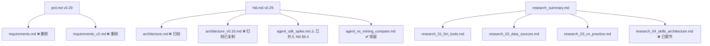

**整改建议**：

| 重叠 | 建议动作 |
| --- | --- |
| `requirements.md` + `requirements_v2.md` 与 `prd.md` 三份并存 | 删除两份 v1/v2，归 archive 留底（archive 已有） |
| `architecture.md`（CLI 双壳）与 `architecture_v0.16.md`（v0.16 双轨）与 `hld.md §2.2` 三份并存 | 删除前两份，archive 留底 |
| `agent_sdk_spike.md` 与 `hld.md §6.4` 重叠 | 改写为 `archive/spike_notes.md`，仅作历史记录 |
| `research_04_skills_architecture.md` 与项目转向后的形态脱节 | 归 archive |
| `user_guide.md` v0.21 老视图、截图全 TODO | v0.36 收尾重写：interview-first 流程 + 三阶段截图 |
| `iteration_log.md` 停在 v0.28（2026-05-08） | 补 v0.29～v0.36 八轮日志（每轮 4 步 SOP） |

整改后 docs/ 文件数从 13 → **8**（prd / hld / iteration_log / agent_vs_mining_compare / deploy_runbook / prompt_cache_research / test_strategy / user_guide），重叠率降到 0。

---

## 3. 业务流程合理性评估

### 3.1 五阶段对照需求

PRD §4 把员工工作流定为五阶段：**报门 → 挖掘 → 检索 → 撰写 → docx**。

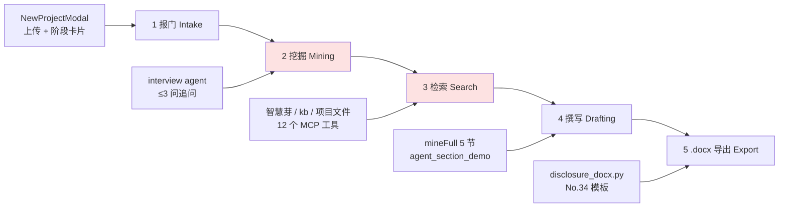

> 红色：当前实现下"挖掘"和"检索"事实上**已被融合**——interview agent 在追问的同时调智慧芽和 kb，检索不再是独立阶段。需要更新 PRD §4 把"五步"重构成"四步"或者明确"检索"是内嵌的 sub-stage。

### 3.2 当前实现 vs 应该的样子

#### 3.2.1 报门（Intake）

| 维度 | 当前实现 | 应该的样子 | 体验断点 |
| --- | --- | --- | --- |
| 表单字段 | title / domain / customDomain / description / attachments[] / intake.stage | 同 + **核心改进点** 字段（与现有最大差异） | description 自由文本，员工容易写成简单一句话，AI 难抓核心 |
| 附件上传 | text-like（md/txt/json/py/js/ts ≤ 2MB）内联到 content；二进制（PDF/pptx）经 `pendingUploads` 异步上传 | 同 | 二进制 PDF/pptx 上传成功但**没文本提取**，agent 读不到内容 |
| 阶段卡片 | idea / poc / dev / prod 四档 | 同 + **TRL 1-9** 选项更专业 | 用户选 idea 与 prod 没区别（除非 prompt 用） |
| 跳工作台 | 跳 `/projects/{pid}` 立即开始 interview | 同 | 工作台首屏冷启动 1-2s 文件树挂载 → interview 启动；用户可能空白凝视 |

**断点 P1**：PDF/pptx 附件没文本提取（read_user_file 工具在二进制时返回提示让用户粘贴）。

#### 3.2.2 挖掘（Mining） — interview-first（v0.36）

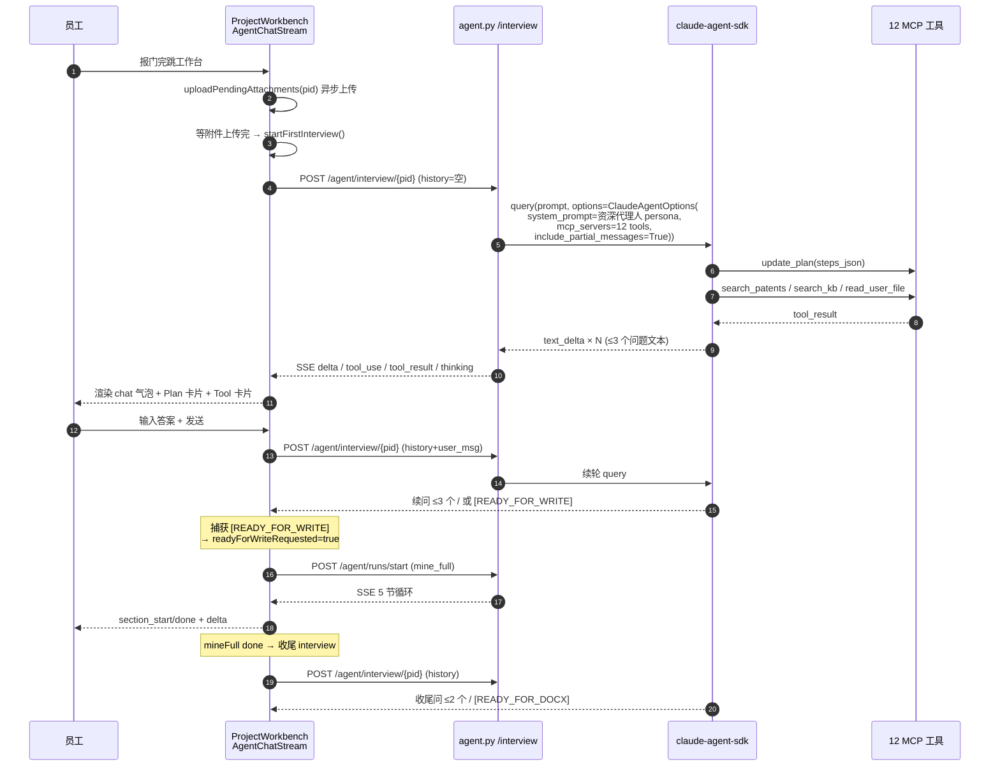

| 维度 | 当前实现 | 应该的样子 | 体验断点 |
| --- | --- | --- | --- |
| 首轮触发 | 等 `uploadPendingAttachments` 完 + 100ms delay → `startFirstInterview()` | 同 | **冷启动 1-3s**，用户看到 chat 空白 + 顶部 a-page-header；建议加 "loading skeleton 气泡" |
| 工具调用透明度 | tool_use 卡片 + Plan 卡片（update_plan）+ thinking 折叠 | 同 | **Plan 卡片渲染逻辑**只在 chat store；如果 update_plan 失败则用户看不到 TODO，agent 看似无计划 |
| 卡死自愈 | 60s 无新 event → 自动 abort + chat.appendError | 30-45s 即提示，60s 强制 abort | 60s 偏长，用户已开始焦虑 |
| 信号识别 | `[READY_FOR_WRITE]` `[READY_FOR_DOCX]` 在 delta 中文本匹配后剥离 | 同 | 文本匹配脆弱；信号最好走结构化事件（type='ready_for_write'） |
| 多轮历史 | 前端 `chat.messages` filter text 类 → role+content 拼 history | 同 | history 取最近 12 条；早期对话内容会丢，但场景内可接受 |

**断点 P0**：interview agent 在 v0.36.3 用 `include_partial_messages=True` 拿 token 级流，但 `agent_section_demo.py` (mineFull) 也开了；两边并行运行时**会争 SSE 槽位**（`acquire_sse_slot("mine_full")` 和 `acquire_sse_slot("interview")` 用同一池 Semaphore(5)），如果用户同时刷新页面 + 重连导致 stale task 没释放 → 短时 503。

**断点 P1**：interview agent 的 system prompt 长达 ~3KB（含 update_plan/save_research 铁律），**未启 prompt cache**（agent_interview.py:184 直接传字符串而非 SystemPromptPreset），同一项目同一用户多次 interview 重复创建 cache → 浪费成本。

#### 3.2.3 检索（Search） — 已融合进 interview / mineFull

```mermaid
flowchart LR
    subgraph InterviewLoop[interview 阶段]
        I1[search_patents 命中量] --> I2[search_kb 实务案例]
        I2 --> I3[read_user_file 用户资料]
    end
    subgraph MineFullLoop[mineFull 阶段]
        M1[search_patents] --> M2[patent_trends]
        M2 --> M3[applicant_ranking]
        M3 --> M4[save_research 类似专利落盘]
    end
    InterviewLoop --> Decision{[READY_FOR_WRITE]?}
    Decision --> MineFullLoop
```

| 维度 | 当前实现 | 应该的样子 | 体验断点 |
| --- | --- | --- | --- |
| 智慧芽工具数 | 5 个：search_patents / search_trends / search_applicants / inventor_ranking / legal_status | 7 个：+`patent_full_text`（专利全文）+`patent_family`（同族） | 5 个对粗扫赛道够用，但 agent 想看专利全文就抓瞎 |
| kb 工具数 | 2 个：search_kb（全 419 文件 fuzzy scan）+ read_kb_file | 同 + `list_kb_subdirs`（按子目录索引） | 当前 search_kb O(N) 扫盘，419 文件每次扫满；上线后单用户秒级响应 OK，5 并发会卡 |
| 项目文件工具 | 4 个：read_user_file / file_search_in_project / file_write_section / save_research | 同 | file_search_in_project 用 SQL LIKE，无 ranking；命中多时 agent 抓不到重点 |
| 跨源融合 | **缺失**：agent 必须自己拼"智慧芽命中量 + kb 案例 + 用户资料"叙事 | 应有 `smart_search(intent, query)` 智能路由层 | agent 多次重复 tool_call（同一关键词查智慧芽和 kb）导致 cost 翻倍 |
| 网络检索 | **缺失**：无 google / arXiv / 知乎 web 工具 | 应有 `web_research(query, source)` 走 HIP 服务（cookie 态） | 用户提的论文 / 知乎案例 agent 查不到，只能瞎编 |

**断点 P0**：缺 `web_research` 工具。CNIPA 官方资料、arXiv 论文、知乎实务案例都查不了；只能靠 kb 419 文件兜底，覆盖窄。

#### 3.2.4 撰写（Drafting） — mineFull 5 节

| 维度 | 当前实现 | 应该的样子 | 体验断点 |
| --- | --- | --- | --- |
| 5 节产物 | prior_art / summary / embodiments / claims / drawings_description | 同 + `02-技术问题.md` + `06-技术效果.md`（共 7 节对齐 No.34 模板） | docx 模板是 9 章节，agent 只写 5 节；剩 4 节走 mining.py 老模板填占位（08/09 全空） |
| 节内提示词 | `_SECTION_PROMPTS` 5 个固定字符串 + 工具调用上限 ≤5/章 | 同 + **few-shot 示例**（每节给 1 个优秀样板） | 当前纯指令式 prompt，agent 第一次生成质量波动大 |
| 工具集 | 章节内只挂 3 个：search_patents/patent_trends/applicant_ranking | 应挂全 12 个：让 agent 能在 embodiments 章读用户 PDF / 在 claims 章查 kb 判例 | `agent_section_demo._build_mcp_server` 与 spike 重复构造一个**精简版 server**，只 3 工具；与 v0.36.1 interview 端 12 工具不一致 |
| 落盘 | `.ai-internal/_compare/full/<sect>.md`（hidden=True） | 也同步写到 `AI 输出/01-背景技术.md` 等可见路径 | **当前 hidden=True 用户看不到产物**！只有 interview agent 后续读 hidden 文件夹 + admin A/B 对比时能看 |
| 进度 | section_start/done + a-steps "5 节并行 timeline" | 同 + 每节"已写 X 字 / Y 工具调用"细粒度 | UI 上 5 step 走完后用户找不到产物（hidden） |

**断点 P0 极严重**：mineFull 把 5 节 markdown 落到 `.ai-internal/_compare/full/<sect>.md` 且 `hidden=True`、`source="ai"`。**前端文件树过滤 hidden=true 默认不显示**，所以用户跑完 mineFull **看不到 5 节产物**！只能从 interview agent 后续提示里间接知道"已写好"。这是 v0.36 重构后最大的体验回归。

**断点 P1**：mineFull 用的 `agent_section_demo._build_mcp_server` 只挂 3 个工具；而 interview agent 用 `agent_sdk_spike._build_mcp_server` 挂 12 个。**两个 MCP server 工具名前缀也不同**：`mcp__patent-section-tools__` vs `mcp__patent-tools__`，没法复用 prompt cache 的 tool description 段。

#### 3.2.5 .docx 导出（Export）

| 维度 | 当前实现 | 应该的样子 | 体验断点 |
| --- | --- | --- | --- |
| 触发 | 顶部"🎯 生成交底书 .docx"按钮（始终可见，[READY_FOR_DOCX] 后高亮 pulse 动画） | 同 | 用户可能在 interview 阶段误点；下游 docx 渲染空 sections |
| 后端实现 | python-docx 按 **No.34 模板** 9 章节解析 `AI 输出/*.md` | 同 | mineFull 落到 hidden `.ai-internal/_compare/full/`，docx 端读 `AI 输出/` 找不到（断点 P0 的级联效应） |
| 模板 | 9 章节硬编码 | 应支持企业自定义模板（上传 .docx 模板 + 占位标记） | YAGNI，暂不做 |
| 下载 | 浏览器自动 download | 同 | 文件名 `{title}-交底书.docx` 含中文，部分浏览器需 encodeURI |

### 3.3 双路径取舍：保留哪条？

```mermaid
graph LR
    subgraph Legacy[mining.py 老路径]
        L1[chat.py auto-mining SSE] --> L2[build_sections]
        L2 --> L3[9 节占位骨架 markdown]
        L3 --> L4[llm_fill 替换 LLM_INJECT]
        L4 --> L5[落 AI 输出/01-背景技术.md ...]
    end
    subgraph AgentSDK[agent SDK 真路径]
        A1[agent.py interview SSE] --> A2[interview_stream<br/>12 tools loop]
        A2 --> A3{用户答 ≥1 轮<br/>+ [READY_FOR_WRITE]}
        A3 --> A4[agent.py runs/start<br/>mine_full]
        A4 --> A5[agent_section_demo<br/>5 节循环 3 tools]
        A5 --> A6[落 .ai-internal/_compare/full/]
    end
```

**对比表（11 维 + v0.36 新增 4 维）**：

| # | 维度 | mining.py 老路径 | agent SDK 真路径 | 建议 |
| --- | --- | --- | --- | --- |
| 1 | 用户体验 | 5 分钟一次性出占位骨架 | interview-first 多轮，单次轮 30s-2min | 老路径"无脑跑"对急用户友好；新路径"问得到位"对认真用户友好 |
| 2 | 内容质量 | 占位 LLM_INJECT，章节硬框架强；填空式低自由度 | 真数据从 tool 来，自由组织 | **agent 胜** |
| 3 | 成本 | 0 cost（模板）+ N 次小 LLM_fill | $0.02-0.05/章 × 5 节 ≈ $0.1-0.25/项目 | **mining 胜（但 quality gap 大）** |
| 4 | 故障兜底 | 永远能出（模板纯函数） | claude CLI OAuth 过期 / 智慧芽 token 限额 → 全挂 | **mining 胜** |
| 5 | 可观测性 | print log + chat SSE 流 | AgentRunLog + AgentEvent + AgentRun 三表 + cost 时序 | **agent 胜** |
| 6 | 测试 | pytest 单测模板 f-string | pytest mock SDK + e2e SSE | 双方都有，但 agent e2e 写法更复杂 |
| 7 | 改 prompt | 改 Python 源码 + 重启 | 改 `_SECTION_PROMPTS` 字符串 | **agent 胜（热改）** |
| 8 | 加新工具 | 改 mining.py 流水线 + chat.py 分支 | 加 `@tool` 装饰函数 | **agent 胜** |
| 9 | 与用户交互 | 单向：跑完落 9 节，等用户答 | 双向：interview 问答 + mineFull 跑 + 收尾问 | **agent 胜** |
| 10 | 5 并发 | 模板秒出，纯函数线程安全 | 每 section 一个 MCP server 实例，资源开销大 | **mining 胜** |
| 11 | 数据真实性 | 占位"等填"，容易"看似真实其实没查" | 数字从 tool 结果来，可追溯 | **agent 胜** |
| 12 | v0.36 信号识别 | 无 | `[READY_FOR_WRITE]/[READY_FOR_DOCX]` 文本匹配 | agent 独有 |
| 13 | v0.34 重连恢复 | 无（一次性流） | AgentRun/AgentEvent 持久化 + /runs/{rid}/stream | agent 独有 |
| 14 | Prompt cache | 无 | exclude_dynamic_sections=True | agent 独有 |
| 15 | A11Y / 移动端 | 模板简单 | 多 step 进度条 / Plan 卡片 / tool 卡片 | 双方都待补 |

**取舍建议**：

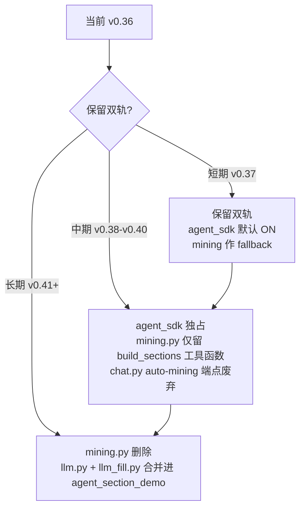

- **短期保留 mining.py 作 fallback**：当 claude CLI OAuth 过期 / 智慧芽 token 失效，agent 全挂时仍有占位骨架可出，业务不挂。
- **中期废弃 chat.py auto-mining 端点**：v0.36 已经不靠它（前端 isFreshDraft 分支只在 `ui.agentMode !== 'agent_sdk'` 时调用），干掉前端切换 toggle 后端点也可移除。
- **长期合并 llm.py 进 agent_section_demo**：mining.py 的 `_inject` / `_examiner_checklist` / `_SECTION_LABEL` 等可作为 agent prompt 的 few-shot 示例引入。

---

## 4. 架构合理性评估

### 4.1 双路径并存代价

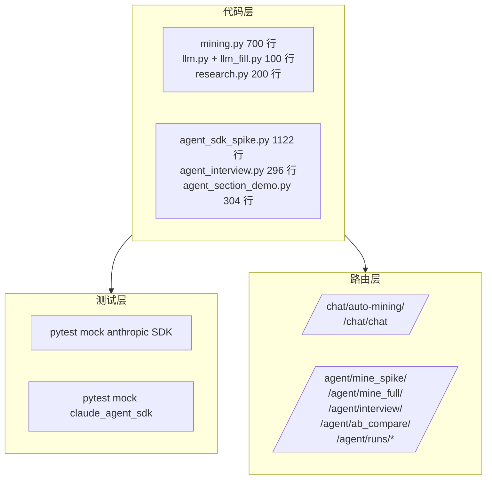

| 维度 | 代价量化 | 缓解 |
| --- | --- | --- |
| **代码重复** | mining.py 的 `build_*_section_legacy` 8 个函数 + agent_section_demo 的 5 个 `_SECTION_PROMPTS` 表达同一份 9 节业务知识 | 提取 `pk/sections/` 公共章节定义层 |
| **测试覆盖** | 双倍：mining 路径 mock anthropic + agent 路径 mock claude_agent_sdk | 抽 common fixture |
| **模型选择** | mining.py 用 `claude-sonnet-4-6`（llm.py:`PP_LIGHT_MODEL`），agent 用 `claude-opus-4-7`（PP_MODEL）；两条路径模型不一致质量难比 | 统一到 opus 4.7 / sonnet 4.6 双档，按 section 切 |
| **prompt 更新成本** | 改一处 prompt（如背景技术）要在 mining.py 模板 + agent_section_demo._SECTION_PROMPTS 改两处 | 抽公共章节描述层 |
| **运维监控** | AgentRunLog 只记 agent 路径；mining 路径无 cost / duration 监控 | mining 也加 RunLog 记录（即使 cost=0） |

### 4.2 12 个 MCP 工具归类合理性

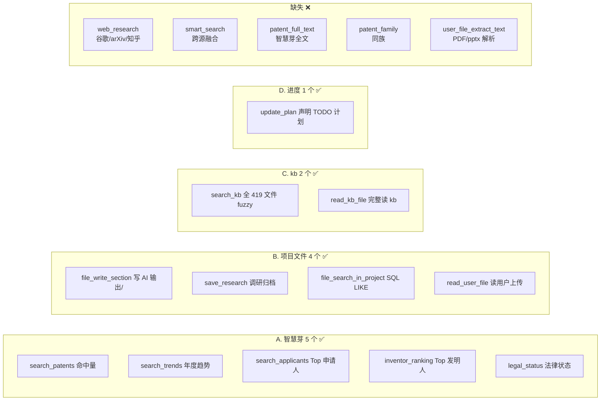

| 工具类别 | 当前数量 | 缺失工具 | 优先级 |
| --- | --- | --- | --- |
| 智慧芽数据 | 5 | `patent_full_text` 取专利全文 / `patent_family` 同族 / `claim_text` 权要原文 | P1 |
| 项目文件 | 4 | `user_file_extract_text` 用 pdfplumber/python-pptx 提文本 | P0 |
| kb 知识库 | 2 | `list_kb_subdirs` 按子目录浏览（37 子目录索引） | P2 |
| 进度声明 | 1 | — | — |
| 网络检索 | **0** | `web_research(query, source)` 走 HIP cookie | **P0** |
| 跨源融合 | **0** | `smart_search(intent)` 智能路由 | P1 |
| 视觉/截图 | 0 | `screenshot_kb_page` 截 kb md 图片摘要（YAGNI） | P3 |

**核心缺口**：

1. **web_research 缺失（P0）**：用户在 interview 中提到论文 / 知乎案例 / CNIPA 官网内容时，agent 只能瞎编。CLAUDE.md 明确"CNIPA 官方资料必调研"，但当前 agent 没有任何手段去抓 CNIPA。
2. **user_file_extract_text 缺失（P0）**：PDF/pptx 上传后 FileNode.content=NULL，read_user_file 返回提示"让用户粘贴关键段落"——这是非常糟糕的体验。应在上传时 worker pdfplumber 提取文本写回 content。
3. **smart_search 缺失（P1）**：agent 想"了解 X 领域全貌"时要自己拼 search_patents + applicants + trends + kb 4 次，cost 浪费 + turn 浪费。

### 4.3 FileNode 缺 readonly 字段 + 四个根文件夹方案

#### 4.3.1 当前 FileNode `source` 枚举

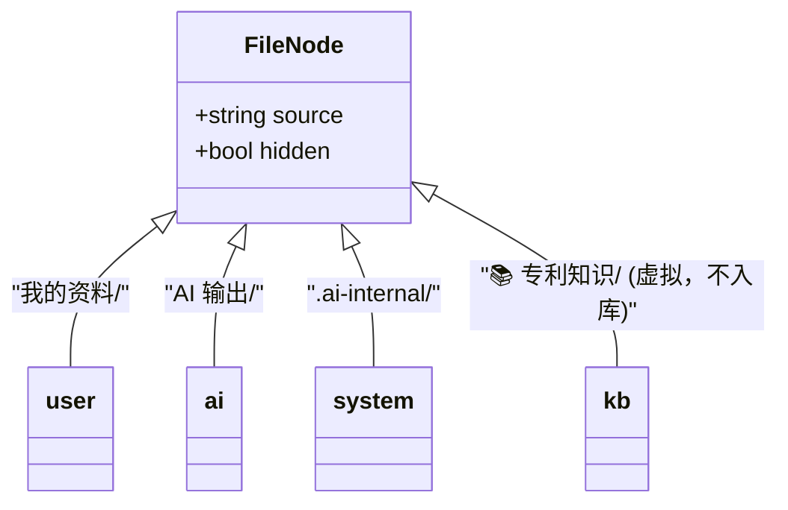

- 当前 `source` 枚举 4 个值：`user / ai / system / kb`
- `hidden=True` 字段控制是否在 UI 显示

**问题**：
- **缺 `readonly` 字段**：kb 节点是虚拟的（前端拼装，后端不存 FileNode），mutate 守卫靠前端 source==='kb' 检查；但 ai 输出的 mineFull 产物理论上**也应该禁止用户改**（因为后续 docx 渲染依赖），目前无字段表达。
- **缺 `frozen` / `archived` 字段**：mineFull 完成后的 5 节 markdown 用户编辑改坏了，docx 渲染失败无告警。

#### 4.3.2 四个根文件夹方案

```mermaid
graph LR
    Proj[项目根] --> R1[我的资料/<br/>source=user, readonly=false]
    Proj --> R2[AI 输出/<br/>source=ai, readonly=false]
    Proj --> R3[.ai-internal/<br/>source=system, hidden=true]
    Proj --> R4[📚 专利知识/<br/>source=kb, readonly=true, 虚拟]

    R2 --> R2a[01-背景技术.md<br/>readonly=false 可编辑]
    R2 --> R2b[_问题清单.md<br/>readonly=false]
    R3 --> R3a[_compare/full/<br/>5 节 mineFull 落盘<br/>readonly=true 应隐藏]
    R3 --> R3b[_compare/01-prior_art-{mining,agent}.md<br/>A/B 对比用]
```

**整改建议**：

| 改造项 | 优先级 | 工作量 |
| --- | --- | --- |
| 加 `readonly: bool` 字段（migration ALTER TABLE） | P1 | S |
| mineFull 把 5 节落 `AI 输出/` 而非 `.ai-internal/_compare/full/` | **P0** | S |
| docx 端读 `AI 输出/` 寻找 9 节 markdown 时优先 mineFull 产物 | P0 | M |
| kb 节点虚拟化（保留）+ readonly=true 前端校验 | P1 | XS |

### 4.4 SSE 事件协议 vs AG-UI 子集对齐

#### 4.4.1 当前 10 类事件

| 事件 | 出现端点 | payload 关键字段 | AG-UI 对应 |
| --- | --- | --- | --- |
| `thinking` | chat / agent / interview | text | `agent.thought` / `agent.status` |
| `tool_use` | agent / interview | name, input, id | `tool.call.start` |
| `tool_result` | agent / interview | text, data, tool_use_id, is_error | `tool.call.result` |
| `delta` | chat / agent / interview | chunk (chat) / text (agent) | `message.delta` |
| `file` | chat / agent | node (FileNodeOut) | `artifact.created` |
| `section_start` | mine_full | name | `task.step.start` |
| `section_done` | mine_full | name, file_id | `task.step.done` |
| `done` | 所有 | num_turns, total_cost_usd, stop_reason | `run.done` |
| `error` | 所有 | message, fallback_used | `run.error` |
| `stream_end` | /runs/{rid}/stream | status | `run.terminated` |

#### 4.4.2 与 AG-UI Protocol（[新鲜] 2025-Q4，OpenHands/Cursor 推动）对齐度

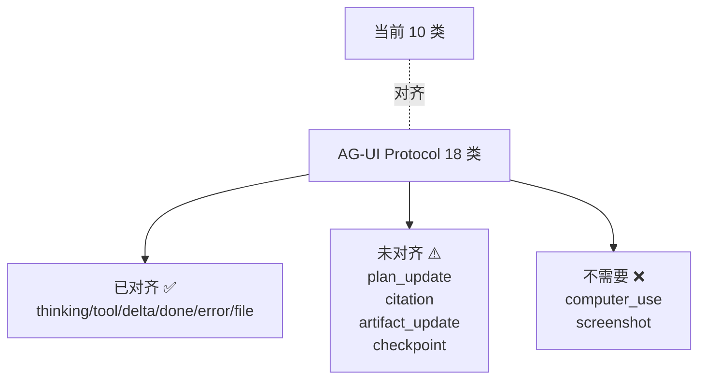

**对齐建议**：

| AG-UI 事件 | 当前实现 | 整改 |
| --- | --- | --- |
| `plan_update` | 走 tool_use(update_plan) | 抽成 first-class 事件 `plan_update {steps: [...]}` |
| `citation` | 无 | save_research 时同时发 citation 事件 → 前端 Source 卡片 |
| `artifact_update` | 用 `file` 但只在首次 | 改为 `artifact_update`，支持后续编辑通知 |
| `checkpoint` | 无 | mineFull section_done 间发 checkpoint，前端可标记保存点 |
| `ready_for_*` 信号 | 走 delta 文本匹配 | 改为 `signal {name:'ready_for_write'}` 事件，避免文本脆弱 |

**总评**：**与 AG-UI ~60% 对齐**。建议 v0.37 把 plan_update / signal / artifact_update 三个高频事件抽为 first-class，避免后续切第三方 agent 框架时大改前端。

### 4.5 凭证 OAuth 过期 — 人工运维痛点

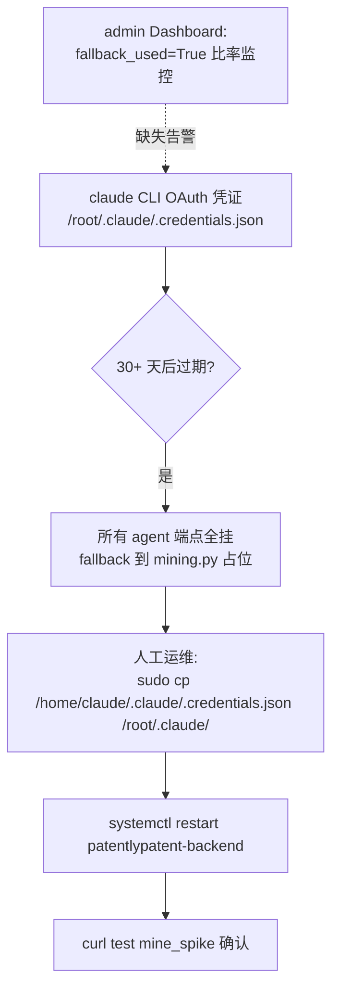

| 问题 | 影响 | 缓解 |
| --- | --- | --- |
| OAuth 过期无主动告警 | 业务全切 fallback，质量骤降 | admin 看 `fallback_used` 比率人工发现，**应加 webhook/邮件告警** |
| 凭证手动 cp 流程脆弱 | 步骤多易遗漏 | 写 `scripts/refresh_oauth.sh` 自动化 |
| 没有 ANTHROPIC_API_KEY fallback | OAuth 是唯一 LLM 入口 | 加 `PP_USE_API_KEY=1` env，走 anthropic SDK 直调 |
| dev / prod 凭证共用一个 home | 串味 | 独立 .credentials.json，systemd override 指 PROJECT_HOME |

**建议**：v0.37 加 `scripts/health_check_llm.sh` cron 每 12 小时跑 mine_spike，连续 2 次 fallback → 发钉钉/邮件告警；同时实装 PP_USE_API_KEY 备用通道。

---

## 5. 已知 bug 与 P0/P1 修复清单

### 5.1 P0（必须 v0.37 修复）

| # | 问题 | 位置 | 现象 | 修复方案 |
| --- | --- | --- | --- | --- |
| P0-1 | **mineFull 产物隐藏，用户看不到** | `agent.py::_write_full_section` → `hidden=True` to `.ai-internal/_compare/full/` | 用户跑完一键全程，UI 显示"5 节已完成"但文件树没看到 markdown | 改写到 `AI 输出/01-背景技术.md...` 等可见路径；保留 hidden _compare 副本用于 A/B |
| P0-2 | **缺 web_research 工具** | agent_sdk_spike.py | agent 在 interview 中用户提 arXiv 论文 / 知乎案例 → 瞎编 | 新增 `web_research(query, source)` 用 HIP 调 google/zhihu/arXiv |
| P0-3 | **PDF/pptx 上传无文本提取** | files.py upload + FileNode | read_user_file 返回提示让用户粘贴 → 极差体验 | 后台 worker 用 pdfplumber/python-pptx 异步提文本写回 content |
| P0-4 | **interview 信号识别脆弱** | AgentChatStream.vue:150-159 | `[READY_FOR_WRITE]` 走 chunk 文本匹配，如 cleaned 拆分跨 chunk 命中失败 | agent 端发 first-class `signal` 事件；前端 store 字段化捕获 |
| P0-5 | **interview agent prompt cache 未开** | agent_interview.py:184 | system_prompt 直传字符串而非 SystemPromptPreset，多轮 interview 重复 cache creation | 改 SystemPromptPreset(name='claude_code', append=SYSTEM_PROMPT, exclude_dynamic_sections=True) |

### 5.2 P1（v0.38 修复）

| # | 问题 | 位置 | 现象 | 修复方案 |
| --- | --- | --- | --- | --- |
| P1-1 | mineFull 和 interview 用不同 MCP server | agent_sdk_spike vs agent_section_demo | 工具描述重复，cache 不共享 | 抽公共 `mcp_factory.py`，所有路径用一个 server |
| P1-2 | search_kb 全量扫盘 O(N) | agent_sdk_spike:_do_search_kb | 419 文件每次顺序 read，5 并发卡 | 启动期建索引 `kb_index.json`，O(1) 查询 |
| P1-3 | file_search_in_project 无 ranking | agent_sdk_spike:_do_file_search_in_project | LIMIT 5 命中按主键顺序，agent 拿到不一定相关 | 加 BM25 简单评分（命中次数 + 标题命中加权） |
| P1-4 | 凭证过期无告警 | 无 | OAuth 过期，业务全 fallback，admin 才知道 | 加 cron 健康检查 + 钉钉/邮件 webhook |
| P1-5 | iteration_log.md 断更（v0.28 → v0.36 缺 8 轮） | docs/iteration_log.md | 上下文文档腐烂 | 补 v0.29～v0.36 八轮日志（每轮 4 步 SOP） |
| P1-6 | user_guide.md 截图全 TODO + v0.36 流程未更新 | docs/user_guide.md | 新员工看文档完全脱节 | 用 v0.36 interview-first 流程重写 + 真实截图 5 张 |
| P1-7 | 章节级 prompt 无 few-shot | agent_section_demo._SECTION_PROMPTS | 第一次生成质量波动大 | 每节加 1 个优秀样板 markdown |
| P1-8 | docx 渲染端只读 `AI 输出/` | disclosure_docx.py | 与 P0-1 级联：当前找不到 5 节 markdown | P0-1 修复后自动解决；但要顺手加 fallback 优先级（mineFull > mining 模板） |
| P1-9 | docs/ 重叠 5 篇未清理 | docs/{requirements,requirements_v2,architecture,architecture_v0.16,agent_sdk_spike}.md | 新人迷路 | 按 §2 整改方案归档 |
| P1-10 | 卡死自愈 60s 偏长 | AgentChatStream.vue:108 | 用户已焦虑 | 30s 提示 + 60s 强制 abort |
| P1-11 | save_research 文件名重复无覆盖策略 | agent_sdk_spike:_do_save_research | 相同 name 落多次 → 文件列表重复 | 改"删旧建新"或加 timestamp 后缀 |
| P1-12 | AgentRunLog 没记 cache_read/creation tokens | agent_sdk_spike:_write_run_log | 看不到真实 cache 命中率 | usage dict 整个落 column |

### 5.3 P2（v0.39+）

| # | 问题 | 位置 | 修复 |
| --- | --- | --- | --- |
| P2-1 | 多租户 cache 跨用户穿透 | system_prompt | 加 tenant_id 段 |
| P2-2 | 移动端 375/768/1024 未真测 | tokens.css | 真机扫 |
| P2-3 | a11y 键盘导航 / ARIA | DefaultLayout | 加 aria-label + tabindex |
| P2-4 | Sentry / cron 备份 | 部署 | 落 deploy_runbook §10 步骤 |
| P2-5 | Playwright e2e 0 用例 | tests/ | 上 L4 5 关键 journey |

---

## 6. 下阶段建议（Phase 推进顺序）

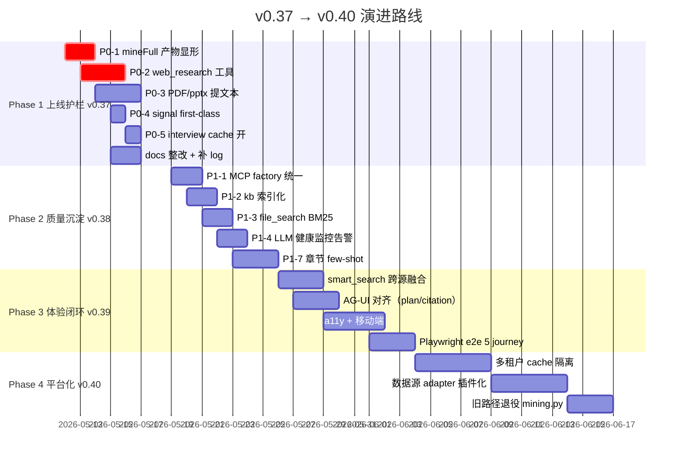

### 6.1 Phase 1（v0.37 · 上线护栏 · 5 天）

**目标**：把 v0.36 的 5 个 P0 体验断点修掉，让 interview-first 流程在公网真用户面前能跑通。

| 任务 | 估时 | 验收 |
| --- | --- | --- |
| **P0-1** mineFull 落 `AI 输出/` + 保留 `_compare` 副本 | 1 天 | UI 文件树看到 5 节 .md，docx 端能读到 |
| **P0-2** `web_research(query, source)` 接 HIP / Brave Search API | 2-3 天 | agent 能查 arXiv 论文 / 知乎专利 / CNIPA 公告 |
| **P0-3** PDF/pptx 提文本（pdfplumber + python-pptx，异步 worker） | 2 天 | read_user_file 拿到真文本 |
| **P0-4** signal first-class（type='signal', payload={'name':'ready_for_write'}） | 1 天 | 不再依赖 chunk 文本匹配 |
| **P0-5** interview agent 用 SystemPromptPreset + exclude_dynamic_sections=True | 0.5 天 | AgentRunLog 看到 cache_read > 0 |
| **docs 整改** 删 5 篇旧文 + 补 iteration_log v0.29-v0.36 + 重写 user_guide v0.36 | 2 天 | docs/ 8 篇 + 完整 v0.36 文档体系 |

### 6.2 Phase 2（v0.38 · 质量沉淀 · 1 周）

**目标**：内功，让 12 个工具更聪明、可观测性补齐、prompt 质量稳定。

| 任务 | 估时 | 验收 |
| --- | --- | --- |
| **P1-1** 抽 `mcp_factory.py`，所有路径共用一个 MCP server | 2 天 | server.version=0.7.0；3 个 endpoint 同一工具集 |
| **P1-2** kb 启动期建索引（kb_index.json：path → keywords TF-IDF） | 2 天 | search_kb 从 O(N) 降到 O(log N)；419 文件 < 50ms |
| **P1-3** file_search_in_project 加 BM25 ranking | 2 天 | 命中按相关度排，top 5 比当前命中率高 |
| **P1-4** LLM 健康监控 cron + 钉钉 webhook | 2 天 | OAuth 过期 24 小时内必告警 |
| **P1-7** 5 节 prompt 各加 1 个 few-shot 优秀样板 | 3 天 | mineFull 首次生成质量稳定（A/B 跑 10 次 cv < 0.2） |
| **P1-11** save_research 同名覆盖策略 | 0.5 天 | 不再有重复文件 |
| **P1-12** AgentRunLog 加 `usage_json` JSON column 落 cache tokens | 0.5 天 | admin 看真实 cache hit rate |

### 6.3 Phase 3（v0.39 · 体验闭环 · 2 周）

**目标**：跨源融合 + AG-UI 协议对齐 + a11y/移动端 + e2e 覆盖。

| 任务 | 估时 | 验收 |
| --- | --- | --- |
| `smart_search(intent, query)` 智能路由层 | 3 天 | agent 一次 tool_call 拿到智慧芽 + kb 综合摘要 |
| AG-UI 三件套（plan_update / citation / artifact_update） | 3 天 | 前端 chat 渲染 Plan 卡片、Source 引用、Artifact 更新通知 |
| a11y（键盘导航 + ARIA + 对比度）+ 移动端真测 | 4 天 | Lighthouse a11y > 90，375px 单栏布局 OK |
| Playwright e2e 5 journey（登录/报门/挖掘/导出/暗色） | 3 天 | CI 跑通，失败截图 + trace zip |

### 6.4 Phase 4（v0.40 · 平台化 · 3 周）

**目标**：从 demo 到平台。

| 任务 | 估时 | 验收 |
| --- | --- | --- |
| 多租户 cache 隔离（system_prompt 加 tenant_id 段） | 5 天 | 不同用户同 idea cache 不串味 |
| 数据源 adapter 插件化（智慧芽 / Google Patents BigQuery / CNIPA） | 5 天 | 切数据源不改 agent 代码 |
| 旧路径退役（删 mining.py / llm.py / llm_fill.py / chat.py auto-mining） | 3 天 | LOC -1000，单轨架构 |
| 文档收尾（v0.40 PRD + HLD + ADR-001~ADR-007） | 3 天 | 平台化决策落档 |

---

## 附录 A：v0.36 全景架构图

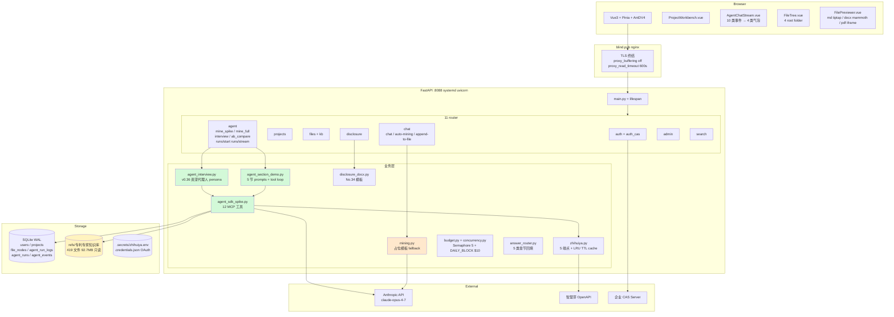

> 绿色：v0.36 重构后主路径 · 橘色：legacy mining 路径 · 黄色：419 文件 kb 只读

---

## 附录 B：mineFull vs auto-mining 控制流对照

### B.1 老路径（chat.py auto-mining）

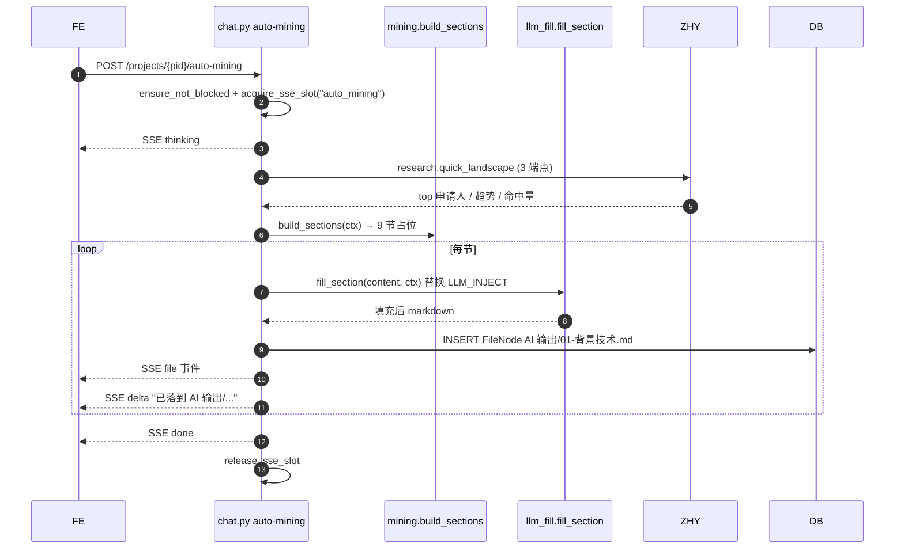

### B.2 新路径（agent.py interview + mineFull）

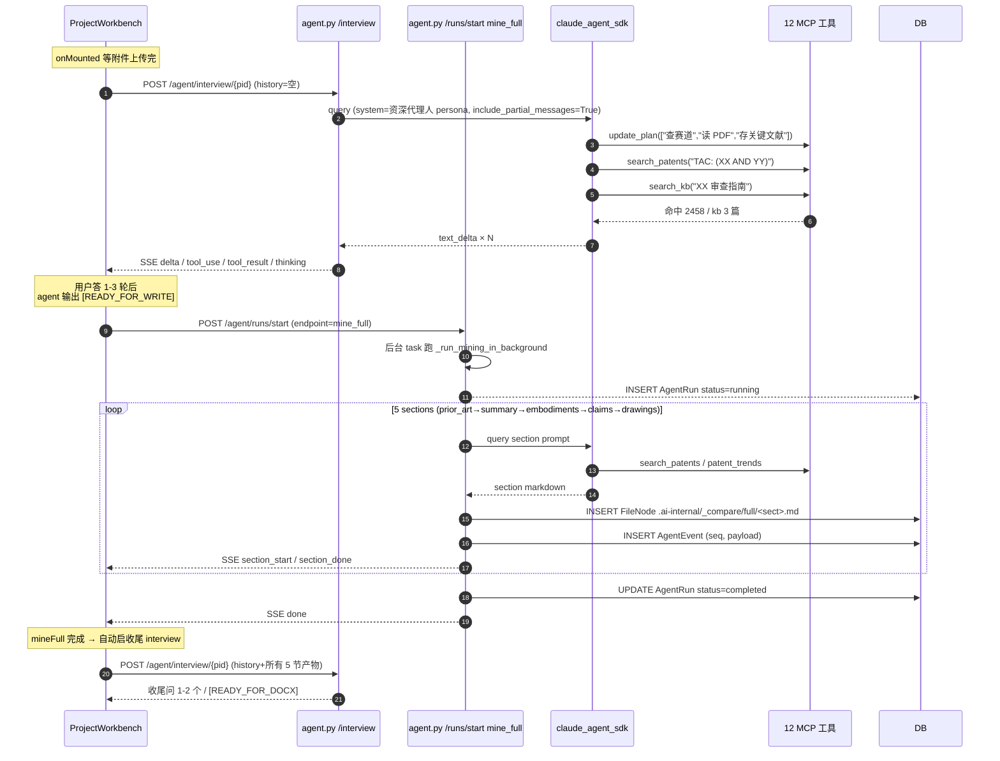

### B.3 关键差异 5 项

| # | 维度 | auto-mining | interview + mineFull |
| --- | --- | --- | --- |
| 1 | 触发模式 | 同步 / 一次跑完 | 异步 detached + 多阶段触发 |
| 2 | 与用户交互 | 单向：跑完→等用户在 chat 答问 | 双向：先问→用户答→开始写→收尾问 |
| 3 | 工具调用 | 0（模板）+ N 次 LLM_fill | 12 个 MCP 工具自驱循环 |
| 4 | 落盘位置 | `AI 输出/`（用户可见） | `.ai-internal/_compare/full/`（**bug**，应改可见） |
| 5 | 监控 | 无 RunLog | AgentRunLog + AgentRun + AgentEvent 三表 |

---

> **结论速览**：v0.36 interview-first 重构 UX 上是大跃进（"先问再写"对认真用户友好），但落地有 5 个 P0 体验断点（最严重是 mineFull 产物 hidden=True 用户看不到）。架构上 12 个工具归类合理但缺 web_research / smart_search 两个跨域工具；MCP server 两份实例（spike vs section_demo）应抽 factory 统一。文档体系 docs/ 13 篇有 5 篇重叠应归档；ai_docs/ 8 篇基本健康，2026-05-11 的 research_agent_activity_stream.md 是 v0.36 UI 决策的关键基线。建议 5 天 Phase 1 修 5 个 P0 + 整 docs，1 周 Phase 2 内功补齐，2 周 Phase 3 体验闭环，3 周 Phase 4 平台化。整体路径清晰，重构方向正确，主要是收尾和打磨。
