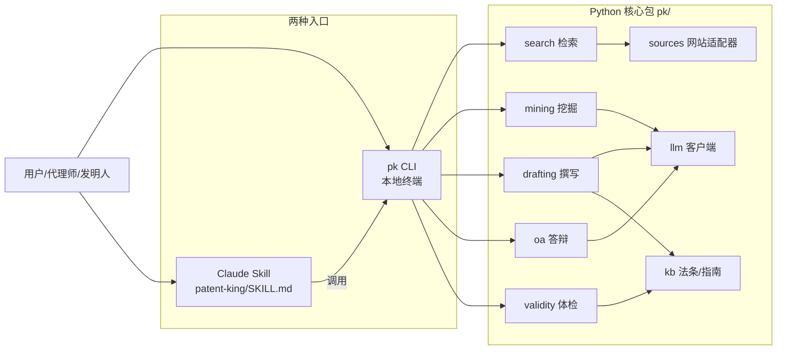
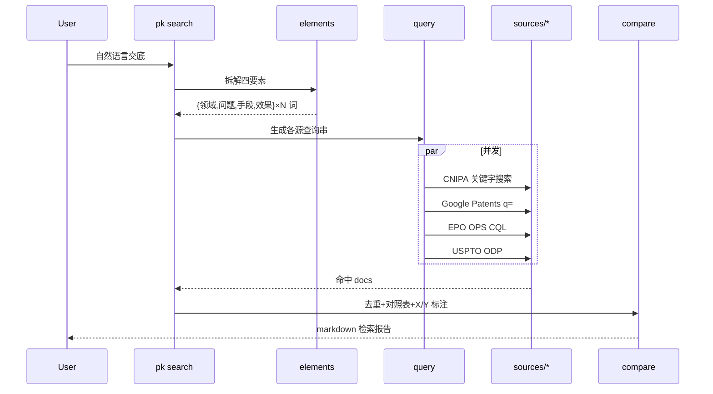
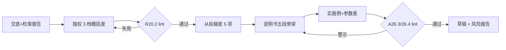

# patent_king 架构设计

> v0.1 · 2026-05-07

## 1. 双壳架构



**要点**
- Skill 仅做"自然语言→CLI 命令"的路由，不重复实现核心逻辑
- pk CLI 可独立使用、可在 CI/脚本/服务中调用
- 所有 LLM 调用统一过 `pk.llm`，便于切换模型/做 prompt 缓存

## 2. 模块图（pk/ 包）

```
pk/
├── cli.py                # 入口：pk search / mine / draft / oa / check
├── pipeline.py           # 编排：组合各模块跑闭环
├── search/
│   ├── elements.py       # 四要素拆解（领域/问题/手段/效果）
│   ├── expand.py         # 关键词扩展（同义词/上下位/中英）
│   ├── ipc.py            # IPC/CPC 推荐
│   ├── query.py          # 统一查询 DSL → 各源 query string
│   ├── dedupe.py         # family 去重 + 排序
│   ├── compare.py        # 特征对照表 + X/Y 类标注
│   └── sources/
│       ├── base.py       # adapter 抽象
│       ├── cnipa.py      # epub.cnipa.gov.cn 关键字爬取
│       ├── googlepatents.py
│       ├── epo_ops.py    # REST
│       └── uspto_odp.py  # REST
├── mining/
│   ├── problem_tree.py   # 5-Why + 1-What-if
│   ├── generalize.py     # 上下位梯度
│   ├── effects.py        # 技术效果矩阵
│   └── portfolio.py      # 布局草图
├── drafting/
│   ├── claims_indep.py   # 独权 3 档概括度
│   ├── claims_dep.py     # 从权梯度
│   ├── spec.py           # 说明书五段骨架
│   ├── embodiments.py    # 实施例 + 参数表
│   └── figures.py        # 附图标号一致性
├── oa/                   # v0.2
│   ├── parse.py
│   ├── three_step.py
│   ├── amend.py          # 含 A33 锚定
│   └── rhetoric.py
├── validity/             # 法条 lint
│   ├── r20_2.py          # 必要技术特征最小集
│   ├── a26_3.py          # 充分公开
│   ├── a26_4.py          # 支持
│   ├── a33.py            # 修改超范围
│   └── unity.py          # 单一性 R34
├── llm/
│   ├── client.py         # Anthropic SDK 封装 + cache
│   └── prompts/          # 各模块 prompt 模板
└── kb/
    ├── law/              # 专利法条文片段
    ├── guidelines/       # 审查指南 2023 关键节
    └── cases/            # 典型判例摘要
```

## 3. 检索流（关键字模式）



## 4. 撰写流（基于检索结果与交底）



## 5. 法条 lint 内嵌点

| 节点 | lint | 触发动作 |
|---|---|---|
| 独权生成 | R20.2 必要技术特征最小集 | 标注可删特征 |
| 从权生成 | 引用关系完整性 | 自动补缺失引用 |
| 说明书 | A26.3 充分公开 | 每个权要特征 must-have 实施例 |
| 说明书 | A26.4 支持 | 功能性限定 must-have 结构对应 |
| 改稿 | A33 修改超范围 | 与原申请 diff，标"中间概括"风险 |
| 多独权 | R34 单一性 | 检测特定技术特征 |

## 6. 网站适配器规约

每个 `pk/search/sources/*.py` 实现：
```python
class Source(SourceBase):
    name: str
    def search(self, q: Query, max_results: int) -> list[Hit]: ...
    def fetch(self, doc_id: str) -> Document: ...
```
- 所有适配器遵守目标网站 robots.txt + 限速（默认 1 req/2s）
- 配置（base_url、selector、API key）放 `pk/config.toml`
- 失败降级：单源失败不影响其它源
- 缓存：`~/.cache/patent_king/` 按 (source, query_hash) key

## 7. LLM 接入

- 默认 Claude Opus 4.7（撰写/答辩）+ Sonnet 4.6（检索/lint，性价比）
- `pk/llm/client.py` 启用 prompt caching（system + KB 法条片段做长缓存）
- prompts 全部在 `pk/llm/prompts/` 文件化，支持 `{var}` 模板渲染

## 8. Skill 薄包装

```
skills/patent-king/
├── SKILL.md            # description: 检索/撰写/答辩中国专利。触发词…
├── scripts/run.sh      # 调用 pk CLI
└── references/
    ├── usage.md        # 子命令速查
    └── lint-rules.md   # A22/A26/A33 摘要
```

SKILL.md 中只写"自然语言意图→pk 子命令"的路由表，不重复业务逻辑。

## 9. 目录全景

```
patent_king/
├── CLAUDE.md
├── pyproject.toml         # 包定义；console_scripts: pk
├── pk/                    # 核心包（见 §2）
├── skills/patent-king/    # Skill 薄包装
├── prompts/               # 共享 prompt（部分 mirror 到 pk/llm/prompts）
├── templates/             # 权要/说明书模板
├── kb/                    # 法条/指南/判例
├── refs/                  # 调研期收集的外部参考
│   ├── kb/                # 文献材料
│   └── 3rd_repos/         # AutoPatent 等
├── ai_docs/               # 调研分析
├── docs/                  # 需求/架构/设计
└── tests/
```

## 10. 风险与对策

| 风险 | 对策 |
|---|---|
| CNIPA 反爬 | 用 epub HTML 端 + 限速 + UA 轮换；必要时退化为只用 Google Patents 的 CN 译文兜底 |
| LLM 撰写"幻觉特征" | 所有特征必须可追溯到（交底/检索文献/实施例）三者之一，做引用校验 |
| A33 修改超范围误判 | LLM 给候选 + 必须人审；diff 工具暴露原文逐字对照 |
| 提示词漂移 | prompts/ 版本化；为每个模块准备 5 个回归样例 |
