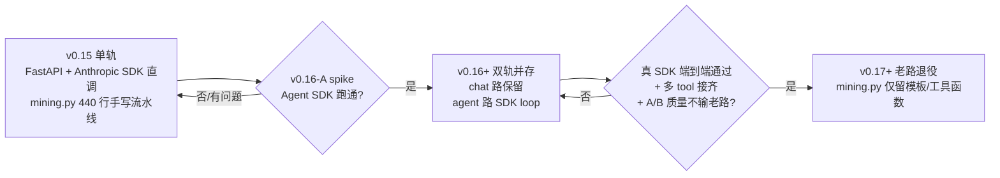
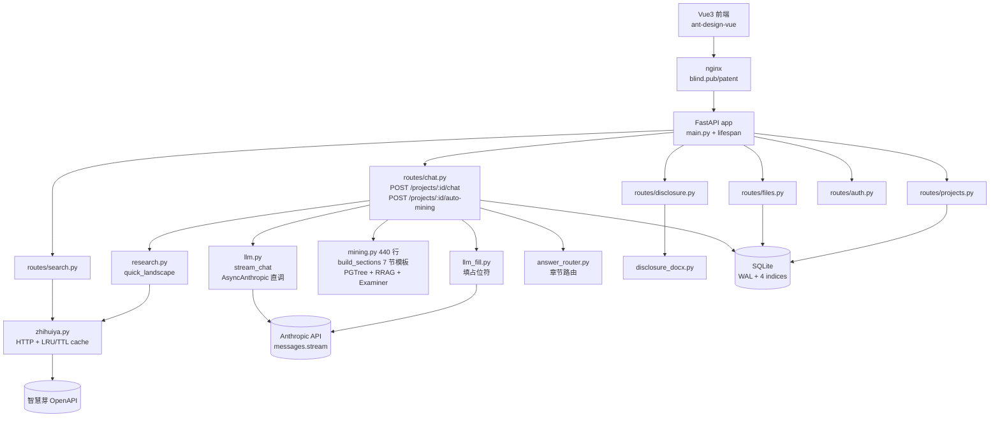
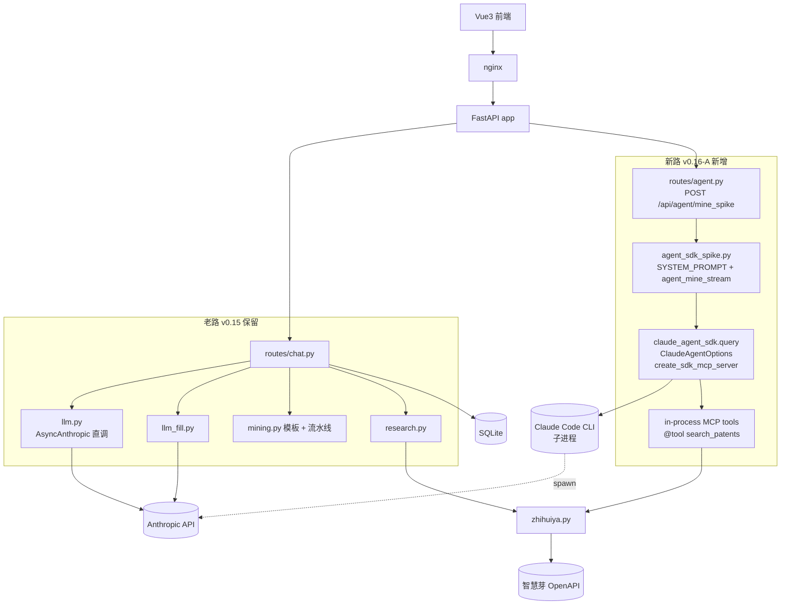
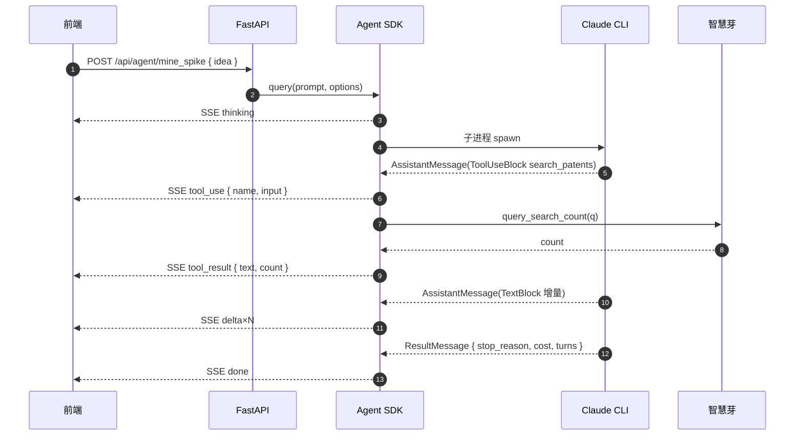

# PatentlyPatent 架构对比 — v0.15 vs v0.16+ (Agent SDK 切换)

> 一句话：v0.15 是「LLM-augmented backend」（FastAPI 直调 Anthropic SDK + 手写流水线），v0.16 起引入 **agentic loop**，把"工具循环 / 多轮 / 自决策"收成 `claude_agent_sdk.query()`，与老路并存做小步迁移。

- 更新日期：2026-05-08（v0.16-A spike 跑通后）
- 配套文件：`docs/agent_sdk_spike.md`（spike 细节）、`backend/app/agent_sdk_spike.py`（实现）
- 状态：**双轨并存**（mining.py 老路保留 + agent_sdk_spike.py 新路并行）

---

## 1. 概览（决策一图流）



---

## 2. v0.15 当前架构图



**关键事实**

- **单一 LLM 调用层**：`llm.py::stream_chat` 用 `AsyncAnthropic.messages.stream`，纯流式输出文本，不带 tool_use。
- **挖掘流水线在 `mining.py`**（440 行）：以**模板 + LLM 注入位**为骨架，`auto-mining` 路由按节顺序跑：
  1. 调智慧芽看 landscape（`research.quick_landscape`，2 次 API）
  2. 喂给 `build_sections(ctx)` 拿 7 节模板
  3. 每节走 `llm_fill.fill_section` 把 `[LLM_INJECT::xxx]` 占位替换为模型输出
  4. 落地写 `FileNode`，SSE 推前端
- **多轮工具调用**：v0.15 没有真正意义的"agent 循环"——只在固定的 chat 链路里跑模板填充；智慧芽是被代码硬编排调用的。
- **流式协议**：SSE 事件 `thinking / delta / file / done`（chat 路），`thinking / delta / file / done` (auto-mining)。

---

## 3. v0.16+ 双轨架构图



**新路核心 ~150 行**（`agent_sdk_spike.py`）：

```python
@tool("search_patents", "智慧芽命中量检索", {"query": str})
async def search_patents(args):
    count = await zhihuiya.query_search_count(args["query"])
    return {"content": [{"type": "text", "text": f"命中 {count} 件"}]}

server = create_sdk_mcp_server(name="patent-tools", tools=[search_patents])
options = ClaudeAgentOptions(
    system_prompt=SYSTEM_PROMPT,
    mcp_servers={"patent-tools": server},
    allowed_tools=["mcp__patent-tools__search_patents"],
    max_turns=8,
)
async for msg in query(prompt=idea_text, options=options):
    # 翻译 AssistantMessage / ToolUseBlock / ResultMessage → SSE dict
    ...
```

---

## 4. 维度对比表

| 维度 | v0.15 (Anthropic SDK 直调) | v0.16+ (Agent SDK) |
|---|---|---|
| **客户端** | `anthropic.AsyncAnthropic` | `claude_agent_sdk.query()` |
| **控制流** | 主调用方写 while/for；步骤硬编码 | SDK 内置 agent loop，model 自决策下一步 |
| **多轮工具调用** | 手工 round-trip：判 `stop_reason==tool_use` → 调函数 → 拼回 `tool_result` 进下一轮 | SDK 自动；`max_turns` 上限 |
| **工具定义** | dict schema + Python 回调字典 | `@tool` 装饰器 + `create_sdk_mcp_server`（in-proc MCP，**无子进程开销**） |
| **system prompt 管理** | chat.py 里手拼字符串（项目元数据 + AI/用户上下文摘要） | `ClaudeAgentOptions(system_prompt=...)` 一次设入 |
| **流式协议** | 手工解析 `text_stream` chunk | 高层 message 对象（`AssistantMessage` / `ToolUseBlock` / `ResultMessage` 等） |
| **错误恢复** | mining.py 各节自己 try/except；`llm.py` fallback 到 mock | spike 模块外层 try/except 整段降级 mock；SDK 内部对单步失败的处理依赖 CLI |
| **并发模型** | 单 request 单流；FastAPI async + httpx | 同左；但 SDK 跑在子进程下，需要确认 systemd 环境 PATH |
| **prompt cache** | 手工加 `cache_control`（v0.15 暂未启用） | 文档说 SDK 自动管理，**未实测命中率** |
| **子代理 / 钩子** | 无 | `hooks=` / 子代理体系（spike 未用） |
| **调试** | 直接看 httpx 日志 + 自己埋打点 | SDK 暴露 `ResultMessage.total_cost_usd` / `num_turns`；trace 不如手写直观 |
| **运维** | 一个进程，依赖 `ANTHROPIC_API_KEY` | 进程 + Claude Code CLI 子进程（依赖 `claude` 在 PATH 里）；或 SDK 配纯 API 模式 |
| **代码量** | mining.py 440 行 + llm.py 58 行 | spike 模块 ~150 行（含 mock + 真路径） |
| **灵活度** | 高（每个 byte 自己控） | 中（贴 SDK 抽象走） |
| **成本可控性** | 强（每次请求预知） | 弱（agent 自决策调几次工具，cost 浮动） |

---

## 5. 流式事件流对比

| 路径 | 事件类型序列 | 备注 |
|---|---|---|
| **v0.15 chat SSE** | `thinking → delta×N → file? → done` | `delta.chunk` 是文本片段；`file` 是归档触发后推 FileNode |
| **v0.15 auto-mining SSE** | `thinking → delta×N → file → delta×N → file → ... → done` | 每节生成完发一个 `file`；穿插 landscape/进度文本 |
| **v0.16 agent SSE** | `thinking → tool_use → tool_result → delta×N → (loop) → done` | 一轮 tool 交互可能重复多次；`done` 带 `stop_reason / total_cost_usd / num_turns` |



---

## 6. 迁移路径（小步快跑）

| Step | 状态 | 内容 | 退出标准 |
|---|---|---|---|
| 1. spike mock 跑通 | ✅ v0.16-A | 新端点 `/api/agent/mine_spike`；search_patents 1 个 tool；mock + 真 SDK 双路径 | 公网 curl 11 个 SSE 事件 |
| 2. 真 SDK 端到端验证 | ⏳ 待做 | 在有 `ANTHROPIC_API_KEY` 的 dev 环境跑 SDK 真路径，确认 `claude` CLI 子进程可启动 | 收到非 mock 的 ResultMessage |
| 3. 多 tool 接入 | ⏳ 待做 | 新增 `search_trends` / `search_applicants` / `search_inventors` / `legal_status` / `file_write_section` 等 tool；让 agent 自决策组合 | 至少 5 个 tool 上线，`max_turns ≥ 6` 跑得稳 |
| 4. A/B 单节替换 | ⏳ 待做 | 用 spike 替换 `mining.py` **一节**的生成（如「现有技术」），对照老输出做主观/客观比较 | 同样输入下质量不输；token cost 可控 |
| 5. 全节迁移 | ⏳ 待做 | 7 节逐步切到 agent；保留模板兜底 | 老路 `auto-mining` 流量降到 < 10% |
| 6. 老路退役 | ⏳ 待做 | `mining.py` 退化为「非 LLM 工具函数 + 模板片段库」；`llm_fill.py` / `llm.py` 直调路径仅留 chat | 删除 LLM 直调代码块；新路径 cover all |

---

## 7. 风险与权衡

| 风险 | 影响 | 状态 / 缓解 |
|---|---|---|
| **CLI 子进程依赖 PATH** | systemd 环境跑 SDK 时找不到 `claude` 二进制会直接报错 | 已知；在 systemd unit 里显式 `Environment=PATH=...` 或包路径软链；最坏 fallback 到纯 API 模式 |
| **真 SDK 路径未实测** | 现网 `use_real_llm=false`，spike 只跑过 mock 分支 | Step 2 必做；本地 dev 配 key 端到端验证 |
| **prompt cache 黑盒** | SDK 文档声明自动管理，但命中率不可见 | 拉 SDK trace + Anthropic dashboard 对账；必要时回到手工 cache_control |
| **`max_turns` 调优** | 默认 8 拍脑袋；过小 agent 早停，过大 token 烧穿 | 加日志收集真实 trace；按章节难度梯度配（背景节 4 / 现有技术 8 / 创造性 12） |
| **智慧芽 cost** | 老路每次 mining 固定 2 次 API；agent 路 tool 调用次数浮动 | 在 tool 内打点；超过阈值告警；可加 `max_tool_calls` 的硬上限（spike 当前未实现） |
| **SDK 版本锁** | claude-agent-sdk 0.1.77 还在快速迭代，API 可能变 | requirements.txt 锁版本；订阅 release notes |
| **事件 schema 不兼容** | 老 chat SSE 是 `delta.chunk`，新 agent SSE 是 `delta.text`，前端要分别处理 | 路由分桶；前端按端点区分 handler |
| **降级路径噪声** | spike 失败会自动 fallback mock，用户可能看到 mock 文案不知所以 | 必须在 `error` 事件里打清楚原因；前端用红条提示 |

---

## 8. TODO

合并自 `docs/agent_sdk_spike.md`（去重 + 优先级）：

| 优先级 | 任务 | 关联 Step |
|---|---|---|
| P0 | 真 SDK 路径在有 `ANTHROPIC_API_KEY` 环境跑通端到端 | Step 2 |
| P0 | systemd 部署确认 `claude` CLI 可发现（或切纯 API 模式） | Step 2 |
| P1 | 加 4-5 个 tool：trends / applicants / inventors / legal / file_write | Step 3 |
| P1 | A/B 一节挖掘：spike vs mining.py「现有技术」节 | Step 4 |
| P1 | `max_turns` 调优 + 真实 trace 收集 | Step 3 |
| P2 | prompt cache 命中率验证 | Step 2-3 期间 |
| P2 | `error` 事件 schema 与前端展示设计 | Step 4 前 |
| P2 | tool 调用次数硬上限（防止 cost 失控） | Step 3 |
| P3 | 老 `/projects/:id/auto-mining` 切到 SDK 路径的兼容方案 | Step 5 |
| P3 | mining.py 模板内容抽到 `templates/` 资源目录，与 LLM 调用解耦 | Step 5-6 |

---

## 9. 关联文档

- `docs/agent_sdk_spike.md` — v0.16-A spike 实现笔记（API 形态 / tool 注册 / 验证结果）
- `docs/iteration_log.md` — 迭代日志（v0.15 / v0.16-A 的 ROI / 测试 / 下轮目标）
- `docs/architecture.md` — v0.15 之前的整体架构（FE/BE/数据流）
- `backend/app/agent_sdk_spike.py` — 新路径核心
- `backend/app/routes/agent.py` — 新路径 SSE 路由
- `backend/app/mining.py` — 老路径 440 行流水线（待迁）
- `backend/app/llm.py` — 老路径 LLM 直调
