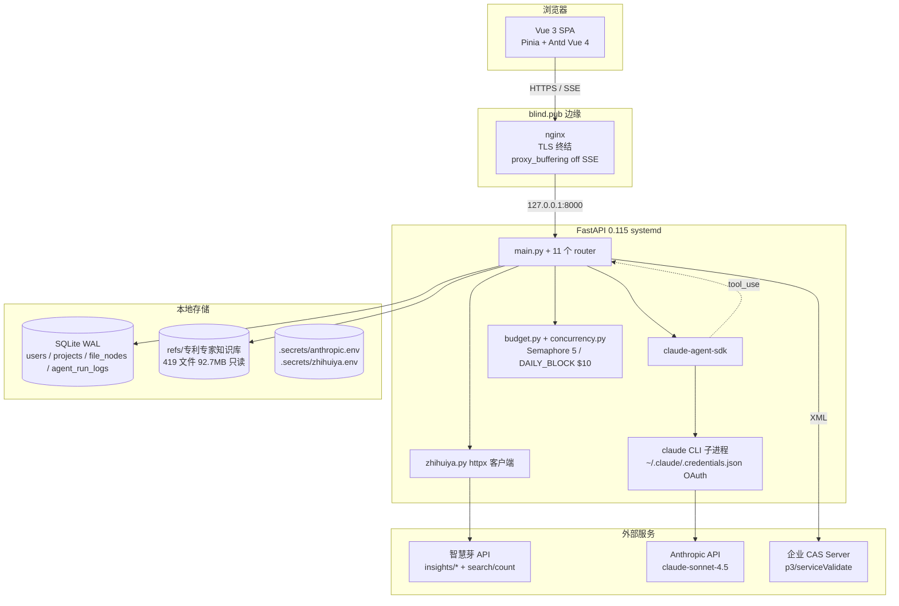
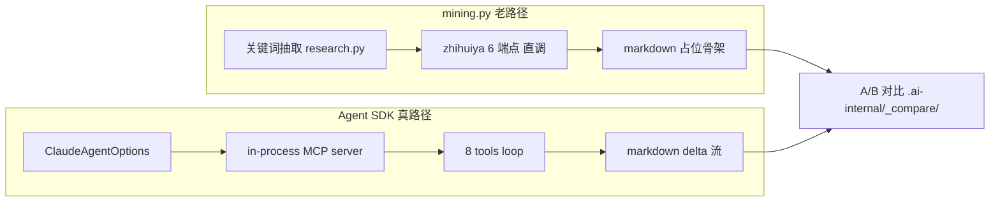
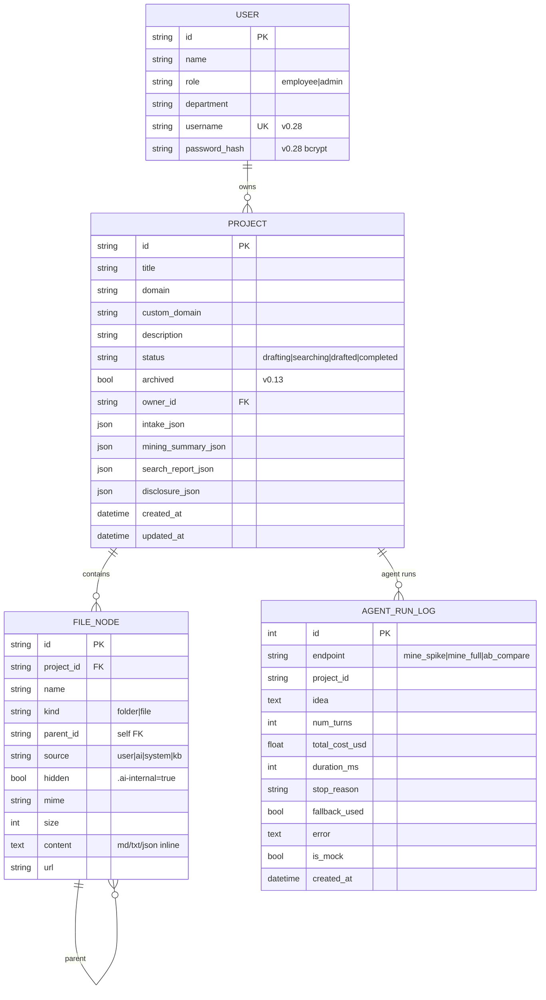
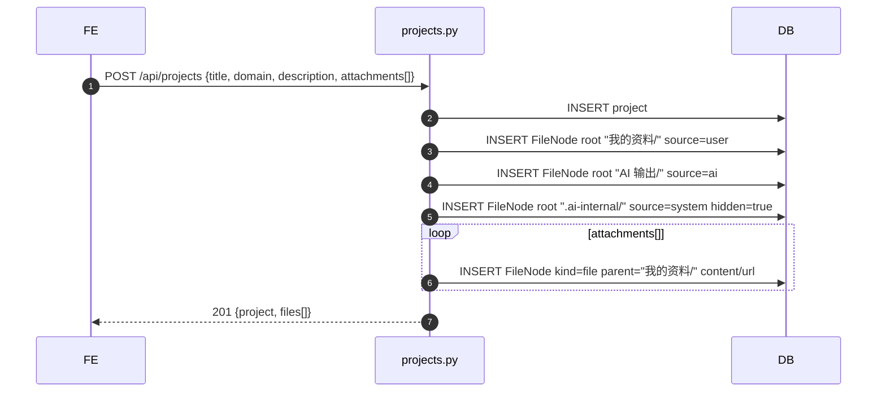
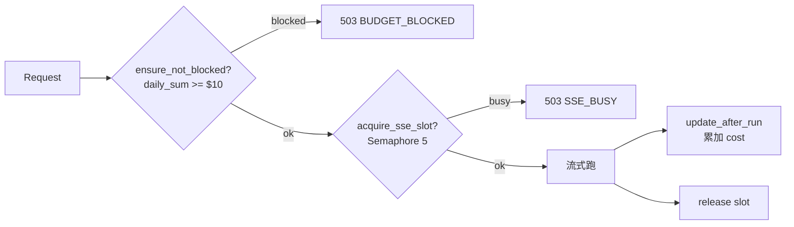
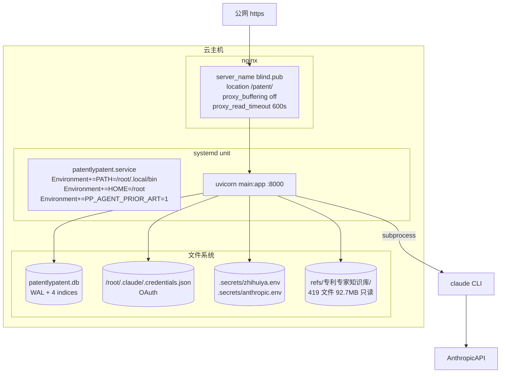

# PatentlyPatent 高层设计文档（HLD）

> 版本：v0.29-doc · 最后更新：2026-05-09
> 关联：[prd.md](./prd.md) · [architecture_v0.16.md](./architecture_v0.16.md) · [agent_sdk_spike.md](./agent_sdk_spike.md) · [agent_vs_mining_compare.md](./agent_vs_mining_compare.md) · [deploy_runbook.md](./deploy_runbook.md) · [prompt_cache_research.md](./prompt_cache_research.md)

---

## 目录

- [1. 概览与定位](#1-概览与定位)
- [2. 系统架构](#2-系统架构)
- [3. 模块清单](#3-模块清单)
- [4. 数据模型](#4-数据模型)
- [5. API 清单](#5-api-清单)
- [6. 核心流程](#6-核心流程)
- [7. 可观测性](#7-可观测性)
- [8. 部署架构](#8-部署架构)
- [9. 性能与成本](#9-性能与成本)
- [10. 安全设计](#10-安全设计)
- [11. 风险与权衡](#11-风险与权衡)
- [12. 演进方向](#12-演进方向)

---

## 1. 概览与定位

PatentlyPatent 是一个 **企业自助专利挖掘工作台**：员工把 idea 报门进来，AI agent（Claude Agent SDK）自驱调用智慧芽实时检索和文件落盘工具，5 分钟内产出 5 节交底书 markdown，再一键导出 No.34 模板 .docx。

- **公网部署**：https://blind.pub/patent（systemd + nginx + sqlite WAL + claude CLI 子进程 OAuth）
- **双轨架构**：mining.py 老路径（占位骨架，稳定）+ agent SDK 真路径（自驱多 tool，cost ~$0.02–$0.05）
- **核心选型**：FastAPI 0.115 + SQLAlchemy 2.0 + claude-agent-sdk 0.1.77 + Vue 3 + Antd Vue 4 + Pinia + Vite

---

## 2. 系统架构

### 2.1 总体拓扑



### 2.2 双轨流量



---

## 3. 模块清单

### 3.1 后端（`backend/app/`）

| 文件 | 职责 |
| --- | --- |
| `main.py` | FastAPI app + lifespan（init_db / log agent SDK 状态）+ 11 个 router 挂载 + CORS |
| `config.py` | pydantic Settings：mock_llm / use_real_zhihuiya / use_agent_sdk_real / CAS_* / DAILY_BUDGET_* |
| `db.py` | SQLAlchemy engine（sqlite WAL / synchronous=NORMAL / cache=64MB / FK on）+ 4 个 INDEX + 幂等 ALTER（archived / username / password_hash） |
| `models.py` | ORM：`User` / `Project` / `FileNode` / `AgentRunLog` |
| `fixtures.py` | 启动期写入 demo users（u1/u2，含 v0.28 真账密 hash） |
| `schemas.py` | Pydantic IO 模型 |
| `llm.py` / `llm_fill.py` | mining.py 老路径用的 LLM 调用与字段填充工具（Anthropic SDK 直调） |
| `mining.py` | 老路径主流水线 440 行；含 `build_*_section_legacy` + `build_*_section_smart`（agent fallback 入口）+ `_run_coro_blocking` |
| `agent_sdk_spike.py` | 8 个 `@tool` 注册 + `create_sdk_mcp_server` + `agent_mine_stream` SSE 翻译；mock + 真路径双轨 |
| `agent_section_demo.py` | 5 节 `_SECTION_PROMPTS` + `mine_section_via_agent`（被 mining.py smart 版调用） |
| `zhihuiya.py` | httpx 客户端 + 模块级 LRU TTL cache(300s/256) + `_safe_query` 4 场景兜底 |
| `budget.py` | `BudgetBlocked` / `check_daily_budget` / `update_after_run` / `ensure_not_blocked` |
| `concurrency.py` | `asyncio.Semaphore(5)` / `sse_slot` async ctx / `SSEBusy` 503 |
| `disclosure_docx.py` | python-docx 按 No.34 模板把 markdown 转 .docx（手写解析，无 3rd lib） |
| `answer_router.py` | 5 类关键词分发 → 写回 md H2 锚点 |
| `research.py` | 关键词抽取 + `quick_landscape` + `landscape_to_md`（top 申请人 + 7 年趋势） |
| `routes/auth.py` | POST /login（v0.28 真账密 + role fallback）/ /login-as / GET /me |
| `routes/auth_cas.py` | GET /cas/login → 302；/cas/callback ticket 验证 → JWT；/cas/logout |
| `routes/projects.py` | GET / POST / PATCH / DELETE 项目；POST 时建 3 个根 folder |
| `routes/files.py` | GET / POST / PATCH / DELETE FileNode |
| `routes/chat.py` | POST /chat SSE（系统提示注入 8 个 md + 6 个用户资料）/ /chat/append-to-file / /auto-mining SSE |
| `routes/search.py` | GET /search/count / trends / applicants（智慧芽透传） |
| `routes/disclosure.py` | POST /disclosure/docx / GET 文件下载 |
| `routes/agent.py` | POST /mine_spike SSE / /ab_compare/{pid} / /mine_full/{pid} SSE |
| `routes/admin.py` | GET /agent_runs（分页 + 过滤）/ /budget_status |
| `routes/kb.py` | GET /kb/tree（懒加载）/ /kb/file（inline pdf+图片）/ /kb/stats |

### 3.2 前端（`frontend/src/`）

| 路径 | 职责 |
| --- | --- |
| `main.ts` + `App.vue` | 入口；ConfigProvider 注入 indigo 主色 / borderRadius / Inter 字体；watch ui.theme 切换 dark |
| `router/` | vue-router 路由 + meta breadcrumb；路由级 lazy（admin Dashboard / echarts 异步 import） |
| `layouts/DefaultLayout.vue` | 56px Header + 260/64 Sidebar；项目卡片右键菜单 + ⋯ 三点菜单（重命名/归档/删除）；面包屑；🌙 切换；📖 教程 |
| `layouts/BlankLayout.vue` | login / 404 / 403 简洁壳 |
| `views/login/Login.vue` | 60/40 hero+卡；CAS 按钮 v-if=cas_enabled；dev 角色切换 v-if=DEV |
| `views/employee/{Dashboard,ProjectNew,ProjectWorkbench,ProjectMining,ProjectSearch,ProjectDisclosure}.vue` | 员工主流程 6 个页面 |
| `views/admin/{Dashboard,Projects}.vue` | 管理 Dashboard：4 stats + agent_runs 表 + 3 echarts + ⚗️ A/B + 🔁 N 次回归 |
| `views/error/{NotFound,Forbidden}.vue` | 404 / 403 96px 渐变文字 |
| `components/workbench/{FileTree,FilePreviewer,NewProjectModal}.vue` | 文件树（含 kb 懒加载 + 拖拽上传 + 多选 + 三点菜单）/ 预览器（md tiptap 编辑 + docx mammoth + pdf iframe）/ 报门 modal（拖拽 + 进度条） |
| `components/chat/{AgentChatStream,MiniChatView,MiningSummaryPanel}.vue` | 主 chat 流（8 类事件 → 4 类气泡：text/tool_call/thinking/error）/ split view 只读 mini chat / mining 总览面板 |
| `components/tutorial/UsageTutorial.vue` | 6 步使用教程 540 行 |
| `stores/{auth,files,chat,ui,project}.ts` | Pinia store；chat 持久化 sessionStorage key=pp.chat.<pid> |
| `api/{auth,client,projects,files,chat,search,disclosure,kb}.ts` | axios 封装；client 加 Bearer interceptor + 401 跳 login |
| `styles/{tokens,global,utilities}.css` | 109+107+131 行设计系统；含 :root[data-theme=dark] 暗色覆盖 |
| `mock/` | MSW（VITE_USE_MSW dev only） |
| `types/index.ts` | FileSource / FileMime / ChatStreamEvent / ChatMessage 等共享类型 |
| `utils/sse.ts` | fetch + ReadableStream 解析 SSE；AbortSignal 透传；AbortError 静默 |

---

## 4. 数据模型

### 4.1 ER 图



### 4.2 索引

| 索引 | 字段 | 目的 |
| --- | --- | --- |
| `ix_projects_owner_status` | (owner_id, status) | Dashboard 列我的项目 |
| `ix_projects_status` | (status) | admin 项目状态饼图 |
| `ix_file_nodes_proj_parent` | (project_id, parent_id) | 文件树子节点查询 |
| `ix_file_nodes_proj_source` | (project_id, source) | "我的资料/" / "AI 输出/" 分组 |
| `ix_users_username` | username（UNIQUE） | v0.28 真账密登录 |

### 4.3 FileNode `source` 枚举

| 值 | 来源 | 示例 |
| --- | --- | --- |
| `user` | 报门拖拽 / 工作台拖拽上传 | "我的资料/idea.md" |
| `ai` | agent file_write_section / mining 落盘 | "AI 输出/01-背景技术.md" |
| `system` | 模板 / .ai-internal 隐藏 | ".ai-internal/_compare/full/prior_art.md" |
| `kb` | 虚拟节点（不入库） | "📚 专利知识/华为白皮书/..." |

---

## 5. API 清单

### 5.1 业务端点

| 方法 | 路径 | 描述 | 鉴权 | SSE |
| --- | --- | --- | --- | --- |
| GET | `/api/ping` | 健康 + cas_enabled / agent_sdk 状态 | 否 | 否 |
| POST | `/api/auth/login` | username+password / role fallback → JWT | 否 | 否 |
| POST | `/api/auth/login-as` | dev：u1/u2 直登（仅 DEV） | 否 | 否 |
| GET | `/api/auth/me` | Bearer 解 JWT 返当前 user | 是 | 否 |
| GET | `/api/auth/cas/login` | 302 跳企业 CAS | 否 | 否 |
| GET | `/api/auth/cas/callback?ticket=` | XML 验证 → JWT → 302 跳前端 | 否 | 否 |
| GET | `/api/auth/cas/logout` | CAS 全局登出 | 否 | 否 |
| GET / POST / PATCH / DELETE | `/api/projects[/{pid}]` | CRUD；POST 时建 3 个根 folder | 是 | 否 |
| GET / POST / PATCH / DELETE | `/api/projects/{pid}/files[/{fid}]` | FileNode CRUD | 是 | 否 |
| POST | `/api/projects/{pid}/chat` | LLM 流式 + answer_router 写回 md | 是 | **是** |
| POST | `/api/projects/{pid}/chat/append-to-file` | 显式写回端点 | 是 | 否 |
| POST | `/api/projects/{pid}/auto-mining` | mining 老路径 5 节 | 是 | **是** |
| GET | `/api/search/count?q=` | 智慧芽命中数 | 是 | 否 |
| GET | `/api/search/trends?q=` | 7 年趋势 | 是 | 否 |
| GET | `/api/search/applicants?q=` | top 申请人 | 是 | 否 |
| POST | `/api/projects/{pid}/disclosure/docx` | 生成 No.34 模板 .docx | 是 | 否 |
| GET | `/api/projects/{pid}/files/{fid}/download` | 下载附件 | 是 | 否 |
| POST | `/api/agent/mine_spike` | spike 入口（单 idea 流式） | 是 | **是** |
| POST | `/api/agent/ab_compare/{pid}` | mining vs agent 双路径并行 | 是 | 否 |
| POST | `/api/agent/mine_full/{pid}` | 5 节端到端 SSE | 是 | **是** |
| GET | `/api/admin/agent_runs?limit=N&endpoint=&fallback=` | agent 运行日志 | admin | 否 |
| GET | `/api/admin/budget_status` | 日预算 + sse_in_flight | admin | 否 |
| GET | `/api/kb/tree?path=` | 知识库一层目录懒加载 | 是 | 否 |
| GET | `/api/kb/file?path=` | 单文件读取（≤5MB；pdf/图片 inline） | 是 | 否 |
| GET | `/api/kb/stats` | subdirs/files/bytes | 是 | 否 |

### 5.2 SSE 事件 schema（统一）

| event type | payload 关键字段 | 出现路径 |
| --- | --- | --- |
| `thinking` | text | agent / chat |
| `tool_use` | name, input, t0 | agent |
| `tool_result` | name, result（截断）, tDurationMs | agent |
| `delta` | text（chunk） | agent / chat |
| `file` | id, name, parent_id, source | chat / agent / mine_full |
| `section_start` | section（prior_art/...） | mine_full |
| `section_done` | section, file_id | mine_full |
| `done` | num_turns, total_cost_usd, stop_reason, sections_completed | 终止帧 |
| `error` | message, fallback_used | 任何流 |

---

## 6. 核心流程

### 6.1 报门（POST /api/projects）



### 6.2 工作台 autoMine 双轨

```mermaid
flowchart TD
    Btn[⚡ 一键全程] --> Mode{ui.agentMode}
    Mode -->|mining| Old[POST /api/projects/&#123;pid&#125;/auto-mining]
    Mode -->|agent_sdk| New[POST /api/agent/mine_full/&#123;pid&#125;]
    Old --> SSE1[SSE 占位骨架 9 节]
    New --> SSE2[SSE 5 节循环 + tool_use 卡片 + delta]
    SSE1 --> Files[落盘 FileNode 到 AI 输出/]
    SSE2 --> Files
    Files --> Tree[FileTree 自动滚动 + spawn-flash 1.6s 高亮]
```



### 6.3 mine_full 端到端

```mermaid
sequenceDiagram
    autonumber
    participant FE
    participant BE as agent.py
    participant Sec as agent_section_demo
    participant SDK as claude-agent-sdk
    participant ZHY
    participant DB
    FE->>BE: POST /api/agent/mine_full/&#123;pid&#125;
    BE->>BE: budget.ensure_not_blocked() + sse_slot acquire
    loop 5 sections
        BE-->>FE: section_start
        BE->>Sec: mine_section_via_agent(section, idea, project_id)
        Sec->>SDK: ClaudeAgentOptions(mcp_servers=[8 tools], system_prompt preset)
        SDK->>SDK: tool_use search_patents
        SDK->>ZHY: GET /search/count
        SDK->>SDK: tool_use file_write_section
        SDK->>DB: INSERT FileNode parent="AI 输出/"
        SDK-->>Sec: text delta + done
        Sec-->>BE: events
        BE-->>FE: tool_use / tool_result / delta / file
        BE-->>FE: section_done(file_id)
    end
    BE->>DB: INSERT AgentRunLog endpoint=mine_full
    BE->>BE: budget.update_after_run
    BE->>BE: sse_slot release
    BE-->>FE: done(total_cost_usd, num_turns, sections_completed)
```



### 6.4 Agent SDK tool loop

- `create_sdk_mcp_server(name="patent-tools", version="0.4.0", tools=[...])` 注册 8 个 `@tool` 函数；
- `ClaudeAgentOptions(mcp_servers={"patent-tools": <server>}, allowed_tools=[...8 names...], system_prompt=SystemPromptPreset(name="claude_code", append=..., exclude_dynamic_sections=True), max_turns=8)`；
- 子进程模式：`claude` CLI 走 OAuth `~/.claude/.credentials.json`，systemd override 注入 `PATH=/root/.local/bin:...` + `HOME=/root`；
- 事件流通过 SDK 的 stream API 拿到，统一翻译成 SSE 9 类事件（见 §5.2）。

### 6.5 SSE 限流 + 预算阻断



### 6.6 Prompt cache（实测 60% 节省）

- 入口：`SystemPromptPreset(name="claude_code", append=DOMAIN_PROMPT, exclude_dynamic_sections=True)`；
- `exclude_dynamic_sections=True` 让 SDK 把 system prompt 里的"当前时间 / 工作目录"等高频变化段裁掉，剩余稳定段进入 Anthropic prompt cache；
- 实测：第 1 次 `cost $0.0534 / cache_creation=4591 / cache_read=21556`；同 idea 第 2 次 `cost $0.0213 / cache_creation=0 / cache_read=26147`；
- 详见 [`docs/prompt_cache_research.md`](./prompt_cache_research.md)。

### 6.7 JWT + CAS 认证

```mermaid
flowchart TD
    Login[Login.vue] --> Pick{登录方式}
    Pick -->|账密| L1[POST /api/auth/login<br/>username + password]
    Pick -->|CAS| L2[GET /api/auth/cas/login → 302]
    Pick -->|dev role| L3[POST /api/auth/login-as<br/>仅 import.meta.env.DEV]
    L1 --> V1[bcrypt 校验]
    L2 --> V2[企业 CAS]
    V2 --> T[/p3/serviceValidate XML<br/>defusedxml]
    T --> Q[查 / 自动建 user role=employee]
    V1 --> JWT[HS256 sign]
    Q --> JWT
    L3 --> JWT
    JWT --> Bearer[axios interceptor<br/>Authorization: Bearer]
    Bearer --> API[受保护路由<br/>get_current_user dependency]
    API -->|401| Login
```

---

## 7. 可观测性

| 维度 | 实现 | 看哪 |
| --- | --- | --- |
| **agent 调用日志** | `AgentRunLog` 表 + `finally` 块嗅探 done/error 事件写入 | GET /api/admin/agent_runs |
| **cost 时序** | echarts line smooth，按 endpoint 6 色，fallback 红 markPoint / mock 灰 | admin Dashboard |
| **fallback 率柱图** | echarts stacked bar，ok 绿 / fallback 橙 / error 红，按 endpoint 分组 | admin Dashboard |
| **error 24h** | 1h bucket 柱图 | admin Dashboard |
| **budget** | `budget.get_daily_sum()` + warn $2 / block $10 | GET /api/admin/budget_status |
| **SSE 并发** | `concurrency.in_flight_count()` | budget_status.sse_in_flight |
| **N 次回归探针** | admin 跑 1-20 次 ab_compare，统计 fallback_rate；> 30% red alert | admin Dashboard |
| **A/B 对比** | POST /agent/ab_compare/{pid} 落盘 `.ai-internal/_compare/01-prior_art-{mining,agent}.md`，admin modal 1200 宽并列 | admin Dashboard |

---

## 8. 部署架构



| 关键文件 | 说明 |
| --- | --- |
| `/etc/systemd/system/patentlypatent.service.d/override.conf` | 注入 PATH + HOME + PP_AGENT_PRIOR_ART=1 |
| `/etc/nginx/conf.d/blind.pub.conf` | TLS + `proxy_buffering off` SSE |
| `/root/.claude/.credentials.json` | claude CLI OAuth（备份 `.bak.v0.18`） |
| `backend/patentlypatent.db` | sqlite，备份 `.bak.v0.26` |

详见 [`docs/deploy_runbook.md`](./deploy_runbook.md)。

---

## 9. 性能与成本

### 9.1 首屏体积（gzip）

| 项 | v0.15 | v0.16+ | 备注 |
| --- | --- | --- | --- |
| 入口 index | 1.5MB | **5KB** | manualChunks |
| vendor-antd | 1.2MB | 796KB | unplugin 按需 |
| vendor-echarts | 同捆 | 1042KB（路由级懒加载） | admin 进入时加载 |
| vendor-mammoth | 同捆 | 56KB（FilePreviewer dynamic import） | docx 预览时加载 |
| **首屏必加载（gzip）** | ~845KB | **~250KB** | -70% |

### 9.2 Cost 实测

| 场景 | turns | cost | 备注 |
| --- | --- | --- | --- |
| `mine_spike` 单 idea（mock） | 1 | $0.000 | mock_complete |
| `mine_spike` 单 idea（真路径） | 1 | $0.034 | claude-sonnet-4.5 |
| `mine_full` 5 节（真路径） | 15 | < $0.5 | section_done × 5 |
| `mine_spike` 同 idea 二次（cache 命中） | 1 | **$0.0213** | cache_read=26147 |
| `ab_compare` agent 路径 | 3 | $0.0–0.05 | mining 路径不计 cost |

### 9.3 限流 / 预算

- SSE 并发：5（`asyncio.Semaphore`）；
- 日预算：warn $2 / block $10；
- 智慧芽 timeout：10s + LRU TTL cache 300s/256；降级返空（不写 cache，下次重试）。

---

## 10. 安全设计

| 维度 | 措施 |
| --- | --- |
| **JWT** | HS256 + 服务端 secret + 过期时间；axios interceptor 自动加 Bearer；401 跳 login |
| **真账密** | bcrypt password_hash；fixture u1/u2 仅 demo |
| **CAS XML 解析** | `defusedxml` 防 XXE / billion laughs |
| **SSE 限流** | `Semaphore(5)`，超限 503，防 1 个 agent 占满 4 核 |
| **预算阻断** | 每次 update_after_run 聚合，>= block 阈值拒 SSE |
| **kb 路径校验** | resolve 后 startswith(KB_ROOT) 防 `../`；max 5MB；隐藏 . 文件 |
| **kb 写守卫** | drop / delete / rename / upload 对 kb 节点 message.warning 拒绝 |
| **CORS** | 允许同源 + dev origin，credentials=true |
| **secrets 隔离** | `.secrets/*.env` 不入 git，systemd override 不打 ENV log |
| **SSE 传输** | nginx `proxy_buffering off` + TLS 终结 |

---

## 11. 风险与权衡

| # | 风险 | 影响 | mitigation |
| --- | --- | --- | --- |
| R-1 | claude CLI OAuth 过期（30+ 天） | 真路径全挂 → 全部 fallback legacy | 监控 `agent_runs.is_mock=False & fallback_used=True` 比率；deploy_runbook.md 写续期步骤；备份 `.credentials.json.bak` |
| R-2 | 智慧芽 token 月度限额 | search_* tool 全降级返空 | `_safe_query` 4 场景兜底 + LRU cache + INFO 日志告警；admin 看 fallback 率 |
| R-3 | SQLite 单机锁竞争 | mine_full 并发 5 时偶尔 BUSY | WAL 已开 + asyncio.to_thread 短事务；硬上限 Semaphore(5) |
| R-4 | prompt cache 跨用户穿透 | 不同 user 同 idea 共享 cache（数据隔离薄） | system_prompt 不带 user 信息；多租户隔离列入 v0.32（O-4） |
| R-5 | mining vs agent 输出不一致 | 用户疑惑 | A/B 对比端点 + admin 双 markdown 并列；fallback 率 < 30% 守门 |
| R-6 | SSE 连接被中间代理拆 | chat 卡顿 / 截断 | nginx `proxy_buffering off` + `proxy_read_timeout 600s`；前端 AbortController 优雅取消 |
| R-7 | 大 PDF（>5MB）kb 预览失败 | 用户体验差 | 上限提示 + 给"原文件直链"兜底；v0.23+ 加分页/流式 |
| R-8 | 单点机器宕机 | 全员不可用 | systemd auto-restart；sqlite WAL 易备份；cron 备份待落（O-2） |
| R-9 | tool 描述变更打破 cache | cost 抖动 | tool 描述统一在 agent_sdk_spike.py 定义，version=0.4.0 锁；改动后 cost 时序图能立刻看到 |
| R-10 | docx 模板偏移 | 代理所返工 | 严格按 No.34 模板 9 章节；e2e 测试 `file` 命令验证 Microsoft Word 2007+ |

---

## 12. 演进方向

短期（v0.29-v0.31）：

1. **可观测性补齐**：Sentry SDK + cron sqlite 备份 + 真用户库；
2. **质量沉淀**：4 节 smart 默认 ON（等真用户 N 次回归 ≥ 50 + fallback < 30%）；prompt cache 拆 tool 描述粒度；
3. **体验**：a11y 键盘导航 / 移动端 375/768/1024 真测 / micro-interaction（节点拖拽过渡 / 数字 count-up）。

中期（v0.32+）：

4. **多租户隔离**：同 idea 不同 user 的 cache 怎么避免穿透（system_prompt 加 tenant_id？还是 SDK session 隔离？）；
5. **数据源可插拔**：智慧芽 → CNIPA 官方 / Google Patents BigQuery / 文献 paper-lookup 三档 adapter（与项目 memory `feedback_pluggable_data_source` 一致）；
6. **第二代 agent**：把 mining 老路径整体废弃，全 agent 自驱；引入 `Subagent` for prior_art 深挖 + claims 风险审查；
7. **企业知识库直连**：除 `refs/专利专家知识库/`，对接企业 GitLab / Confluence 作 file_search 数据源。

---

> 本 HLD 与 [`docs/prd.md`](./prd.md) 配套：HLD 讲技术、PRD 讲产品。开发期任何模块改动应同步更新本文件相应小节并在 `docs/iteration_log.md` 写一行变更日志。
