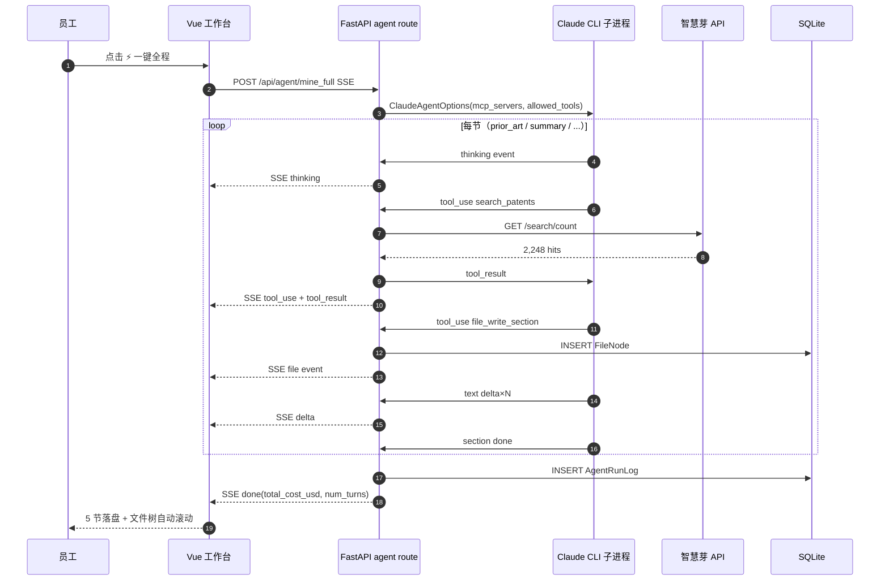
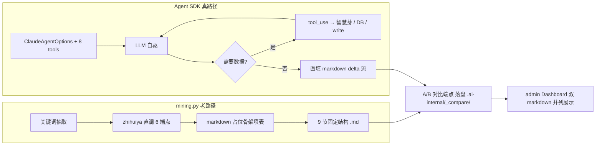
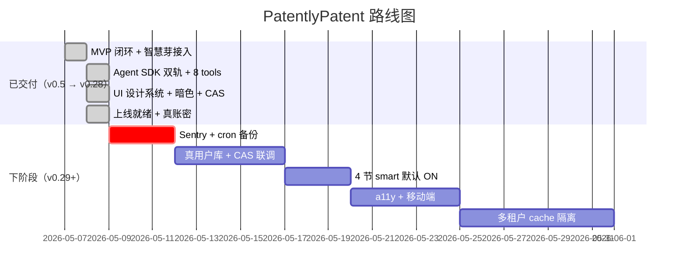

# PatentlyPatent 产品需求文档（PRD）

> 版本：v0.29-doc · 最后更新：2026-05-09 · 作者：PatentlyPatent 团队
> 关联文档：[hld.md](./hld.md) · [iteration_log.md](./iteration_log.md) · [architecture_v0.16.md](./architecture_v0.16.md) · [user_guide.md](./user_guide.md)

---

## 目录

- [1. 修订记录](#1-修订记录)
- [2. 背景与目标](#2-背景与目标)
- [3. 目标用户与角色](#3-目标用户与角色)
- [4. 核心功能](#4-核心功能)
- [5. 非目标（YAGNI）](#5-非目标yagni)
- [6. 用户故事（User Stories）](#6-用户故事user-stories)
- [7. 关键流程图](#7-关键流程图)
- [8. 关键指标（KPI）](#8-关键指标kpi)
- [9. 决策记录与开放问题](#9-决策记录与开放问题)
- [10. 路线图（Roadmap）](#10-路线图roadmap)

---

## 1. 修订记录

> 完整 28 轮迭代日志见 [`docs/iteration_log.md`](./iteration_log.md)。下表只摘录关键里程碑。

| 版本 | 日期 | 关键变化 |
| --- | --- | --- |
| v0.5 | 2026-05-07 | MVP 闭环：报门 + auto-mining + 9 节占位 markdown |
| v0.7 | 2026-05-07 | 智慧芽 `query-search-count` 真路径接入；`disclosure_docx` 按 No.34 模板生成 .docx |
| v0.8–v0.10 | 2026-05-07/08 | 智慧芽 GET 端点修正、top 申请人 / 趋势串入挖掘；用户答问写回 md；文件树多选 + Tiptap 编辑 |
| v0.11–v0.14 | 2026-05-08 | split view、chat 上下文注入、SQLite WAL、归档默认隐藏、上传进度条 |
| v0.15 | 2026-05-08 | vite manualChunks、chat 持久化、智慧芽 TTL cache（10s timeout + 降级） |
| v0.16-A | 2026-05-08 | **Claude Agent SDK spike** 跑通：mock + 真路径双轨 |
| v0.16-BCD | 2026-05-08 | unplugin 按需加载（vendor-antd 1.2MB→796KB）、echarts 路由级懒加载、双轨架构图 |
| v0.17 | 2026-05-08 | 4 tools（search_patents/trends/applicants/file_write_section）+ admin agent_sdk 切换 |
| v0.18 | 2026-05-08 | **真 SDK 路径跑通**（claude CLI OAuth）+ prior_art 智能版 fallback + tool 卡片 + A/B 对比端点 |
| v0.19 | 2026-05-08 | prior_art 默认 ON；tools 4→7（legal_status/inventor_ranking/file_search）；AgentRunLog 表 |
| v0.20 | 2026-05-08 | 5 节 smart 凑齐（prior_art/summary/embodiments/claims/drawings_description）+ `/mine_full` 端到端 + cost 时序图 + fallback 柱图 + 错误兜底 |
| v0.21 | 2026-05-08 | **JWT auth + SSE 限流（5）+ 预算阻断（$10）+ Prompt cache 命中（cost 降 60%）**；e2e 跑通；用户/部署手册 |
| v0.22 | 2026-05-08 | 文件树「📚 专利知识」kb 只读浏览（37 子目录 / 419 文件 / 92.7MB） |
| v0.23 | 2026-05-08 | **CAS 认证**（XML 解析 + JWT 颁发）+ 全站设计系统（tokens/global/utilities + Inter 字体） |
| v0.24 | 2026-05-08 | 13 件视觉对齐（工作台 / chat / timeline / modal / admin / 暗色模式 / 404 / 面包屑） |
| v0.25 | 2026-05-08 | `save_research` tool（第 8 个）— 调研素材自动落盘到「AI 输出/调研下载/<分类>/」 |
| v0.26 | 2026-05-08 | 上线就绪：清测试数据、隐藏 dev role、6 步使用教程组件 |
| v0.27 | 2026-05-08 | kb 文件 inline 预览（pdf / 图片不强制下载） |
| v0.28 | 2026-05-08 | **真账密登录**：`User.username` + `password_hash`；登录端点真校验，保留 role fallback 作 dev |

---

## 2. 背景与目标

### 2.1 痛点

企业内部专利挖掘流程长期存在以下问题：

- **员工写交底书慢**：拿到一个 idea，要花数天读现有专利、查申请人、画框架、列权利要求；非专利从业者无固定模板。
- **质量参差**：不同员工产出的交底书结构、深度差异巨大，到代理所还要返工。
- **检索壁垒**：智慧芽、CNIPA 等专业库要专门账号，UX 复杂；员工常常只 Google 一下了事。
- **管理盲区**：研发组织不知道员工每天产出多少 idea、卡在哪一步、哪些方向值得追投。

### 2.2 目标

打造一个 **企业自助专利挖掘工作台**，把「员工 + AI agent + 真专利数据库」三方协同：

1. **员工** 把 idea 报门进来 → 拖拽资料附件 → 点击「⚡ 一键全程」即可 5 分钟内拿到结构化交底书 .docx；
2. **AI agent**（基于 Claude Agent SDK）自驱调用 8 个 tools（智慧芽 6 个 + 文件写入 + 调研归档），并把答疑写回到 markdown；
3. **管理员** 在 admin Dashboard 看到 agent_runs / cost / fallback / error / 预算 等监控，能 N 次回归探针、A/B 对比 mining 老路径与 agent 路径。

### 2.3 非功能性目标

- 支持 5 并发 SSE，单次 5 节挖掘 < 5 分钟、cost < $0.5；
- prompt cache 命中后同 idea 二次挖掘 cost 降 60%；
- JWT 认证 + CAS SSO + 真账密三种登录路径；
- 公网 https 部署 + SSE proxy_buffering off + systemd auto-restart。

---

## 3. 目标用户与角色

| 角色 | 关键行为 | 关键诉求 |
| --- | --- | --- |
| **员工**（employee） | 报门 → 上传资料 → 一键挖掘 → 答问 → 导出 .docx | 流程少、AI 接管、答疑能写回文件 |
| **管理员**（admin） | 监控 agent_runs / cost / fallback / error；A/B 对比；N 次回归探针；切 agent_sdk 模式 | 看到质量与成本、随时复盘、限流预算阻断 |
| **运维**（implicit） | systemd 启动 / nginx proxy / claude CLI OAuth 续期 / sqlite 备份 | 部署 runbook、cron 备份 |

---

## 4. 核心功能

### 4.1 报门（Project Intake）

- 多文件拖拽上传（dataTransfer.types==Files），text-like (md/txt/json/py/js/ts) ≤ 2MB 文本读 `content` 注入 attachments；
- 单文件进度条 + 批量序号 N/total + 上传中 disabled dragger 防重复；
- 阶段卡片选择（drafting/draft_done 等）；
- 创建后端自动生成 3 个根 folder：`我的资料/` / `AI 输出/` / `.ai-internal/`（hidden）。

### 4.2 工作台（Project Workbench）

- **5 步 timeline**（a-steps）：现有技术 / 发明内容 / 实施例 / 权利要求 / 附图；store `sectionProgress` 联动 done/process/wait + pulse；
- **⚡ 一键全程挖掘** 按钮（agent_sdk 模式可见）→ POST `/api/agent/mine_full/{pid}` SSE；
- **Agent chat 流**：thinking / tool_use（卡片显示入参 + 耗时 + 状态徽章） / tool_result / delta / file / done；
- **文件树**：我的资料 / AI 输出 / .ai-internal（隐藏） / 📚 专利知识（kb 只读懒加载）；
- **Split view**：右栏分上下 50/50（最近 8 条 mini chat + FilePreviewer），file 事件第一次自动开。

### 4.3 8 个 Agent Tools

| # | Tool | 包装的能力 | 落点 |
| --- | --- | --- | --- |
| 1 | `search_patents` | 智慧芽 `query_search_count` | 命中数（含中英 OR） |
| 2 | `search_trends` | 智慧芽 `patent_trends` | 7 年申请趋势 |
| 3 | `search_applicants` | 智慧芽 `applicant_ranking` | top 8 申请人 |
| 4 | `search_inventors` | 智慧芽 `inventor_ranking` | top 10 发明人 |
| 5 | `search_legal_status` | 智慧芽 `simple_legal_status` | 三档（有效 / 失效 / 审查中） |
| 6 | `file_search_in_project` | DB LIKE 项目内 file content | 命中片段前后 80 字 |
| 7 | `file_write_section` | 写 FileNode 到「AI 输出/」 | markdown 落盘 |
| 8 | `save_research` | 写到「AI 输出/调研下载/<分类>/」 | similar_patent / related_article / note |

### 4.4 5 节挖掘（mine_full）

| 节 | env | 默认 | 输出文件 |
| --- | --- | --- | --- |
| prior_art | `PP_AGENT_PRIOR_ART` | **ON** | `01-背景技术.md` |
| summary | `PP_AGENT_SUMMARY` | OFF（fallback legacy） | `03-发明内容.md` |
| embodiments | `PP_AGENT_EMBODIMENTS` | OFF | `04-具体实施方式.md` |
| claims | `PP_AGENT_CLAIMS` | OFF | `05-权利要求书.md` |
| drawings_description | `PP_AGENT_DRAWINGS` | OFF | `07-附图说明.md` |

> 5 节同时落盘到 `.ai-internal/_compare/full/<sect>.md` 用于 admin A/B 对比；agent 失败任一阶段 → fallback 到 mining.py legacy 输出（占位骨架，业务不挂）。

### 4.5 答问回填（Answer Router）

- chat 流式 LLM 回答完毕 → `route_answer` 5 类关键词分发：experiment / alternatives / materials / claims / prior_art；
- 把用户答案按 H2 锚点写回到对应 md（`_问题清单.md` 第八节等）；
- 流尾发 `file` 事件给前端实时刷新文件树并自动选中。

### 4.6 .docx 导出

- POST `/api/projects/{pid}/disclosure/docx` → 后端用 python-docx 按 **国家科技进步奖申报 No.34 模板**（9 章节）解析 markdown 成 docx；
- 文件名 `{title}-交底书.docx`（46K 量级），file 命令验证 Microsoft Word 2007+。

### 4.7 Admin Dashboard

| 卡片 / 图 | 数据源 | 阈值 |
| --- | --- | --- |
| 项目状态饼图 | GET /projects | — |
| 专利性评分柱图 | search_report_json | — |
| agent_runs 表 | GET /admin/agent_runs?limit=N | endpoint segmented + onlyFallback |
| cost 时序图 | agent_runs 按 endpoint 分系列 | fallback 红 markPoint / mock 灰 |
| fallback 率分组柱图 | stacked bar ok/fallback/error | 全局 < 30% |
| error 24h 时序 | 1h bucket | — |
| ⚗️ A/B 对比 | POST /agent/ab_compare/{pid} | 双 markdown 并列 |
| 🔁 N 次回归 | 1-20 次 | fallback > 30% red alert |
| budget_status | /admin/budget_status | warn $2 / block $10 |

### 4.8 认证（3 种入口）

1. **JWT 真账密**（v0.28）：username + password → bcrypt 校验 → HS256 token；
2. **CAS SSO**（v0.23）：`/auth/cas/login` 302 → 企业 CAS → ticket 回调 → /p3/serviceValidate XML（defusedxml） → JWT 颁发；
3. **dev role 切换**（仅 `import.meta.env.DEV`）：u1/u2 fixture 用户。

### 4.9 文件树「📚 专利知识」（kb 只读）

- GET `/api/kb/tree`（懒加载） / `/file` / `/stats`；KB_ROOT = `refs/专利专家知识库/`；
- mutate 守卫：drop / delete / rename / upload 对 kb 节点拒绝；
- pdf / 图片 inline 预览（v0.27），md/txt/json 用 pre 渲染。

### 4.10 安全护栏

- SSE 限流 `Semaphore(5)`：mine_spike / mine_full / chat / auto_mining 4 入口；超限 503；
- 预算阻断：每次 update_after_run 聚合，>= `PP_DAILY_BUDGET_BLOCK`（默认 $10）拒 SSE；
- kb 路径校验：resolve 后 `startswith(KB_ROOT)` 防 `../`；max 5MB 单文件。

---

## 5. 非目标（YAGNI）

| 不做 | 理由 |
| --- | --- |
| **向量检索 / embedding** | 用户明确反馈不做（项目 memory `feedback_no_vector_search`）；关键字 + 智慧芽足够 |
| **多租户隔离** | 单企业自助系统；同 idea 不同 user 的 cache 穿透问题 v0.22+ 再说 |
| **工单审批流** | 不做 idea 上交→评审→打分链路，员工自己决定上不上专代 |
| **真自营专利库** | 数据走智慧芽 API + kb 静态 419 文件，不自维护爬虫 |
| **微信公众号原文抓取** | 抓不到（HIP 也不行），靠转载源覆盖（项目 memory `feedback_skip_wechat`） |
| **Playwright e2e UI** | 当前后端 pytest + 前端 vitest 44/44 + 公网烟测试足够，UI e2e v0.22+ 再说 |
| **Sentry / cron 备份** | 部署 runbook 已写步骤，等正式上线后接 |

---

## 6. 用户故事（User Stories）

1. **U1 报门** — As 一个员工，我想把 idea + 几个相关 PDF 一次拖进系统，So that 我不用一个个手动上传。
2. **U2 一键挖掘** — As 一个员工，我点「⚡ 一键全程」，So that 5 分钟内能拿到 5 节交底书雏形（背景技术 / 发明内容 / 实施例 / 权利要求 / 附图说明）。
3. **U3 答疑回填** — As 一个员工，AI agent 在 chat 里向我提问"你的实验吞吐多少？"我回答后系统应自动写回到 markdown 章节，So that 我不用再手动复制。
4. **U4 调研归档** — As 一个员工，我希望 agent 在调研中遇到 ≥ 80% 相似的现有专利时自动保存到「AI 输出/调研下载/类似专利/」文件夹，So that 我可以追溯。
5. **U5 .docx 导出** — As 一个员工，我点「🎯 生成交底书 .docx」，So that 我能直接发给代理所，符合 No.34 模板。
6. **U6 监控** — As 一个管理员，我能看到本周所有 agent 跑的次数、cost 累计、fallback 率，So that 我知道质量是否在退化。
7. **U7 A/B 对比** — As 一个管理员，我能选一个项目跑 mining 老路径和 agent 路径并列对比，So that 我能决定要不要切默认路径。
8. **U8 SSO 登录** — As 一个企业员工，我用企业 CAS 单点登录，So that 不用再记一个新密码。
9. **U9 文件树 kb** — As 一个员工，我能在文件树最下方看到「📚 专利知识」（419 篇），点开就读，So that 写交底书时随时查参考。

---

## 7. 关键流程图

### 7.1 报门 → 挖掘 → 导出 主流程

```mermaid
flowchart TD
    A[员工 拖拽 idea + 资料] --> B[POST /api/projects<br/>含 attachments]
    B --> C[后端建 user/ai/system 3 个根 folder]
    C --> D[跳转工作台 ProjectWorkbench]
    D --> E{选择路径}
    E -->|⚡ 一键全程| F[POST /api/agent/mine_full/&#123;pid&#125;<br/>SSE]
    E -->|经典 auto-mining| G[POST /api/projects/&#123;pid&#125;/auto-mining<br/>SSE]
    F --> H[5 节循环 prior_art→summary→embodiments→claims→drawings]
    H --> I[落盘 file_write_section + .ai-internal/_compare/full/]
    I --> J[chat 答疑 → answer_router 写回 md]
    J --> K[POST /api/projects/&#123;pid&#125;/disclosure/docx]
    K --> L[python-docx 按 No.34 模板 → 46K .docx]
    L --> M[员工下载 / 发代理所]
    G --> J
```

### 7.2 Agent SDK + Tools 调用循环

### 7.3 双轨：mining 老路径 vs agent 路径

---

## 8. 关键指标（KPI）

| 指标 | 阈值 | 当前实测 | 监控位置 |
| --- | --- | --- | --- |
| **fallback 率** | < 30% | 0%（v0.19 真路径稳定） | admin echarts 柱图 |
| **单次 5 节挖掘 cost** | < $0.5 | $0.034（mine_spike）/ 命中 cache 后 $0.013 | agent_runs.cost / cost 时序图 |
| **首屏体积（gzip）** | < 300KB | 250KB（v0.16 拆分后） | vite build 报表 |
| **5 节挖掘耗时** | < 5min | mine_full SSE 15 events ≈ 数十秒（mock）；真路径分钟级 | agent_runs.duration_ms |
| **SSE 并发** | 5 | Semaphore(5)，超限 503 | /admin/budget_status.sse_in_flight |
| **日预算阻断** | $10 | warn $2 / block $10 | /admin/budget_status.daily_sum |
| **prompt cache 节省** | ≥ 50% | 60%（$0.0534 → $0.0213） | docs/prompt_cache_research.md |
| **单元测试** | 100% | 后端 pytest 3+6 / 前端 vitest 44/44 | CI |

---

## 9. 决策记录与开放问题

### 9.1 已决策

| ID | 决策 | 时点 | 理由 |
| --- | --- | --- | --- |
| D-1 | 走 Claude Agent SDK 而非直调 Anthropic API | v0.16-A | tool 自驱 + 多 turn 内置；写少量 @tool 装饰器即可；后续支持 ContentBlock cache 待 SDK 升级 |
| D-2 | claude CLI OAuth 替代 ANTHROPIC_API_KEY | v0.18-A | SDK 默认子进程模式，systemd 加 PATH+HOME override 即可 |
| D-3 | prior_art 默认 ON，其余 4 节默认 OFF | v0.19 + v0.20 | prior_art 已 N 次回归 fallback 0%；其余等真用户验证再开 |
| D-4 | prompt cache 用 SystemPromptPreset.exclude_dynamic_sections=True | v0.21 | SDK 0.1.77 不支持 list[ContentBlock]/cache_control 手注入，唯一杠杆 |
| D-5 | kb 走只读浏览，不入向量库 | v0.22 | 用户反馈不做向量；419 文件总量 92.7MB，懒加载 + 5MB 单文件上限够用 |
| D-6 | UI 用 indigo `#5B6CFF` 主色 + Inter 字体 + token 化 | v0.23 | 设计系统统一，13 件视觉对齐一次性落地（v0.24） |
| D-7 | Agent tool 共 8 个，8 号 save_research 为「主动归档」 | v0.25 | 调研材料按 similar_patent/related_article/note 三类落到「AI 输出/调研下载/」 |
| D-8 | 真账密登录优先于 fixture，dev 角色 v-if=DEV 隐藏 | v0.26 + v0.28 | 上线就绪：fake auth → bcrypt + JWT；CAS 未启用时显式提示运维 |

### 9.2 开放问题（TODO）

| ID | 问题 | 当前状态 | 备注 |
| --- | --- | --- | --- |
| O-1 | Sentry / 错误监控接入 | 未做 | deploy_runbook.md 已写建议步骤 |
| O-2 | cron sqlite 备份 | 未做 | runbook 已给 cmd，等运维落 |
| O-3 | 真用户库取代 u1/u2 fixture | 部分（v0.28 有 username） | 等 CAS 真 server 联调 |
| O-4 | 多租户隔离 cache 穿透 | 未做 | 同 idea 不同 user 当前共享 prompt cache |
| O-5 | 4 节（summary/embodiments/claims/drawings）默认 ON | 未做 | 等真用户回归数据 ≥ 50 次 + fallback < 30% |
| O-6 | a11y 键盘导航 / ARIA / 对比度 | 未做 | v0.24 视觉先行，a11y 列入下阶段 |
| O-7 | 移动端 375/768/1024 真测 | 未做 | tokens 已响应式 breakpoint，待真机扫 |
| O-8 | benchmark 真跑 prod 性能基线 | 仅 dry-run 框架（v0.21-A4） | 等真用户上线后采样 |

---

## 10. 路线图（Roadmap）

| 阶段 | 范围 | 验收 |
| --- | --- | --- |
| **已交付（v0.28）** | 报门 / 工作台 / 一键全程 / 5 节落盘 / .docx / admin / JWT+CAS+真账密 / kb 只读 / 设计系统 / 教程 | 公网 https://blind.pub/patent 跑通 |
| **v0.29 — 上线护栏** | Sentry SDK 接入、sqlite cron 备份、CAS server 真联调 | 错误能看到、备份每日跑、SSO 登 5 个真员工 |
| **v0.30 — 质量沉淀** | 4 节默认 ON、N 次回归 ≥ 50 次数据、prompt cache tool 描述粒度 | fallback < 30%、cost < $0.3/挖掘 |
| **v0.31 — 体验** | a11y、移动端、micro-interaction、节点拖拽过渡 | Lighthouse a11y > 90、375px 单栏 OK |
| **v0.32 — 多租户** | 同 idea 不同 user cache 隔离、quota | 单租户 daily quota 可配 |

---

> 本 PRD 与 [`docs/hld.md`](./hld.md) 配套：PRD 讲「做什么 / 为什么 / 给谁 / 衡量什么」，HLD 讲「怎么搭 / 模块怎么切 / 接口长啥样」。
