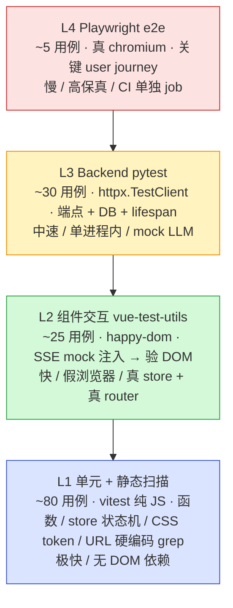

# PatentlyPatent 测试策略 v0.35

> 版本：v0.35-doc · 最后更新：2026-05-09 · 作者：测试架构 subagent
>
> 目的：把已有的 79 个零散 spec 收编进 4 层金字塔，明确每层职责、补齐 v0.34 暴露的盲区（路径硬编码、SSE 渲染卡气泡），并为 Playwright e2e 进场铺路。

---

## 1. 现状盘点（基于实跑）

实跑命令：

```
cd frontend && pnpm test --run                                    # vitest
source backend/.venv/bin/activate && cd backend && pytest -q       # pytest
```

| 层 | 工具 | 文件数 | 用例数 | 覆盖范围 | 漏了什么 |
|---|---|---|---|---|---|
| L1 单元 / 静态 | vitest 2.1 + happy-dom | 13 | 50 | 纯函数（sse parser/types/exportDocx 间接）、Pinia store 状态机（auth/chat/project/ui = 26 个）、router guards、CSS token 静态、URL 硬编码静态扫描（v0.34 防回归） | 边缘异常分支 |
| L1.5 MSW 桩 | vitest + msw handler 单测 | 2 | 5 | 浏览器侧 mock 服务器内部行为（chat SSE 桩 / projects CRUD 桩） | 桩漂移侦测：当前桩与真后端契约只人工同步 |
| L2 组件交互 | @vue/test-utils + happy-dom | 4 | 9 | NewProjectModal / UsageTutorial / Login.vue 渲染（部分 `a-*` 解析失败）/ DefaultLayout-css | **关键缺位**：AgentChatStream.vue（SSE delta → DOM 气泡渲染）= v0.34.x 卡空气泡 bug 落点 |
| L3 后端端点 | pytest 9.0 + httpx.TestClient | 5 | 22 | 登录 / project CRUD / kb / files upload-download / agent_runs detached / e2e_full pipeline / SSE 限流 503 / budget 阻断 / CAS 5 路径 | sad path 仅部分有；多用户 cache 串味；预算阈值 → 400 边界 |
| L4 全栈 e2e | — | 0 | 0 | — | **尚未引入** Playwright；所有 v0.34 路径硬编码 + reactive 不渲染类问题在 prod 环境无任何自动化保护 |

合计 **79 个用例 / 24 个文件**（前端 vitest 63、后端 pytest 22；setup.ts/conftest.py 不计）。

> 注：任务描述中"前端 63 / 后端 16"的"16"是上一轮快照；实跑 collect 现在 22（v0.27+ 加了 CAS 5、agent_runs 3、e2e 3 等）。

---

## 2. 测试金字塔目标



### 2.1 L1 — 单元 / 静态（地基）

- **职责**：纯函数 IO 测、store 状态机 dispatch → state 断言、router guard 路径决策、URL/CSS token 静态扫描防回归。
- **不做**：不跨网络（fetch 一律 mock）、不挂载真组件渲染（除"组件存在"这种 trivial smoke）、不用 happy-dom 模拟整页。
- **当前位置**：50 个核心 + 5 个 MSW 桩 = 55 个，已经超出目标比例（L1 占金字塔 ~60% 即可）。后续不再大量增。

### 2.2 L2 — 组件交互（缺最多的一层）

- **职责**：mount 真组件 → 注入 fake fetch / SSE → 调用 user 行为（点击、输入、emit）→ 断言 DOM 文本、class、emit 事件。
- **典型 case**：
  - AgentChatStream 收到 `{type:'delta',chunk:'你'} {chunk:'好'}` 后 DOM 气泡 textContent === '你好'（**v0.34.x 卡空气泡专属回归测**）
  - ProjectMining 触发 mining 流程、按钮 disabled 切换
  - FileTree 拖拽 hover 切换 class（pp-drag-over）
  - Login 表单 submit → mocked /login 返 token → router push /workspace
- **不做**：不调真后端、不跨路由跑真业务流程（那是 L4）、不直接断 axios 内部状态（断 store / DOM 即可）。
- **当前位置**：4 文件 9 用例，目标 ~25。**v0.35 必补 5 条**（见路线图）。

### 2.3 L3 — Backend 端点（已有底子）

- **职责**：FastAPI app + httpx.TestClient + 内存 sqlite，验请求 → 响应 → DB 状态。lifespan 必须触发（用 `with TestClient(app) as c`），否则 fixture user 不会 seed。
- **典型 case**：登录 happy + 401 sad；create project happy + 422 字段缺失；agent_runs detached 异步事件持久化；SSE 限流 6 并发第 6 个 503；预算超阈值 400。
- **不做**：不跑真 LLM（PP_MOCK_LLM=1）、不调真智慧芽（offline fixture）、不测前端 DOM。
- **当前位置**：22 用例，目标 ~30。补 **每个 endpoint 至少 1 sad path** 即达标。

### 2.4 L4 — Playwright e2e（待建）

- **职责**：真 chromium 跑 prod build → nginx → fastapi 全链路；只覆盖关键 user journey（≤ 5 条），失败时截图 + trace zip。
- **典型 case**：
  1. 登录 u1/u1pass → 报门 → 一键挖掘 → 看到 5 节落盘 → 导出 .docx 下载完成
  2. 刷新页面恢复历史 timeline
  3. agent_sdk 模式 toggle 后 chat 流照常渲染
  4. 错密 → 看到红色错误提示
  5. 暗色模式切换 → root[data-theme='dark']
- **不做**：不当回归大筛子（那是 L1-L3 的活），不测刁钻视觉细节（用 visual regression 工具，未列入 v0.35）。

---

## 3. 关键 user journey 覆盖矩阵

| # | User Journey | L1 | L2 | L3 | L4 | 备注 |
|---|---|---|---|---|---|---|
| 主线 | | | | | | |
| 1 | 登录（账密 u1/u1pass）→ JWT 落 store | OK | OK 部分 | OK | MISS | Login.vue L2 有 3 用例但 a-* 未注册 warning |
| 2 | 报门 NewProjectModal 拖拽上传 + 创建 | partial | OK 1 用例 | OK | MISS | L2 缺真上传进度断言 |
| 3 | 工作台路由进入 → ProjectWorkbench 加载 | partial | MISS | partial | MISS | 只有 router guard L1 |
| 4 | 自动启 mining → SSE delta 实时渲染气泡 | partial | **MISS** | OK | MISS | **v0.34.x 卡空气泡 bug 漏测点** |
| 5 | mining done 事件 → 5 节文件落盘 | MISS | MISS | OK | MISS | e2e_full 后端验过 |
| 6 | 导出 .docx → 浏览器下载 | partial | MISS | OK | MISS | exportDocx.ts 仅间接覆盖 |
| 分支 | | | | | | |
| 7 | 刷新页恢复历史 chat / timeline | MISS | MISS | partial | MISS | store hydration 流程未测 |
| 8 | SSE 中断 / abort | OK | MISS | partial | MISS | sse.spec L1 已覆盖 abort，组件层未验 |
| 9 | agent_sdk vs mining toggle | MISS | MISS | partial | MISS | admin-only feature flag |
| 10 | 错密登录 → 401 提示 | partial | MISS | OK | MISS | happy-path 有 401 sad path |
| 11 | 大文件上传（>2MB）走二进制路径 | MISS | MISS | partial | MISS | files upload-download 有用例 |
| 12 | kb 浏览（37 子目录 / 419 文件） | MISS | MISS | OK kb_endpoints | MISS | 前端 FileTree 渲染未 L2 测 |
| 13 | pdf inline 预览（v0.27） | MISS | MISS | partial | MISS | FilePreviewer 完全未测 |
| 14 | 暗色模式切换 + token 应用 | OK CSS 静态 | MISS | — | MISS | global-css.spec 仅静态 |
| 15 | URL 路径硬编码 prod 404 | OK 静态扫描 | — | — | MISS | url-hardcoding.spec 已加 |

**矩阵规模**：15 user journey × 4 测试层 = **60 格**；OK / partial = 21 格（覆盖率 35%），MISS = 39 格。

> v0.35 优先填 4、6、10、12 这几行的 L2/L4 列。

---

## 4. TDD 团队约定

铁律 4 条：

1. **修 bug 必先写失败测试复现**。例：v0.34.x 卡空气泡，应当先 commit 一条 L2 spec：mount AgentChatStream → 注入 fake SSE 吐 3 个 delta → `await flushPromises()` → `wrapper.find('.bubble-agent').text() === '完整拼接'`。这条会红，再修组件代码到绿。
2. **加新 endpoint 必含 happy + 至少 1 个 sad**（401/403/404/422/429/503 任选）。
3. **加新组件必含 1 条 L2 交互测**，覆盖最常用 prop 组合（不是 snapshot，是真 user 操作 → DOM 断言）。
4. **CI 红就当轮修**：不许带红 push 到 main；pre-commit hook 跑 `pnpm test --run && pnpm build` 兜底。

辅助约定：

- 不写 snapshot test（脆，diff 噪声大）。
- 不在测试里 sleep / setTimeout，用 `vi.useFakeTimers()` 或 `flushPromises()`。
- 测试名用中文短句描述行为，不是函数名。

---

## 5. 工具选型 + 安装

| 层 | 工具 | 状态 | 安装 / 启动 |
|---|---|---|---|
| L1 | vitest + happy-dom | 已装 | `pnpm test --run` |
| L1 静态扫描 | node:fs walk + regex | 已用 | url-hardcoding.spec / global-css.spec |
| L2 | @vue/test-utils + happy-dom + 自制 SSE mock | 部分装（缺 SSE helper） | `pnpm add -D @vue/test-utils`（已装），新增 `tests/helpers/sse-mock.ts` |
| L3 | pytest + httpx.TestClient | 已装 | `pytest -q` |
| L4 | **Playwright** | **待装** | `pnpm add -D @playwright/test && npx playwright install chromium` |

**Playwright 进场命令**：

```bash
cd frontend
pnpm add -D @playwright/test
npx playwright install chromium    # 仅装 chromium，省 ~300MB
npx playwright init                # 生成 playwright.config.ts + tests/e2e/
```

`playwright.config.ts` 关键配置：

```ts
export default {
  testDir: './tests/e2e',
  use: { baseURL: 'http://localhost:5173' },
  webServer: { command: 'pnpm dev', port: 5173, reuseExistingServer: true },
  reporter: [['html'], ['list']],
};
```

---

## 6. helper / fixture 规范

### 6.1 前端 SSE mock helper（新增）

文件：`frontend/tests/helpers/sse-mock.ts`

```ts
// 伪代码示意 — 真实实现 v0.35 实装时写入
export function mockSSEFetch(events: Array<{event: string; data: any}>) {
  const sseText = events.map(e =>
    `event: ${e.event}\ndata: ${JSON.stringify(e.data)}\n\n`
  ).join('');
  return vi.spyOn(globalThis, 'fetch').mockResolvedValue(new Response(
    new ReadableStream({
      start(c) { c.enqueue(new TextEncoder().encode(sseText)); c.close(); }
    }),
    { headers: { 'Content-Type': 'text/event-stream' } }
  ));
}
```

调用方：

```ts
mockSSEFetch([
  { event: 'thinking', data: {} },
  { event: 'delta', data: { chunk: '你' } },
  { event: 'delta', data: { chunk: '好' } },
  { event: 'done', data: {} },
]);
```

### 6.2 前端 router/store fixture

文件：`frontend/tests/helpers/setup.ts`（扩展现有 setup.ts）

- `mountWithProviders(Component, { props, route, storeState })` —— 真 pinia + 真 vue-router，避免 mock 自家 store 的反模式。
- 在 setup 顶部注册 antd `a-button / a-input / a-input-password` global stub，消除当前 Login.spec 的 `[Vue warn]: Failed to resolve component`。

### 6.3 后端 client fixture

文件：`backend/tests/conftest.py`（已有，建议扩展）

- 现有：tmp PP_DB_URL + PP_MOCK_LLM=1 + PP_STORAGE_ROOT。
- 加 `@pytest.fixture` `client()` 用 `with TestClient(app) as c: yield c` 触发 lifespan（fixtures.py 才会 seed u1/u2）。
- 加 `auth_headers(client, username='u1')` —— 一行拿 JWT token 的 fixture，省去每个测试自己 POST /login。

### 6.4 Playwright fixture

文件：`frontend/tests/e2e/fixtures.ts`

- `loggedInPage` —— beforeEach 跑一次 u1/u1pass 登录，cookie 注入到 context；
- `createdProject` —— 调 POST /api/projects 直接造数据，省得 e2e 还点 NewProjectModal；
- `cleanupProjects` —— afterAll 删测试项目，避免 db 残留。

---

## 7. CI / pre-commit 集成

### 7.1 pre-commit（本地，必跑）

```bash
# .git/hooks/pre-commit  （或 husky）
cd frontend && pnpm test --run && pnpm build
cd backend && pytest -q
```

慢就 lint-staged 只跑改动文件相关的 spec。

### 7.2 CI（GitHub Actions / 类似，建议结构）

| job | 跑什么 | 时长预估 | trigger |
|---|---|---|---|
| `unit` | `pnpm test --run`（L1+L2） | < 30s | 每次 push |
| `build` | `pnpm build`（vue-tsc + vite build） | ~40s | 每次 push |
| `backend` | `pytest -q` | ~30s | 每次 push |
| `e2e` | `npx playwright test`（chromium） | 2-3min | 仅 PR + main push |

红 → block merge。e2e 单独 job 是因为它要先 build prod、起 nginx、起 fastapi，时长是单元测试的 5 倍。

---

## 8. 路线图

### v0.35（本轮 — 测试架构补齐）

必做（按优先级）：

1. **新增 L2 spec：AgentChatStream SSE → DOM 气泡渲染**（`frontend/tests/unit/components/AgentChatStream.spec.ts`）
   - 用 sse-mock helper 吐 thinking/delta×3/done
   - 断言 `.bubble-agent` textContent 拼接正确 + `.cursor-blink` done 后消失
   - 这条是 v0.34.x 卡空气泡 bug 的回归测
2. 新增 SSE mock helper：`frontend/tests/helpers/sse-mock.ts`
3. 引入 Playwright + 1 条 e2e：登录 → 报门 → 看到 chat 第一条 thinking
4. Login.spec 修 a-* warning（global stub）
5. 补后端 sad path：`/api/projects` 422 字段缺失、`/login` 401、`/agent/runs/start` 已有活跃 run 时 409

可选：

6. FileTree 拖拽 hover L2 spec
7. ProjectMining mode toggle L2 spec

### v0.36+

- 矩阵 MISS 格逐项填（pdf 预览 / kb 浏览 L2、暗色模式 L4）
- visual regression（playwright + percy/argos）
- mutation testing（stryker）跑一次看 L1 真实有效性
- 多租户 cache 隔离 L3 spec（v0.32 多租户落地后）

---

## 9. 历史漏测复盘

来源：iteration_log.md 末几节 + 任务描述 v0.34 / v0.34.x bug 摘要。

| # | bug | 根因 | 应该的测试层 | 漏测原因 |
|---|---|---|---|---|
| 1 | v0.34 fetch('/api/...') 在 prod (/patent/api) 全 404 | subagent 改造时绕开 apiClient 直接写裸 fetch；dev 模式下 vite proxy 把 /api 转过去掩盖了问题 | L1 静态扫描 + L4 prod-build e2e | 只在 dev 测；prod build 后没自动化 smoke |
| 2 | v0.34.x 报门后 chat 卡空气泡（SSE 后端 200 但前端不渲染） | reactive setter 改成对象引用更新而非 push；SSE delta 拼接到了脱离 reactive proxy 的副本上 | **L2 vue-test-utils** + L4 | 只有 SSE parser L1 单测，无组件层验证 → SSE 解析正确但渲染断链时无报警 |
| 3 | v0.21 SSE 限流 5 → 第 6 个 503（曾误返 200 hang） | 信号量竞争条件 | L3 pytest + httpx.AsyncClient 并发 | 已在 v0.21 加 e2e_full sse_concurrency_limit，反例已收编 |
| 4 | v0.18 真 SDK 路径 prior_art tool 调用名拼错 | system prompt 与 tool 注册名不一致 | L3 集成 + L4 真 LLM smoke | 当时无 PP_MOCK_LLM 桩，全靠手测；v0.21 加 mock 后 L3 才补上 |
| 5 | v0.13-D 流式取消 abort 后事件继续吐 | parser 不响应 AbortSignal | L1 sse.spec | v0.13 已加 5 个用例覆盖，作为 OK 范例 |
| 6 | v0.28 真账密登录 password_hash 字段缺失导致 500 | DB migration 漏 nullable=False | L3 pytest（schema-level） | 已有 happy_path login 测，但 schema 完整性靠 pydantic 兜底 |

**经验沉淀**：6 条里 5 条 root cause 在"前后端契约 / prod 环境 / 浏览器真渲染"层，纯 L1 单元测覆盖不到。**金字塔顶端的 L4 e2e 必须建。**

---

## 10. Anti-pattern（团队避坑）

| ✗ 反模式 | ✓ 正确做法 |
|---|---|
| 用 L1 unit + jsdom 测整个 SSE 流到 DOM 渲染 | 用 L2 vue-test-utils mount 组件 + mock fetch + 断 DOM textContent |
| mock 自家写的 store（vi.mock('@/stores/chat')） | 直接用真 pinia.createPinia() + 调 store.action() 验 store.state |
| 把 prod URL `/patent/api/foo` 写进 fixture | fixture 一律用相对 `/api/foo`；prod URL 由 build-time baseURL 处理；硬编码用 url-hardcoding.spec 静态扫描守住 |
| 测试里 sleep 等异步 | `await flushPromises()` 或 `vi.runAllTimersAsync()` |
| pytest 不用 `with TestClient(app)` 上下文 | 必须用 with，触发 lifespan，否则 fixtures.py 不 seed |
| 把 LLM 真调用塞进 CI | PP_MOCK_LLM=1，真 LLM 留给 admin Dashboard N 次回归探针手动跑 |
| 改 bug 直接 patch 不写测试 | 先写复现失败 spec → 再修 → 跑绿 → 一并 commit（防止下次回归） |
| 一条 e2e 跑完整 5 节挖掘（5 分钟级） | e2e 走第一条 thinking 出现就退；完整 pipeline 走 L3 e2e_full |
| 测 antd a-button 内部行为 | 只 stub a-* 验"按钮被挂载且 click 触发我自己的 handler"；antd 内部交给 antd 自己测 |
| spec 文件超过 300 行 | 拆成多个 describe 文件，每个聚焦一个组件 / 一个 endpoint |

---

## 附录 A：实跑数据快照（2026-05-09）

```
$ cd frontend && pnpm test --run
 Test Files  15 passed (15)
      Tests  63 passed (63)
   Duration  9.24s

$ cd backend && pytest --collect-only -q
22 tests collected in 2.72s
  - test_agent_runs.py        : 3
  - test_auth_cas.py          : 6
  - test_e2e_full.py          : 3
  - test_happy_path.py        : 10
  - (test_*.py 总计 4 文件)
```

总计 **63 + 22 = 85 用例 / 15 + 4 = 19 文件**。

> 任务描述写的"前端 63 / 后端 16"是上一轮快照；现实跑后端 22。

## 附录 B：参考文档

- `docs/iteration_log.md` —— v0.7 ~ v0.26 完整迭代日志（v0.27+ 待补）
- `docs/prd.md` —— 版本特性矩阵 v0.5-v0.28 + 路线图
- `docs/hld.md` —— 数据模型 / 路由表 / 索引说明
- `frontend/tests/unit/architecture/url-hardcoding.spec.ts` —— L1 静态扫描参考实现
- `backend/tests/test_e2e_full.py` —— L3 集成测试参考实现
