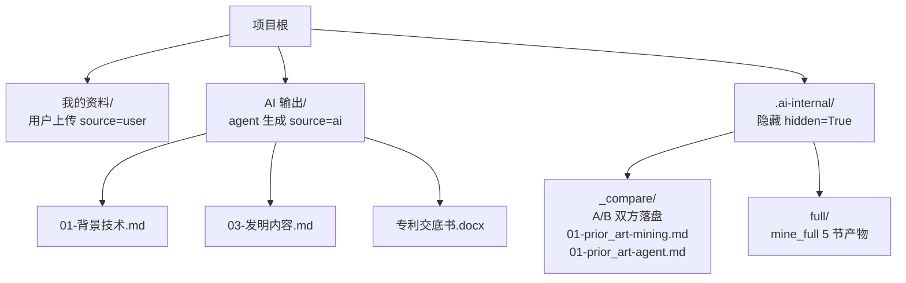
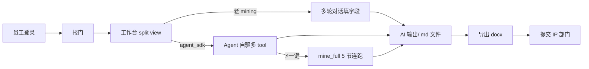

# PatentlyPatent 员工使用手册 (v0.21)

> **PatentlyPatent 是什么**：企业自助专利挖掘 Web 系统，员工 + Agent 协作把工作中的创新拆成结构化交底书草稿，一键导出 docx。

公网入口：<https://blind.pub/patent>

---

## 1. 登录

当前为 **fake auth**（不校验密码，原型阶段用）：

1. 访问 `/patent/`，进入登录页
2. 选择角色：**employee**（员工，做挖掘）或 **admin**（管理员，监控 + A/B 对比 + 配额）
3. 点击「进入系统」直达对应 Dashboard

---

## 2. 报门（新建创意）

员工 Dashboard → 「+ 新建项目」 →

| 字段 | 说明 |
|---|---|
| 标题 | 一句话描述创新（≤30 字） |
| 领域 | 软件 / 通信 / 算法 / 制造 / 材料 等 |
| 阶段 | idea / poc / dev / prod —— 越靠后挖掘细节越深 |
| 期望 | 想要保护的核心点（自由文本） |
| 资料 | 拖拽上传 md/txt/json/py/js/ts 等文本文件 ≤ 2MB；架构图 PNG/JPG 直传 |

提交后跳转「项目工作台」。

---

## 3. 工作台界面（split view）

```
┌─────────────┬───────────────────────┬──────────────────┐
│ 左 Sidebar  │  中 Chat 流式         │  右 文件预览     │
│ - 项目列表  │  - 用户/AI 对话气泡   │  - md / docx 可预览│
│ - 文件树    │  - tool_call 卡片     │  - md 可编辑写回 │
│ - 进度徽章  │  - thinking 折叠      │  - split 模式上下│
│             │  - 5 步 timeline      │    分 mini chat  │
└─────────────┴───────────────────────┴──────────────────┘
```

- 文件事件触发后**第一次自动开 split view**（mini chat + 文件预览各 50%）
- streaming 中 ⚡按钮闪烁，可暂停/取消

---

## 4. 三种挖掘模式

| 模式 | 路径 | 触发 | 谁决定 tool 调用 |
|---|---|---|---|
| **老 mining**（默认） | `POST /api/projects/:id/auto-mining` | 多轮对话引导填字段 | 后端 Python 流水线（mining.py） |
| **agent_sdk 自动** | `POST /api/agent/mine_spike` | admin 在工作台顶部 segmented 切到「Agent SDK」 | LLM 自驱（claude-agent-sdk） |
| **一键全程**⚡ | `POST /api/agent/mine_full/:id` | agent_sdk 模式下点⚡按钮 | LLM 自驱跑完 5 节落盘 |

> agent_sdk 模式 admin only 可见；切换 toggle 仅在非 streaming 时可点。

---

## 5. 五节挖掘内容

| # | 章节 | 输出文件（AI 输出/） | 关键 prompt 要点 |
|---|---|---|---|
| 1 | 现有技术 | `01-背景技术.md` | 智慧芽 query_search_count + applicant_ranking + trends |
| 2 | 发明内容 | `03-发明内容.md` | 3 段：技术问题 → 核心方案 → 关键效果 |
| 3 | 实施例 | `04-实施例.md` | ≥2 个 embodiment，含步骤/优选值，禁瞎编实验 |
| 4 | 权利要求 | `05-权利要求.md` | broad/medium/narrow 三档 + R20.2 必要技术特征最小集 |
| 5 | 附图 | `07-附图说明.md` | 3-5 张关键图（数据流/架构/时序/状态/部署） |

---

## 6. 文件树结构



- `.ai-internal/` 在 UI 上隐藏，仅 admin A/B 对比 modal 能看到
- `_compare/` 装 mining vs agent 同节双方输出，方便人工对比

---

## 7. 工具栏操作

| 按钮 | 行为 |
|---|---|
| 📎 拖拽上传 | 文件直接拖到树或工具栏 |
| ☐ → 🗑×N | 第一次点开多选模式，再点触发批量删 |
| ✏️ 重命名 | 双击节点改名 |
| 📝 编辑 md | 文件预览器右上「编辑」→ textarea + 实时 marked 预览 → 保存 PATCH /files/:fid |

---

## 8. 导出 docx

工作台顶部「🎯 生成交底书 .docx」按钮：

1. 后端合并 `AI 输出/` 下所有 markdown
2. python-docx 按 No.34 模板（9 章节）填写
3. 落盘 `backend/storage/{pid}/` 并入库到 `AI 输出/专利交底书.docx`
4. 浏览器自动下载 ~46KB .docx，可 mammoth.js 内嵌预览

---

## 9. 工作流总览



---

## 10. Admin 视图

入口：登录选 admin → Admin Dashboard。功能：

| 模块 | 数据来源 |
|---|---|
| 项目总览 | `GET /api/admin/projects` |
| **agent_runs 监控表** | `GET /api/admin/agent_runs?limit=50` |
| Cost 时序图 | echarts line，按 endpoint(mine_spike/ab_compare/mine_full) 分系列 |
| Fallback 率分组柱图 | stacked bar：ok 绿 / fallback 橙 / error 红 |
| ⚗️ prior_art A/B 对比 | 输入 pid+idea 触发并行 mining + agent 双方对比 modal |
| 🔁 N 次回归 | 1-20 次 ab_compare，跑完显示 fallback 率，>30% 红色告警 |

每行展开可看 idea 全文 / endpoint segmented 过滤 / onlyFallback checkbox / mock 灰标记。

---

## 截图位

- 
- 
- 
- 
- 

> TODO：v0.21 admin Dashboard 提到的 `/api/admin/budget_status`（每日 cost 累计 + 预算告警）尚未在代码中实现（grep 无匹配），需在 v0.21 收尾时补齐前端展示。
