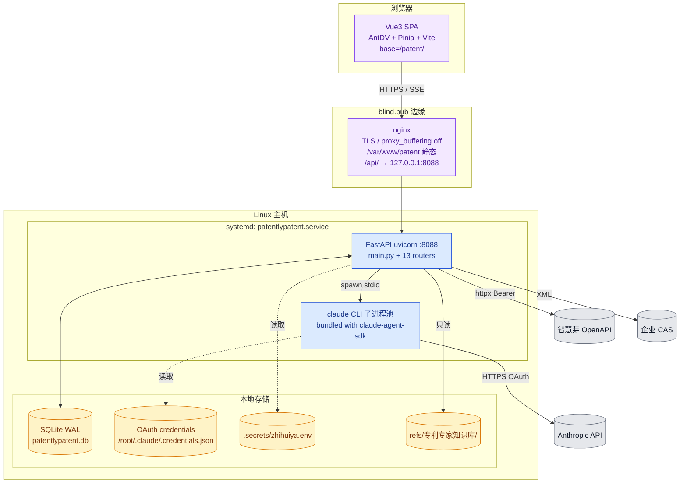
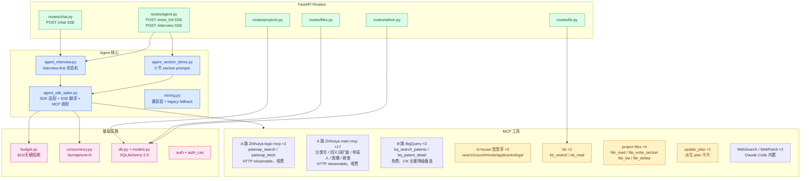
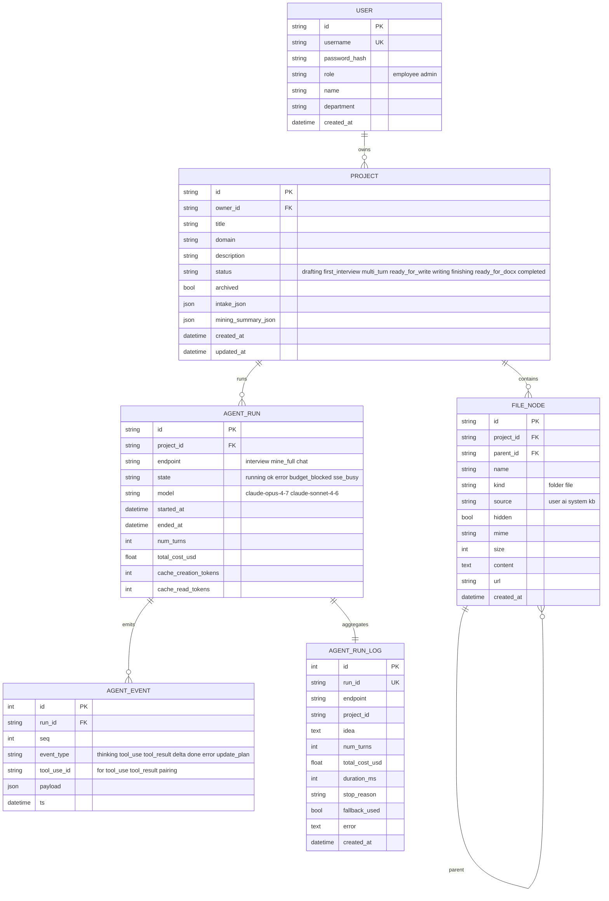
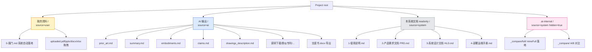
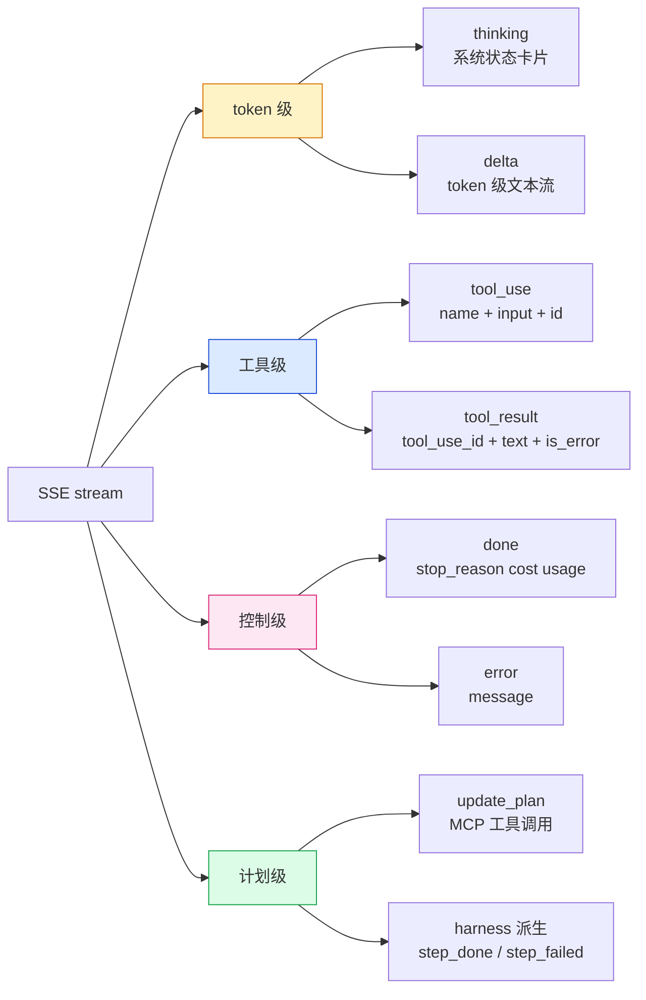
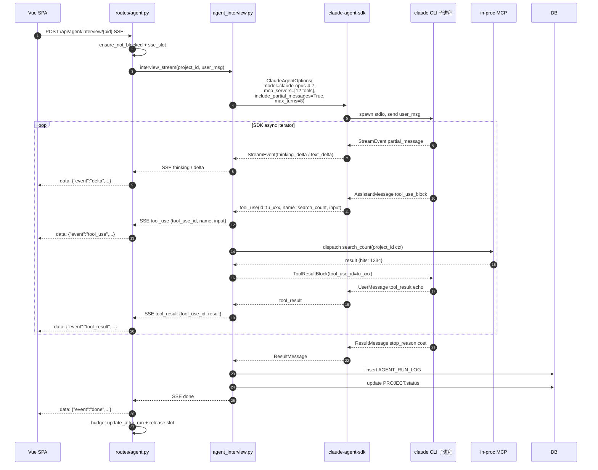
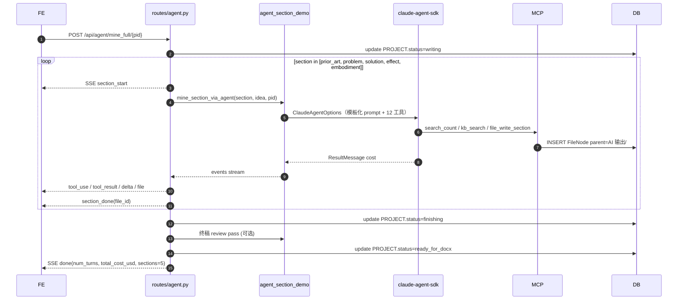
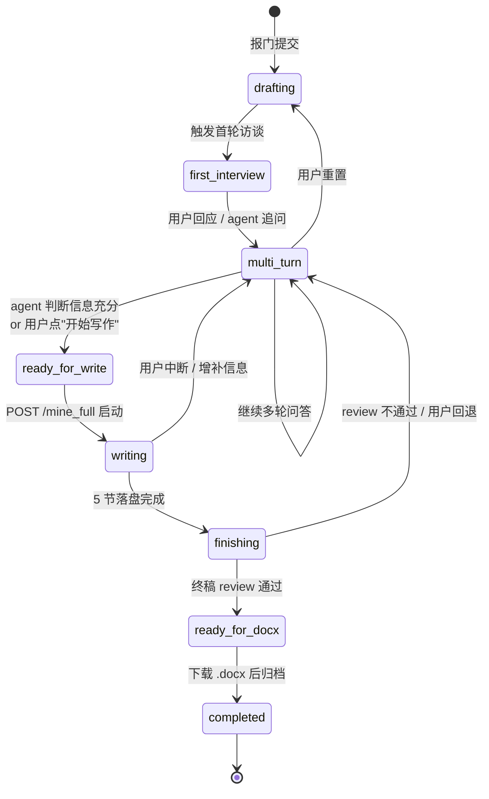
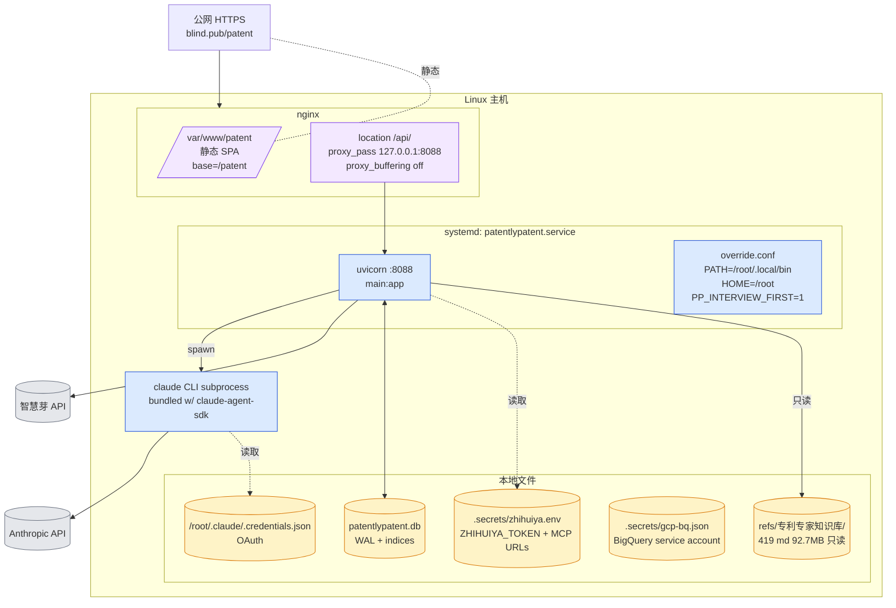
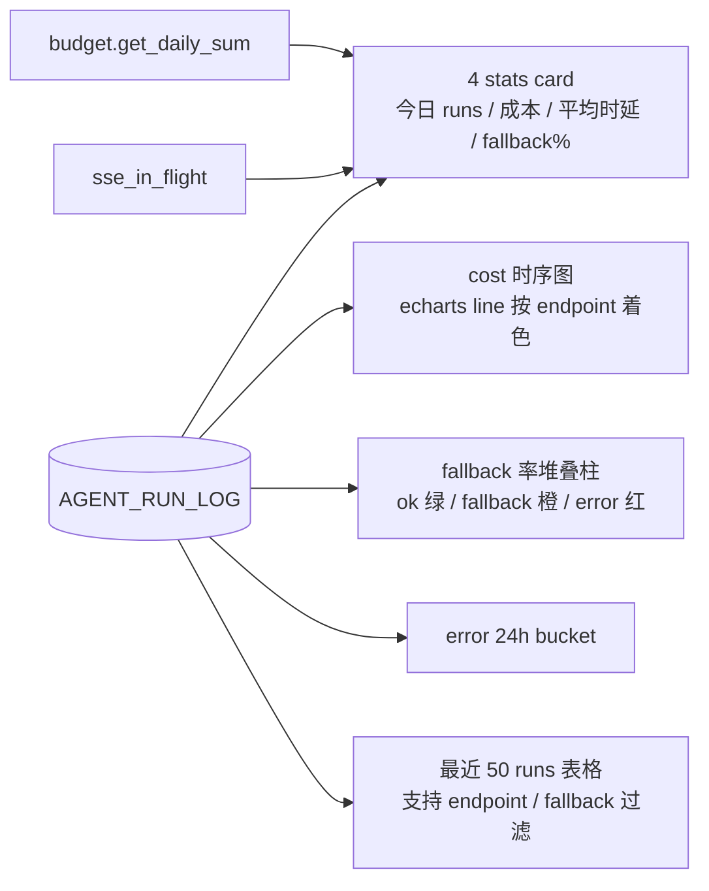

# PatentlyPatent 高层设计文档

> 更新于 2026-05-13 · 关联：[prd.md](./prd.md) · [deploy_runbook.md](./deploy_runbook.md) · [user_guide.md](./user_guide.md)

---

## 目录

- [1. 总体架构（C4 三层）](#1-总体架构c4-三层)
- [2. 数据模型 ER](#2-数据模型-er)
- [3. 文件树概念模型](#3-文件树概念模型)
- [4. SSE 事件协议规范](#4-sse-事件协议规范)
- [5. Agent SDK 真流时序](#5-agent-sdk-真流时序)
- [6. Interview-First 状态机](#6-interview-first-状态机)
- [7. MCP 工具拓扑](#7-mcp-工具拓扑)
- [8. 部署架构](#8-部署架构)
- [9. 安全模型](#9-安全模型)
- [10. 可观测性](#10-可观测性)
- [11. 容量与限流](#11-容量与限流)
- [12. 关键风险与缓解](#12-关键风险与缓解)
- [13. 演进路径](#13-演进路径)

### 阅读路径建议

- 想看**全景**：先读 §1 C4 三层
- 想看**核心流程**：§6 状态机 + §5 时序图
- 想接**工具/数据源**：§7 MCP 拓扑
- 想**部署/排障**：§8 + §10 + `deploy_runbook.md`

---

## 1. 总体架构（C4 三层）

### 1.1 Layer 1 — System Context（系统上下文）


**外部依赖矩阵**：

| 依赖 | 通道 | 凭证 | 失败影响 |
| --- | --- | --- | --- |
| 智慧芽 OpenAPI | HTTPS | env `ZHIHUIYA_TOKEN` | search 类工具返空，agent 继续但召回率下降 |
| Anthropic Claude | bundled claude CLI 子进程 stdio | `/root/.claude/.credentials.json` OAuth | 启动期硬校验失败 → 服务拒启动 |
| 企业 CAS | HTTPS GET XML | `CAS_BASE_URL` + service callback URL | 仅 SSO 入口；账密路径仍可用 |
| 本地 KB | 文件系统只读挂载 | 路径白名单 | kb_* 工具降级，影响参考资料质量 |

### 1.2 Layer 2 — Containers（容器视图）



**容器清单**：

| 容器 | 进程 / 部署 | 端口 | 关键配置 |
| --- | --- | --- | --- |
| Vue3 SPA | nginx 静态 | 443 (via nginx) | `base=/patent/`，路由 `import.meta.env.BASE_URL` |
| nginx | systemd | 80/443 | `proxy_buffering off`，`proxy_read_timeout 600s` |
| FastAPI | systemd: uvicorn | 127.0.0.1:8088 | `Environment+=PATH=/root/.local/bin`，`HOME=/root` |
| claude CLI | FastAPI 子进程（按请求 spawn） | stdio | bundled in `claude-agent-sdk` whl |
| SQLite | 内嵌进程 | 文件 | WAL + synchronous=NORMAL + 64MB cache |

### 1.3 Layer 3 — Components（核心组件视图）



**核心组件职责**：

| 组件 | 职责 |
| --- | --- |
| `agent_interview.py` | interview-first 状态机驱动；多轮问答 → 触发写作；主流程入口；装配 in-process + remote MCP 服务 |
| `agent_section_demo.py` | 5 节 section_prompt 模板 + `mine_section_via_agent`；被 interview「ready_for_write」状态调用 |
| `agent_sdk_spike.py` | `claude-agent-sdk` 适配层；SDK 事件 → SSE 翻译；in-process MCP server 装配（智慧芽 in-house + kb + project files + update_plan + BigQuery 降级路） |
| `patents_bq.py` | Google Patents BigQuery adapter（B 路降级）；`is_available()` 检测凭证，缺则工具不暴露给 agent，行为静默回退 |
| `zhihuiya.py` | 智慧芽 in-house REST 封装（query-search-count / insights/* / simple-legal-status 等）；TTL cache 10s |
| `mining.py` | legacy 占位骨架兜底；agent 失败时 `AgentRunLog.fallback=True` |
| `budget.py` / `concurrency.py` | 日预算 + SSE 并发；接入 interview/mine_full 双入口 |

---

## 2. 数据模型 ER



**关键字段说明**：

| 表 | 字段 | 用途 |
| --- | --- | --- |
| `PROJECT.status` | 8 态枚举 | interview-first 状态机持久化（见 §6） |
| `AGENT_RUN.model` | string | 区分 opus-4-7 主路径与 sonnet-4-6 light 路径 |
| `AGENT_RUN.cache_*_tokens` | int | prompt cache 实测命中（与 cost 关联分析） |
| `AGENT_EVENT.tool_use_id` | string | 配对 `tool_use` 与 `tool_result`（前端"工具卡"展开/折叠靠它） |
| `AGENT_EVENT.seq` | int | run 内严格递增；前端断线重连用 `Last-Event-ID` 续传 |

**核心索引**：

| 索引 | 字段 | 目的 |
| --- | --- | --- |
| `ix_projects_owner_status` | (owner_id, status) | Dashboard 列我的项目 + 按状态筛选 |
| `ix_file_nodes_proj_parent` | (project_id, parent_id) | 文件树子节点 |
| `ix_file_nodes_proj_source` | (project_id, source) | 4 个根文件夹分组 |
| `ix_agent_events_run_seq` | (run_id, seq) | SSE 重放 / tool_use_id 关联 |
| `ix_agent_runs_proj_started` | (project_id, started_at DESC) | 项目内最近运行 |

---

## 3. 文件树概念模型

每个 Project 创建时自动建 **4 个根文件夹**，决定 agent / 用户 / 系统三方写权限。



**根文件夹权限矩阵**：

| 文件夹 | source | hidden | readonly | 用户写 | agent 写 | UI |
| --- | --- | --- | --- | --- | --- | --- |
| 📁 我的资料/ | user | false | false | 是 | 否（但 agent 可 read_user_file） | 是 |
| 📁 AI 输出/ | ai | false | false | 是 | 是 | 是 |
| 📖 本系统文档/ | system | false | **true** | 否 | 否 | 是（🔒 移到末尾，紧贴 kb） |
| .ai-internal/ | system | **true** | false | 否 | 是 | 否（admin only） |

**实现细节**：
- `FileNode.readonly: bool`
- 后端 `_is_readonly_ancestor()` 向上遍历 parent_id，命中 readonly 即拒；`create_file / update_file / delete_file / upload_file` 全检查
- 前端 FileTree `isReadonlyTree()` 同步守护，UI 弹"只读"提示
- `system_docs.py` 启动期幂等 `backfill_all_projects()`：4 个白名单 md 自动同步到每个项目根；docs/ 任一文件改了 → 重启 backend 自动推到所有项目
- `0-报门.md`：create_project 时由 title/description/intake_json 拼成 markdown 自动落「我的资料/」，让员工和 agent 都看得到

**虚拟节点（不入库）**：

| 节点 | 来源 | 说明 |
| --- | --- | --- |
| 📚 专利知识/ | refs/专利专家知识库/ 文件系统懒加载 | source=kb；通过 `/api/kb/tree` 实时挂载 |

---

## 4. SSE 事件协议规范

### 4.1 事件分类总览



### 4.2 事件 schema 详表

| event | 字段 | 来源 | 前端处理 |
| --- | --- | --- | --- |
| `thinking` | `{ text }` | 后端调度推送 | 浅灰斜体行（折叠到调研过程组） |
| `delta` | `{ text }` | SDK `StreamEvent.content_block_delta.text_delta` | agent 气泡 token 增量 + 检测 `[READY_FOR_WRITE]` / `[READY_FOR_DOCX]` |
| `tool_use` | `{ id, name, input }` | SDK `AssistantMessage.ToolUseBlock` | 调研过程组内一行工具卡（pending） |
| `tool_result` | `{ tool_use_id, text, is_error }` | SDK `UserMessage.ToolResultBlock` | 按 id 配对挂到对应工具卡 |
| `done` | `{ stop_reason, num_turns, total_cost_usd, usage }` | SDK `ResultMessage` | endAgent；stop_reason=`tool_use` 时提示用户继续 |
| `error` | `{ message }` | try/except | 红色 alert |
| `update_plan` | `{ name: 'mcp__patent-tools__update_plan', input.steps_json }` | MCP tool 镜像 | 前端 parse steps_json → chat.setPlan() |
| **`step_done`** ★ | `{ content: '✓ <title>' }` | **harness** chat.setPlan diff 检测 | 绿色左边轻量气泡，独立于工具卡组 |
| **`step_failed`** ★ | `{ content: '✗ <title>' }` | harness 同上 | 红色左边轻量气泡 |

★ harness 派生：前端 `setPlan(newSteps)` 时对比旧 plan，状态变 `completed`/`failed` 自动 push 系统消息 —— **不依赖 LLM 自觉叙述**，工程层保证可见性。

### 4.3 关键约束

| 约束 | 说明 |
| --- | --- |
| **token 级流** | 必须启用 `include_partial_messages=True`，否则只能拿到段落级 |
| **tool_use_id 关联** | `tool_use` 与 `tool_result` 配对；前端用 Map<tool_use_id, ToolCard> |
| **顺序保证** | 同一 run 内 `seq` 严格递增；nginx 不缓冲，应用层用单 asyncio queue |
| **断线重连** | 客户端 `Last-Event-ID: <seq>`；服务端从 `AGENT_EVENT` 表续推 |
| **截断** | `tool_result.result` 单帧 ≤ 32KB；超出 → `truncated=true`，原文落盘 .ai-internal/_compare/ |

---

## 5. Agent SDK 真流时序

### 5.1 单轮 interview turn 内部时序



### 5.2 mine_full 5 节流水（ready_for_write → writing）



### 5.3 SDK 消息类型映射

| SDK 类型 | 字段 | → SSE event |
| --- | --- | --- |
| `StreamEvent(type="thinking_delta")` | `delta.text` | `thinking` |
| `StreamEvent(type="text_delta")` | `delta.text` | `delta` |
| `AssistantMessage.content[*].tool_use_block` | `id, name, input` | `tool_use` |
| `UserMessage.content[*].tool_result_block` | `tool_use_id, content, is_error` | `tool_result` |
| `ResultMessage` | `num_turns, total_cost_usd, stop_reason, usage` | `done` |
| 异常 / timeout | `str(exc)` | `error` |

---

## 6. Interview-First 状态机



**状态语义与转移规则**：

| 状态 | 触发条件 | UI 表现 | 后端动作 |
| --- | --- | --- | --- |
| `drafting` | POST /api/projects | 工作台空壳 + 引导卡 | 建 4 根目录 + 入库 |
| `first_interview` | 用户点"开始访谈" 或自动 | chat 流首条 agent 问题 | spawn agent_interview，model=opus-4-7 |
| `multi_turn` | 任意一轮答复后 | chat 流持续 | 状态轮转，依据"信息充分度"启发式 |
| `ready_for_write` | agent emit `update_plan` 含 ready 标记，或用户手动 | 显示"开始写作"按钮 | 锁定 idea / intake_json |
| `writing` | 用户点"开始写作" | 5 节进度条 + 文件树高亮 | 调 `mine_section_via_agent` ×5 |
| `finishing` | 5 节落盘 | 终稿 review 卡片 | 可选 review agent 跑一遍 |
| `ready_for_docx` | review 通过 | "下载 .docx" 按钮亮 | 等用户点 disclosure/docx |
| `completed` | docx 下载成功 | 项目置 archived 可选 | 写 AGENT_RUN_LOG 终态 |

**状态持久化**：写入 `PROJECT.status`，每次转移记 `AGENT_EVENT(event_type='state_change')`。

---

## 7. MCP 工具拓扑

### 7.1 工具全景

```mermaid
graph TB
    classDef remote fill:#dbeafe,stroke:#1d4ed8,color:#1e3a8a
    classDef bq fill:#fef3c7,stroke:#d97706,color:#78350f
    classDef inhouse fill:#e0e7ff,stroke:#4f46e5,color:#312e81
    classDef web fill:#fed7aa,stroke:#ea580c,color:#7c2d12
    classDef kb fill:#fce7f3,stroke:#db2777,color:#831843
    classDef file fill:#dcfce7,stroke:#16a34a,color:#14532d
    classDef plan fill:#fef9c3,stroke:#ca8a04,color:#713f12

    AGENT[claude-agent-sdk · opus-4-7<br/>include_partial_messages=True<br/>resolved by claude CLI OAuth]

    subgraph ARoute["A 路：智慧芽托管 MCP（首选，HTTP streamable，收费）"]
        LOGIC[logic-mcp ×2<br/>patsnap_search 关键词/语义检索<br/>patsnap_fetch 拉权要/法律/同族]:::remote
        MAIN[main-mcp ×17<br/>分类号助手 / 同义词扩展 / 申请人<br/>语义/图像/嵌套/相似公开号]:::remote
    end

    subgraph BRoute["B 路：BigQuery 降级备选（免费，公开数据集）"]
        BQ1[bq_search_patents<br/>Google Patents · CN 全量<br/>关键词+国别+年份]:::bq
        BQ2[bq_patent_detail<br/>权要/说明书/IPC/引证]:::bq
    end

    subgraph InhouseZhy[in-house 智慧芽 REST 兜底 ×5]
        IH1[search_patents 命中量]:::inhouse
        IH2[search_trends 近 10 年]:::inhouse
        IH3[search_applicants Top]:::inhouse
        IH4[inventor_ranking Top]:::inhouse
        IH5[legal_status 单件法律状态]:::inhouse
    end

    subgraph Web[Web 通用 ×2 SDK 内置]
        W1[WebSearch]:::web
        W2[WebFetch URL → 正文]:::web
    end

    subgraph KbT[本地知识库 ×2]
        K1[search_kb 419 篇 CN 实务]:::kb
        K2[read_kb_file 全文]:::kb
    end

    subgraph FileT[项目文件 ×4]
        F1[read_user_file<br/>PDF/pptx/docx/xlsx/xls/text<br/>真提文本 + DB 缓存]:::file
        F2[file_search_in_project]:::file
        F3[file_write_section md → AI 输出/]:::file
        F4[save_research → 调研下载/]:::file
    end

    subgraph PlanT[计划 ×1]
        P1[update_plan steps[] → harness 派生汇报]:::plan
    end

    AGENT --> LOGIC & MAIN
    AGENT -. A 业务错时回退 .-> BQ1 & BQ2
    AGENT --> IH1 & IH2 & IH3 & IH4 & IH5
    AGENT --> W1 & W2
    AGENT --> K1 & K2
    AGENT --> F1 & F2 & F3 & F4
    AGENT --> P1

    LOGIC & MAIN --> ZHY[(智慧芽 connect.zhihuiya.com<br/>apikey in URL)]
    BQ1 & BQ2 --> BQ[(bigquery.googleapis.com<br/>patents-public-data<br/>service-account JSON)]
    IH1 & IH2 & IH3 & IH4 & IH5 --> ZHY_REST[(智慧芽 REST<br/>connect.zhihuiya.com<br/>Bearer token)]
    W1 & W2 --> NET[(公网)]
    K1 & K2 --> KBFS[(refs/专利专家知识库/)]
    F1 & F2 & F3 & F4 --> DB[(SQLite FileNode)]
    P1 -.setPlan diff.-> CHAT[(前端 step_done)]
```

### 7.2 工具规约

| # | 工具 | 输入 | 输出 | 副作用 / 上下文 |
| --- | --- | --- | --- | --- |
| **A 路 — 智慧芽托管 MCP（HTTP streamable，apikey 在 URL）** ||||
| A1 | `patsnap_search` | `keywords / 语义 query / 字段过滤` | 命中量 + 命中专利数组（公开号/标题/摘要/相似度） | quota -1 |
| A2 | `patsnap_fetch` | `publication_number` | 权要 / 法律状态 / 同族 | quota -1 |
| A3 | `search_patent_count` | 布尔检索式 | 命中量 | quota -1 |
| A4 | `suggest_keywords` | `seed keyword` | 同义词/上下位扩展 | quota -1 |
| A5 | `query_classification_helper` / `search_classification_helper` | 关键词 → IPC/CPC | 分类号列表 | quota -1 |
| A6 | `search_patents_by_(original/current)_assignee` / `search_patents_by_semantic` / `search_similar_patents_by_pn` / `search_patent_field` / `search_patent_by_pn` / `search_patents_nested` / `search_defense_patents` | 多维 query | 专利列表 | quota -1 |
| A7 | `image_search_*` ×4 | 图片/URL | 相似图像专利 | quota -1 |
| **B 路 — BigQuery 降级备选（A 路业务错时使用）** ||||
| B1 | `bq_search_patents` | `keyword, country=CN, year_from=2020, limit≤50` | `[{publication_number, title_zh, abstract_zh, assignee, filing_date, country_code}]` | BigQuery slot；按扫描字节计费（免费层 1TB/月） |
| B2 | `bq_patent_detail` | `publication_number` | title/abstract/claims/description/assignee/ipc/citations 中文 | 同上；description ≤8000 字、claims ≤4000 字截断 |
| **in-house 智慧芽 REST 兜底** ||||
| C1 | `search_patents` | `query: str` | 命中量 | REST `/query-search-count` |
| C2 | `search_trends` | `query, lang?` | `[{year, count}]` × 10 | REST `/insights/trends` |
| C3 | `search_applicants` | `query, lang?` | `[{name, count}]` × 10 | REST `/insights/applicant-ranking` |
| C4 | `inventor_ranking` | `query, lang?` | `[{name, count}]` × 10 | REST `/insights/inventor-ranking` |
| C5 | `legal_status` | 公开号 | 有效/失效/审查中 | REST `/simple-legal-status` |
| **Web / KB / 项目文件 / 计划** ||||
| D1 | `WebSearch` | `query` | 网页结果 | Claude Code 内置 |
| D2 | `WebFetch` | `url, prompt` | 抓取 + LLM 总结 | Claude Code 内置 |
| D3 | `search_kb` | `keyword` | `[{path, title, snippet}]` × 5 | 模糊匹配文件名 + 正文 |
| D4 | `read_kb_file` | `path` | 全文 ≤30000 字 | 路径白名单 |
| D5 | `read_user_file` | `project_id, name` | 文本 ≤30000 字 | DB content 空时 file_extract 实时提取（PDF/pptx/docx/xlsx/xls）+ 回写缓存 |
| D6 | `file_search_in_project` | `project_id, keyword` | `[{file_id, name, snippet}]` × 5 | content LIKE |
| D7 | `file_write_section` | `project_id, name, content, parent_folder?` | `{file_id, path}` | INSERT FileNode |
| D8 | `save_research` | `project_id, name, content, category, source_url?` | `{file_id, path}` | INSERT 「AI 输出/调研下载/<分类>/」 |
| D9 | `update_plan` | `steps_json: str` | `{steps}` | harness 前端 diff 派生 step_done/step_failed |

### 7.3 关键约定

- **A 路优先 + B 路自动降级**：SYSTEM_PROMPT 显式约束「`patsnap_search` 业务错（67200004/05）时立即切 `bq_search_patents`，不要反复重试」。
- **B 路凭证就位检测**：`patents_bq.is_available()` 校验 `GOOGLE_APPLICATION_CREDENTIALS` + `BQ_BILLING_PROJECT`，缺则不向 agent 暴露 B 工具（行为静默回退到 A）。
- **效率铁律**：同关键词不重复调；`suggest_keywords` 扩同义词后一次 `patsnap_search`，避免「先 count 再发愁」；4-6 次检索通常够判赛道。
- **project_id 注入**：interview 路由把 `project_id` 拼到 user_msg 末尾，避免 LLM 误传他人项目。
- **readonly 守护**：所有写操作（file_write_section / save_research / 上层 routes/files.py）调 `_is_readonly_ancestor()` 检测，命中 403。
- **配额可见**：A 路 `67200005 Insufficient balance` 上抛让 LLM 看见，不吞 fallback 误判蓝海。

---

## 8. 部署架构



| 关键路径 | 用途 |
| --- | --- |
| `/etc/systemd/system/patentlypatent.service.d/override.conf` | 注入 PATH/HOME/feature flag |
| `/etc/nginx/conf.d/blind.pub.conf` | TLS + SPA fallback + SSE proxy |
| `/var/www/patent/` | Vite build dist 同步目标 |
| `/root/.claude/.credentials.json` | claude CLI OAuth（**严禁入 git**，备份 `.bak.vN`） |
| `backend/patentlypatent.db` | SQLite 主库（每日 cron 备份 → `.bak.YYYYMMDD`） |
| `.secrets/zhihuiya.env` | 智慧芽 REST token + 托管 MCP URLs（systemd `EnvironmentFile=`） |
| `.secrets/gcp-bq.json` | BigQuery service account JSON；env `GOOGLE_APPLICATION_CREDENTIALS` + `BQ_BILLING_PROJECT` 注入 |

**部署 SOP** 详见 [`docs/deploy_runbook.md`](./deploy_runbook.md)。

---

## 9. 安全模型

| 维度 | 措施 | 实现位置 |
| --- | --- | --- |
| **认证 - JWT** | HS256 + 服务端 secret + 过期时间；axios interceptor 自动加 Bearer | `routes/auth.py` |
| **认证 - CAS** | `/p3/serviceValidate` XML，`defusedxml` 防 XXE | `routes/auth_cas.py` |
| **真账密** | bcrypt password_hash；fixture u1/u2 仅 demo（待真员工库替换） | `models.User` |
| **授权** | role-based：`role in {employee, admin}`；admin 路由 dependency 校验 | `routes/admin.py` |
| **SSE 限流** | `asyncio.Semaphore(5)`；超限 503 `SSE_BUSY` | `concurrency.py` |
| **日预算阻断** | 每次 update_after_run 聚合；≥ $10 拒新 SSE | `budget.py` |
| **CLI 凭证管理** | `/root/.claude/.credentials.json` 文件权限 0600；备份 `.bak.vN`；过期监控 = `agent_runs.fallback_used` 比率上升告警 | systemd 进程私有 |
| **智慧芽 token** | `.secrets/zhihuiya.env` 不入 git；systemd `EnvironmentFile=`；日志脱敏 | `.secrets/` |
| **文件 sanitize** | kb 路径 resolve 后 `startswith(KB_ROOT)`；max 5MB；隐藏 `.` 文件；上传 mime 白名单 | `routes/kb.py`, `routes/files.py` |
| **CORS** | 同源 + dev origin 白名单；credentials=true | `main.py` |
| **SSE 传输** | nginx `proxy_buffering off` + TLS | nginx conf |
| **启动期硬校验** | 服务启动时执行 `claude --version` + 探测 credentials；失败则 systemd 重启循环触发告警 | `main.py` lifespan |
| **写权限隔离** | kb / system 根禁止用户写；前端 + 后端双重守卫 | FE FileTree + BE files.py |

---

## 10. 可观测性

### 10.1 启动期自检

```python
# main.py lifespan
1. init_db() + seed_users
2. system_docs.backfill_all_projects()      # 28+ 项目同步本系统文档 + 0-报门.md
3. 清理僵死 AgentRun：所有 status='running' 标 cancelled（systemd 重启后旧 task 已死）
4. assert_claude_cli_available()            # 硬校验 claude CLI 可用，缺则启动失败
5. agent_sdk_spike.log_startup_status()     # 输出 claude_cli=/path / model / 智慧芽 + BigQuery 凭证状态
```

启动日志样例：
```
system_docs: backfilled 28 projects
marked 1 stale running AgentRun as cancelled (systemd restart)
startup ok | claude_cli=.../bundled/claude | use_real_zhihuiya=True | model=claude-opus-4-7
```

### 10.2 AgentRunLog 关键字段

| 字段 | 说明 |
| --- | --- |
| `run_id` | UUID |
| `endpoint` | `interview` / `mine_full` / `mine_spike` / `chat` / `ab_compare` |
| `num_turns` / `total_cost_usd` / `stop_reason` / `duration_ms` | SDK ResultMessage 透传 |
| `cache_creation_input_tokens` / `cache_read_input_tokens` | prompt cache 命中（实测 60% 节省） |
| `fallback_used` | True 表示 agent 失败兜底到 legacy 占位骨架（监控 < 30%） |
| `error` | exception str（脱敏） |

### 10.2 admin Dashboard 看板



### 10.3 日志策略

| 通道 | 内容 | 查看 |
| --- | --- | --- |
| `journalctl -u patentlypatent.service` | uvicorn stdout/stderr；含 claude CLI 子进程错误 | `journalctl -u patentlypatent -f` |
| `AGENT_RUN_LOG` 表 | 每 run 聚合 | `/api/admin/agent_runs` |
| `AGENT_EVENT` 表 | 每 event（含 tool_use_id） | 内部排障，SSE 重放 |
| nginx access/error | HTTP 层 | `/var/log/nginx/` |
| SQLite 慢查询 | journal_mode=WAL，无内置慢查询；用 `EXPLAIN QUERY PLAN` 临时排查 | - |

---

## 11. 容量与限流

| 资源 | 限制 | 实现 | 超限行为 |
| --- | --- | --- | --- |
| **SSE 并发** | `Semaphore=5` | `concurrency.py` async ctx | 503 `SSE_BUSY` |
| **日成本** | `DAILY_BUDGET_BLOCK=$10` (warn $2) | `budget.py` 聚合 `AgentRunLog` | 503 `BUDGET_BLOCKED` |
| **单 run max turns** | `max_turns=8` interview / 5 mine_full | `ClaudeAgentOptions` | SDK 自停，`stop_reason=max_turns` |
| **智慧芽 timeout** | 10s + LRU TTL cache 300s/256 | `zhihuiya.py` | `_safe_query` 返空，agent 继续 |
| **kb 单文件上限** | 5MB | `routes/kb.py` | 413 + "原文件直链"兜底 |
| **SQLite 并发** | WAL + synchronous=NORMAL + 64MB cache | `db.py` | 短事务 + asyncio.to_thread 避免阻塞 |
| **SSE 单帧大小** | tool_result ≤ 32KB | 序列化前截断 | `truncated=true` + 原文落盘 |
| **prompt cache** | `SystemPromptPreset(exclude_dynamic_sections=True)` | 实测 cache_read 命中 60%+ | system_prompt 不随 user 变 |

---

## 12. 关键风险与缓解

| # | 风险 | 影响 | 缓解 |
| --- | --- | --- | --- |
| R-1 | **claude CLI OAuth 凭证过期**（30+ 天） | agent 路径全挂；启动期硬校验失败 → 服务拒启 | 监控 `journalctl` 启动失败；deploy_runbook 续期 SOP；备份 `.credentials.json.bak.vN`；监控 `agent_runs.fallback_used` 上升 |
| R-2 | **智慧芽 quota 月度耗尽 / 业务错** | A 路 search 工具不可用 | SYSTEM_PROMPT 引导切 B 路 BigQuery；in-house REST `_safe_query` 4 场景兜底 + LRU TTL cache 300s；admin Dashboard 看 fallback |
| R-3 | **BigQuery 凭证 / API 未启用** | B 路降级不可用 | `is_available()` 静默回退到 A 路；启动日志显式打印凭证就位状态；deploy_runbook 含 GCP 启用步骤 |
| R-4 | **SDK 版本升级** | 字段重命名 / 事件类型变化打破 SSE 翻译层 | 版本锁定 `pyproject.toml`；升级先在 dev 跑真路径冒烟；保留 `mining.py` 兼容层作回退 |
| R-5 | **并发 SSE 资源耗尽** | 同 host CPU/连接堆积 | Semaphore=5 硬上限；nginx `proxy_read_timeout 600s`；客户端 AbortController 优雅取消 |
| R-6 | **prompt cache 跨用户穿透** | 同 idea 不同 user 共享 cache（数据隔离薄） | system_prompt 不带 user 信息；多租户隔离列入远景 |
| R-7 | **SQLite 单机锁竞争** | mine_full 并发 5 时偶尔 BUSY | WAL + 短事务 + asyncio.to_thread；硬上限 Semaphore(5) |
| R-8 | **tool 描述变更打破 cache** | cost 抖动 | 工具描述集中在 `agent_sdk_spike.py`；改动后 cost 时序图能立刻看到 |
| R-9 | **interview-first 死循环**（agent 永远不进 ready_for_write） | 用户等不到写作 | `max_turns=8` 兜底；UI 提供「强制进入写作」按钮；启发式：≥ 3 轮 + intake_json 覆盖 5 字段 → 自动推进 |
| R-10 | **大 PDF kb 预览失败** | 用户体验差 | 5MB 上限提示 + 直链兜底 |
| R-11 | **单点机器宕机** | 全员不可用 | systemd auto-restart；sqlite WAL 易备份；cron 备份（P1） |
| R-12 | **SSE 连接被中间代理拆** | chat 卡顿 / 截断 | nginx `proxy_buffering off`；前端 `Last-Event-ID` 断线重连 |
| R-13 | **docx 模板偏移** | 代理所返工 | 通用 5 章结构；e2e 验证 `file` 命令返 "Microsoft Word 2007+" |

---

## 13. 演进路径

| 主题 | 退出条件 |
| --- | --- |
| **可观测性补齐** | SSE 断线重连可用 / Sentry 错误上报 / cron 备份恢复演练 1 次 |
| **Subagent 深挖** | prior_art subagent 召回 +20% |
| **多租户隔离** | tenant_id 维度的 prompt cache 隔离实证 |
| **企业 kb 接入** | GitLab / Confluence 至少 1 个团队接入 |
| **移动端 + a11y** | 375px 单栏 OK / Lighthouse a11y > 90 |
| **多 agent 协作** | 检索 + 撰写 + 审查三角合议；删除 `mining.py` 兼容层 |

---

> 本 HLD 与 [`docs/prd.md`](./prd.md) 配套：HLD 讲技术、PRD 讲产品。
