# patent_king 高层设计文档

> 更新于 2026-05-12 · 关联：[prd.md](./prd.md) · [deploy_runbook.md](./deploy_runbook.md) · [user_guide.md](./user_guide.md)

---

## 目录

- [1. 总体架构（C4 三层）](#1-总体架构c4-三层)
- [2. 数据模型 ER](#2-数据模型-er)
- [3. 文件树概念模型](#3-文件树概念模型)
- [4. SSE 事件协议规范](#4-sse-事件协议规范)
- [5. Agent SDK 真流时序](#5-agent-sdk-真流时序)
- [6. Interview-First 状态机](#6-interview-first-状态机)
- [7. MCP 工具拓扑](#7-mcp-工具拓扑)
- [8. 部署架构](#8-部署架构)
- [9. 安全模型](#9-安全模型)
- [10. 可观测性](#10-可观测性)
- [11. 容量与限流](#11-容量与限流)
- [12. 关键风险与缓解](#12-关键风险与缓解)
- [13. 演进路径](#13-演进路径)

### 阅读路径建议

- 想看**全景**：先读 §1 C4 三层
- 想看**核心流程**：§6 状态机 + §5 时序图
- 想接**工具/数据源**：§7 MCP 拓扑
- 想**部署/排障**：§8 + §10 + `deploy_runbook.md`

---

## 1. 总体架构（C4 三层）

### 1.1 Layer 1 — System Context（系统上下文）

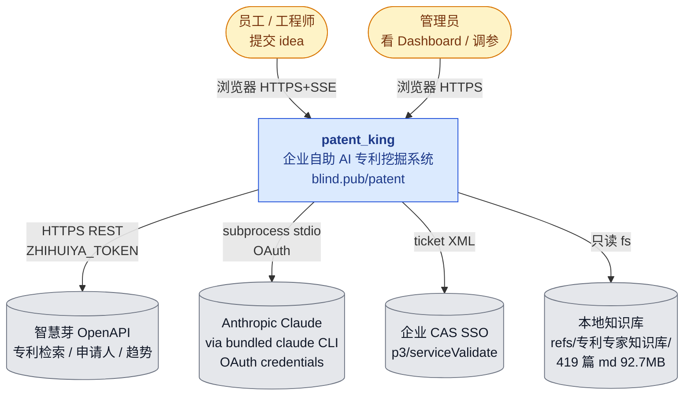

**外部依赖矩阵**：

| 依赖 | 通道 | 凭证 | 失败影响 |
| --- | --- | --- | --- |
| 智慧芽 OpenAPI | HTTPS | env `ZHIHUIYA_TOKEN` | search 类工具返空，agent 继续但召回率下降 |
| Anthropic Claude | bundled claude CLI 子进程 stdio | `/root/.claude/.credentials.json` OAuth | 启动期硬校验失败 → 服务拒启动 |
| 企业 CAS | HTTPS GET XML | `CAS_BASE_URL` + service callback URL | 仅 SSO 入口；账密路径仍可用 |
| 本地 KB | 文件系统只读挂载 | 路径白名单 | kb_* 工具降级，影响参考资料质量 |

### 1.2 Layer 2 — Containers（容器视图）

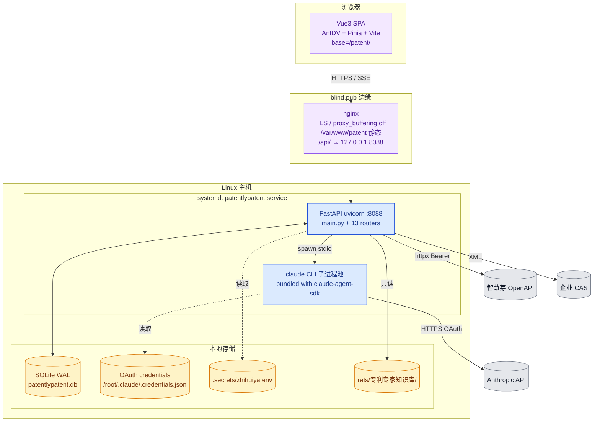

**容器清单**：

| 容器 | 进程 / 部署 | 端口 | 关键配置 |
| --- | --- | --- | --- |
| Vue3 SPA | nginx 静态 | 443 (via nginx) | `base=/patent/`，路由 `import.meta.env.BASE_URL` |
| nginx | systemd | 80/443 | `proxy_buffering off`，`proxy_read_timeout 600s` |
| FastAPI | systemd: uvicorn | 127.0.0.1:8088 | `Environment+=PATH=/root/.local/bin`，`HOME=/root` |
| claude CLI | FastAPI 子进程（按请求 spawn） | stdio | bundled in `claude-agent-sdk` whl |
| SQLite | 内嵌进程 | 文件 | WAL + synchronous=NORMAL + 64MB cache |

### 1.3 Layer 3 — Components（核心组件视图）

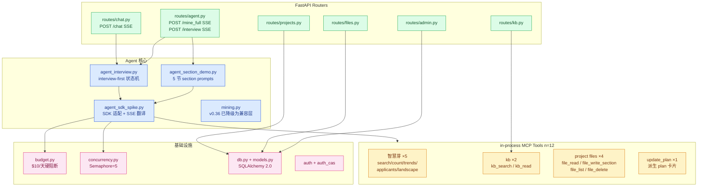

**核心组件职责**：

| 组件 | 职责 | v0.36 关键变化 |
| --- | --- | --- |
| `agent_interview.py` | interview-first 状态机驱动；多轮问答 → 触发写作 | **v0.36 新增**，主流程入口 |
| `agent_section_demo.py` | 5 节 section_prompt 模板 + `mine_section_via_agent` | 被 interview "ready_for_write" 状态调用 |
| `agent_sdk_spike.py` | `claude-agent-sdk` 适配层；SDK 事件 → SSE 翻译；MCP server 装配 | 删除全部 mock；启动期校验 CLI |
| `mining.py` | 老路径兼容；保留 `_legacy` 函数供 admin 回归测试 | v0.36 主流程不再调用 |
| `budget.py` / `concurrency.py` | 日预算 + SSE 并发 | 接入 interview/mine_full 双入口 |

---

## 2. 数据模型 ER

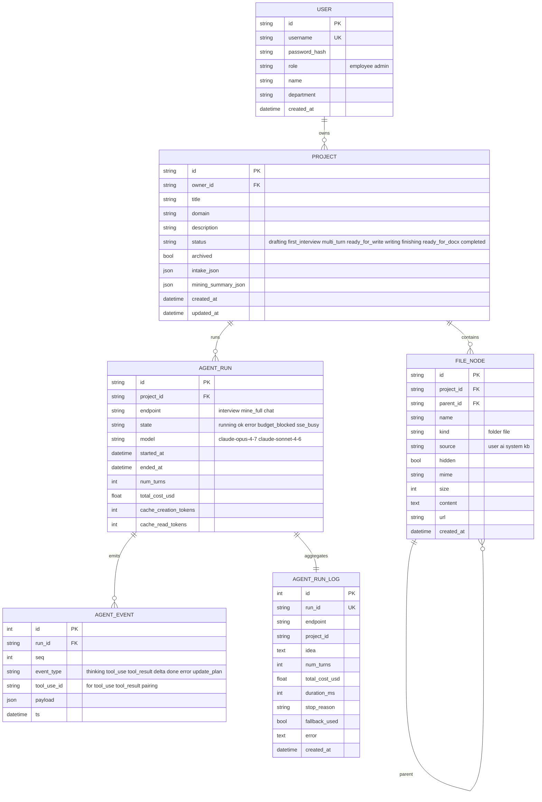

**关键字段说明**：

| 表 | 字段 | 用途 |
| --- | --- | --- |
| `PROJECT.status` | 8 态枚举 | interview-first 状态机持久化（见 §6） |
| `AGENT_RUN.model` | string | 区分 opus-4-7 主路径与 sonnet-4-6 light 路径 |
| `AGENT_RUN.cache_*_tokens` | int | prompt cache 实测命中（与 cost 关联分析） |
| `AGENT_EVENT.tool_use_id` | string | 配对 `tool_use` 与 `tool_result`（前端"工具卡"展开/折叠靠它） |
| `AGENT_EVENT.seq` | int | run 内严格递增；前端断线重连用 `Last-Event-ID` 续传 |

**核心索引**：

| 索引 | 字段 | 目的 |
| --- | --- | --- |
| `ix_projects_owner_status` | (owner_id, status) | Dashboard 列我的项目 + 按状态筛选 |
| `ix_file_nodes_proj_parent` | (project_id, parent_id) | 文件树子节点 |
| `ix_file_nodes_proj_source` | (project_id, source) | 4 个根文件夹分组 |
| `ix_agent_events_run_seq` | (run_id, seq) | SSE 重放 / tool_use_id 关联 |
| `ix_agent_runs_proj_started` | (project_id, started_at DESC) | 项目内最近运行 |

---

## 3. 文件树概念模型

每个 Project 创建时自动建 **4 个根文件夹**，决定 agent / 用户 / 系统三方写权限。

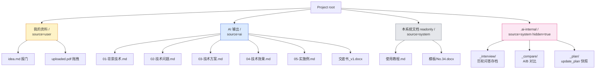

**根文件夹权限矩阵**：

| 文件夹 | source | hidden | 用户写 | agent 写 | 用户读 | UI 默认显示 |
| --- | --- | --- | --- | --- | --- | --- |
| 我的资料/ | user | false | 是 | 否 | 是 | 是 |
| AI 输出/ | ai | false | 否（除"接受/拒绝"操作） | 是 | 是 | 是 |
| 本系统文档/ | system | false | 否（只读模板） | 否 | 是 | 是 |
| .ai-internal/ | system | true | 否 | 是 | admin only | 否 |

**虚拟节点（不入库）**：

| 节点 | 来源 | 说明 |
| --- | --- | --- |
| 📚 专利知识/ | refs/专利专家知识库/ 文件系统懒加载 | source=kb；通过 `/api/kb/tree` 实时挂载 |

---

## 4. SSE 事件协议规范

### 4.1 事件分类总览

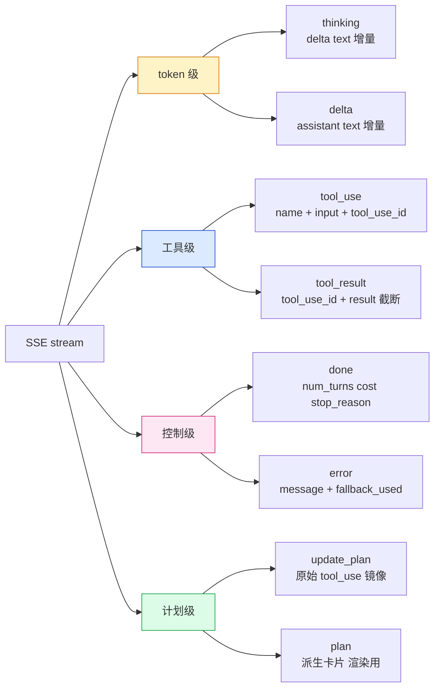

### 4.2 事件 schema 详表

| event | 关键字段 | 来源 | 前端处理 |
| --- | --- | --- | --- |
| `thinking` | `{ text: string }` | SDK `StreamEvent` 中 `thinking_delta` | 灰色斜体气泡，可折叠 |
| `tool_use` | `{ tool_use_id, name, input, t0 }` | SDK `AssistantMessage.tool_use_block` | 工具卡 header（pending） |
| `tool_result` | `{ tool_use_id, result, is_error, duration_ms }` | SDK `UserMessage.tool_result_block` | 工具卡 body，按 `tool_use_id` 配对 |
| `delta` | `{ text }` | SDK `partial_message` text chunk | assistant 气泡内 token 流追加 |
| `done` | `{ num_turns, total_cost_usd, stop_reason, cache_creation_tokens, cache_read_tokens }` | SDK `ResultMessage` | 关闭流，更新 run log |
| `error` | `{ message, fallback_used, code }` | try/except | 红色 alert，触发降级 |
| `update_plan` | `{ tool_use_id, plan: [{step, status, eta}] }` | MCP tool `update_plan` 调用镜像 | 透传 |
| `plan` | `{ items: [{step, status, eta}], rev }` | 由 `update_plan` 派生（去重 + 单调 rev） | 顶部进度条卡片 |

### 4.3 关键约束

| 约束 | 说明 |
| --- | --- |
| **token 级流** | 必须启用 `include_partial_messages=True`，否则只能拿到段落级 |
| **tool_use_id 关联** | `tool_use` 与 `tool_result` 配对；前端用 Map<tool_use_id, ToolCard> |
| **顺序保证** | 同一 run 内 `seq` 严格递增；nginx 不缓冲，应用层用单 asyncio queue |
| **断线重连** | 客户端 `Last-Event-ID: <seq>`；服务端从 `AGENT_EVENT` 表续推 |
| **截断** | `tool_result.result` 单帧 ≤ 32KB；超出 → `truncated=true`，原文落盘 .ai-internal/_compare/ |

---

## 5. Agent SDK 真流时序

### 5.1 单轮 interview turn 内部时序

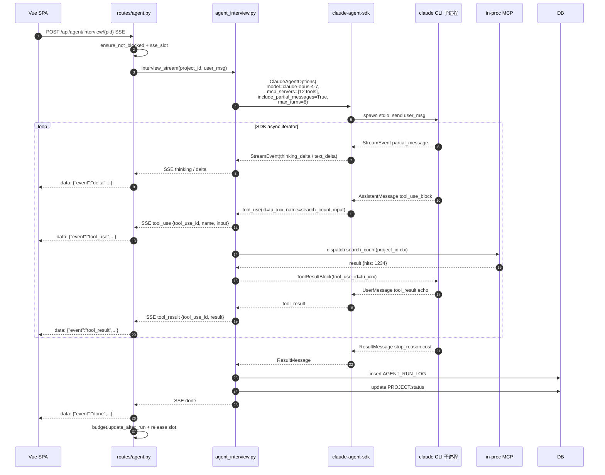

### 5.2 mine_full 5 节流水（ready_for_write → writing）

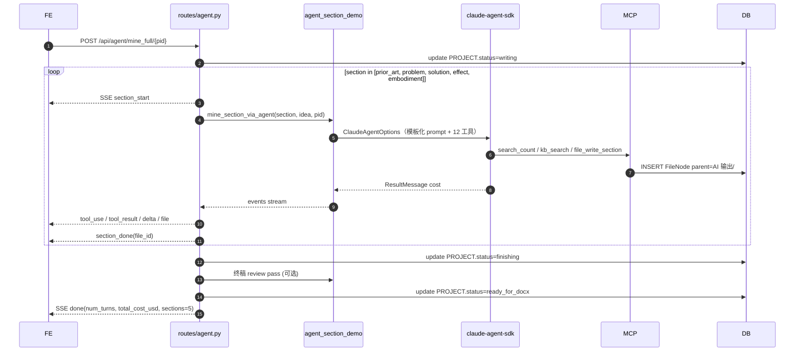

### 5.3 SDK 消息类型映射

| SDK 类型 | 字段 | → SSE event |
| --- | --- | --- |
| `StreamEvent(type="thinking_delta")` | `delta.text` | `thinking` |
| `StreamEvent(type="text_delta")` | `delta.text` | `delta` |
| `AssistantMessage.content[*].tool_use_block` | `id, name, input` | `tool_use` |
| `UserMessage.content[*].tool_result_block` | `tool_use_id, content, is_error` | `tool_result` |
| `ResultMessage` | `num_turns, total_cost_usd, stop_reason, usage` | `done` |
| 异常 / timeout | `str(exc)` | `error` |

---

## 6. Interview-First 状态机

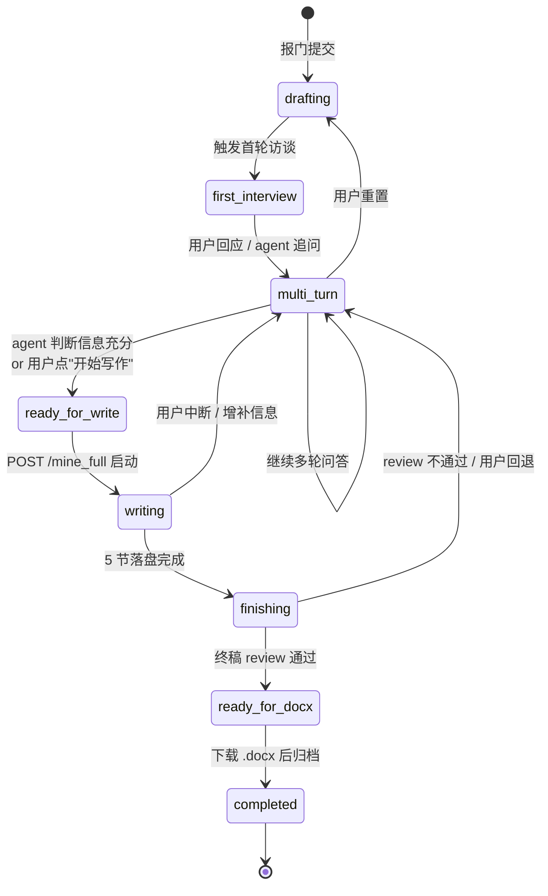

**状态语义与转移规则**：

| 状态 | 触发条件 | UI 表现 | 后端动作 |
| --- | --- | --- | --- |
| `drafting` | POST /api/projects | 工作台空壳 + 引导卡 | 建 4 根目录 + 入库 |
| `first_interview` | 用户点"开始访谈" 或自动 | chat 流首条 agent 问题 | spawn agent_interview，model=opus-4-7 |
| `multi_turn` | 任意一轮答复后 | chat 流持续 | 状态轮转，依据"信息充分度"启发式 |
| `ready_for_write` | agent emit `update_plan` 含 ready 标记，或用户手动 | 显示"开始写作"按钮 | 锁定 idea / intake_json |
| `writing` | 用户点"开始写作" | 5 节进度条 + 文件树高亮 | 调 `mine_section_via_agent` ×5 |
| `finishing` | 5 节落盘 | 终稿 review 卡片 | 可选 review agent 跑一遍 |
| `ready_for_docx` | review 通过 | "下载 .docx" 按钮亮 | 等用户点 disclosure/docx |
| `completed` | docx 下载成功 | 项目置 archived 可选 | 写 AGENT_RUN_LOG 终态 |

**状态持久化**：写入 `PROJECT.status`，每次转移记 `AGENT_EVENT(event_type='state_change')`。

---

## 7. MCP 工具拓扑

### 7.1 12 个工具全景

```mermaid
graph TB
    classDef zhy fill:#dbeafe,stroke:#1d4ed8
    classDef kb fill:#fef3c7,stroke:#d97706
    classDef file fill:#dcfce7,stroke:#16a34a
    classDef plan fill:#fce7f3,stroke:#db2777

    AGENT[claude-agent-sdk<br/>opus-4-7]

    subgraph ZhyTools[智慧芽 ×5]
        T1[search_count<br/>q → hits]:::zhy
        T2[search_trends<br/>q → 7年趋势]:::zhy
        T3[search_applicants<br/>q → top 申请人]:::zhy
        T4[search_landscape<br/>q → 综合地形]:::zhy
        T5[search_patents<br/>q → 标题/摘要列表]:::zhy
    end

    subgraph KbTools[知识库 ×2]
        T6[kb_search<br/>关键词 → 命中文件]:::kb
        T7[kb_read<br/>path → 全文]:::kb
    end

    subgraph FileTools[项目文件 ×4]
        T8[file_read<br/>file_id → content]:::file
        T9[file_write_section<br/>section + md → FileNode]:::file
        T10[file_list<br/>project → tree]:::file
        T11[file_delete<br/>file_id]:::file
    end

    subgraph PlanTools[计划 ×1]
        T12[update_plan<br/>items[] → 派生 plan 卡]:::plan
    end

    AGENT --> T1 & T2 & T3 & T4 & T5
    AGENT --> T6 & T7
    AGENT --> T8 & T9 & T10 & T11
    AGENT --> T12

    T1 & T2 & T3 & T4 & T5 --> ZHY[(智慧芽 OpenAPI)]
    T6 & T7 --> KBFS[(refs/专利专家知识库/)]
    T8 & T9 & T10 & T11 --> DB[(SQLite FileNode)]
    T12 --> EV[(AGENT_EVENT)]
```

### 7.2 工具规约

| # | 工具 | 输入 | 输出 | 副作用 | 上下文注入 |
| --- | --- | --- | --- | --- | --- |
| 1 | `search_count` | `q: str` | `{hits: int}` | 智慧芽 quota -1 | - |
| 2 | `search_trends` | `q, years?` | `[{year, count}]` | quota -1 | - |
| 3 | `search_applicants` | `q, top?` | `[{name, count}]` | quota -1 | - |
| 4 | `search_landscape` | `q` | 综合 json | quota -1 | - |
| 5 | `search_patents` | `q, limit?` | 列表 | quota -1 | - |
| 6 | `kb_search` | `q, top?` | `[{path, snippet}]` | - | - |
| 7 | `kb_read` | `path: str` | `{content: str}` | 路径白名单校验 | - |
| 8 | `file_read` | `file_id` | `{content}` | - | **project_id** |
| 9 | `file_write_section` | `section, content` | `{file_id}` | INSERT FileNode | **project_id** |
| 10 | `file_list` | - | tree | - | **project_id** |
| 11 | `file_delete` | `file_id` | `{ok}` | DELETE FileNode | **project_id** |
| 12 | `update_plan` | `items: list[Step]` | `{rev}` | INSERT AGENT_EVENT | **run_id** |

**project_id 注入**：通过 closure 在 `create_sdk_mcp_server()` 创建时绑定，避免 LLM 误传他人项目。

---

## 8. 部署架构

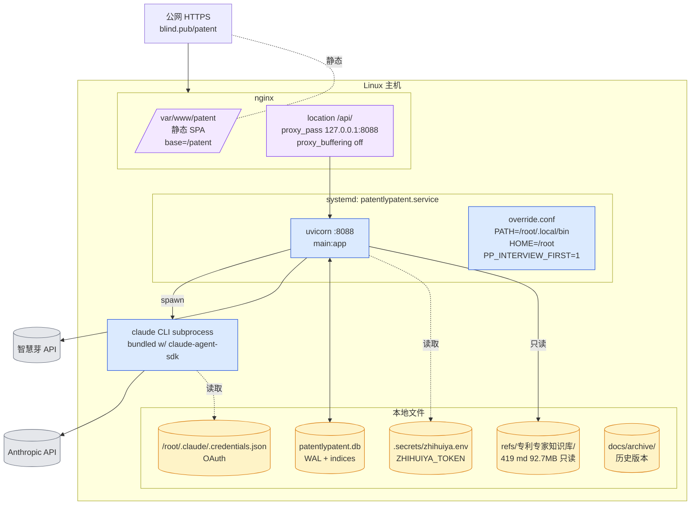

| 关键路径 | 用途 |
| --- | --- |
| `/etc/systemd/system/patentlypatent.service.d/override.conf` | 注入 PATH/HOME/feature flag |
| `/etc/nginx/conf.d/blind.pub.conf` | TLS + SPA fallback + SSE proxy |
| `/var/www/patent/` | Vite build dist 同步目标 |
| `/root/.claude/.credentials.json` | claude CLI OAuth（**严禁入 git**，备份 `.bak.vN`） |
| `backend/patentlypatent.db` | SQLite 主库（每日 cron 备份 → `.bak.YYYYMMDD`） |
| `.secrets/zhihuiya.env` | 智慧芽 token（systemd `EnvironmentFile=`） |

**部署 SOP** 详见 [`docs/deploy_runbook.md`](./deploy_runbook.md)。

---

## 9. 安全模型

| 维度 | 措施 | 实现位置 |
| --- | --- | --- |
| **认证 - JWT** | HS256 + 服务端 secret + 过期时间；axios interceptor 自动加 Bearer | `routes/auth.py` |
| **认证 - CAS** | `/p3/serviceValidate` XML，`defusedxml` 防 XXE | `routes/auth_cas.py` |
| **真账密** | bcrypt password_hash；fixture u1/u2 仅 demo | `models.User` |
| **授权** | role-based：`role in {employee, admin}`；admin 路由 dependency 校验 | `routes/admin.py` |
| **SSE 限流** | `asyncio.Semaphore(5)`；超限 503 `SSE_BUSY` | `concurrency.py` |
| **日预算阻断** | 每次 update_after_run 聚合；≥ $10 拒新 SSE | `budget.py` |
| **CLI 凭证管理** | `/root/.claude/.credentials.json` 文件权限 0600；备份 `.bak.vN`；过期监控 = `agent_runs.fallback_used` 比率上升告警 | systemd 进程私有 |
| **智慧芽 token** | `.secrets/zhihuiya.env` 不入 git；systemd `EnvironmentFile=`；日志脱敏 | `.secrets/` |
| **文件 sanitize** | kb 路径 resolve 后 `startswith(KB_ROOT)`；max 5MB；隐藏 `.` 文件；上传 mime 白名单 | `routes/kb.py`, `routes/files.py` |
| **CORS** | 同源 + dev origin 白名单；credentials=true | `main.py` |
| **SSE 传输** | nginx `proxy_buffering off` + TLS | nginx conf |
| **启动期硬校验** | 服务启动时执行 `claude --version` + 探测 credentials；失败则 systemd 重启循环触发告警 | `main.py` lifespan |
| **写权限隔离** | kb / system 根禁止用户写；前端 + 后端双重守卫 | FE FileTree + BE files.py |

---

## 10. 可观测性

### 10.1 AgentRunLog 关键字段

| 字段 | 说明 | 来源 |
| --- | --- | --- |
| `run_id` | UUID | 创建 run 时生成 |
| `endpoint` | `interview` / `mine_full` / `chat` | 入口 router |
| `model` | `claude-opus-4-7` / `claude-sonnet-4-6` | ClaudeAgentOptions |
| `num_turns` | SDK ResultMessage | `result.num_turns` |
| `total_cost_usd` | float | `result.total_cost_usd` |
| `cache_creation_tokens` / `cache_read_tokens` | int | `result.usage` |
| `stop_reason` | `end_turn` / `max_turns` / `error` | SDK |
| `fallback_used` | bool | catch 块标记 |
| `duration_ms` | int | started_at 与 ended_at 差 |
| `error` | text | exception str（脱敏） |

### 10.2 admin Dashboard 看板

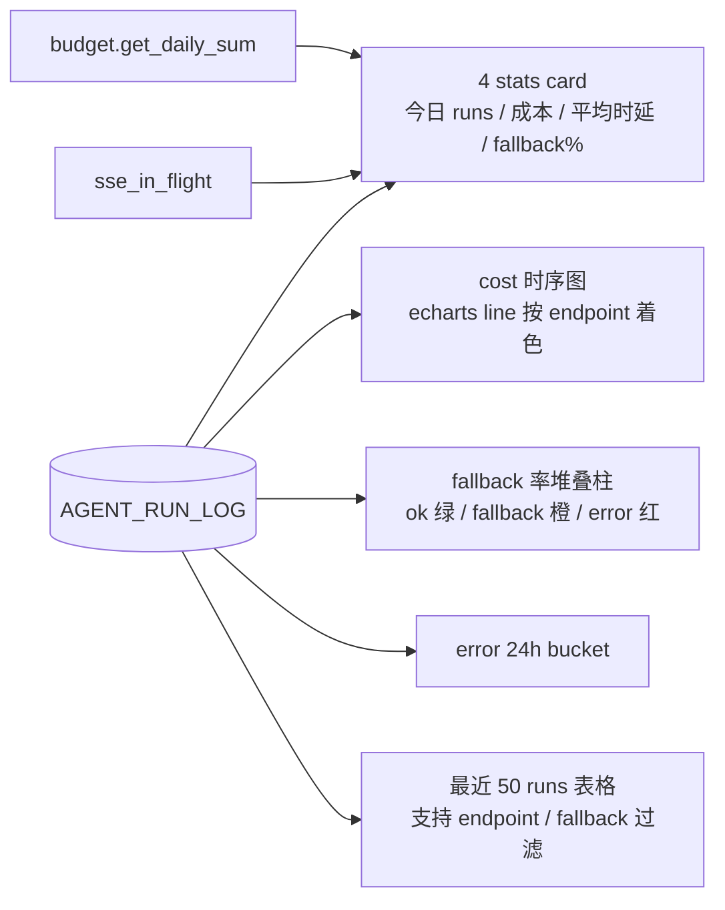

### 10.3 日志策略

| 通道 | 内容 | 查看 |
| --- | --- | --- |
| `journalctl -u patentlypatent.service` | uvicorn stdout/stderr；含 claude CLI 子进程错误 | `journalctl -u patentlypatent -f` |
| `AGENT_RUN_LOG` 表 | 每 run 聚合 | `/api/admin/agent_runs` |
| `AGENT_EVENT` 表 | 每 event（含 tool_use_id） | 内部排障，SSE 重放 |
| nginx access/error | HTTP 层 | `/var/log/nginx/` |
| SQLite 慢查询 | journal_mode=WAL，无内置慢查询；用 `EXPLAIN QUERY PLAN` 临时排查 | - |

---

## 11. 容量与限流

| 资源 | 限制 | 实现 | 超限行为 |
| --- | --- | --- | --- |
| **SSE 并发** | `Semaphore=5` | `concurrency.py` async ctx | 503 `SSE_BUSY` |
| **日成本** | `DAILY_BUDGET_BLOCK=$10` (warn $2) | `budget.py` 聚合 `AgentRunLog` | 503 `BUDGET_BLOCKED` |
| **单 run max turns** | `max_turns=8` interview / 5 mine_full | `ClaudeAgentOptions` | SDK 自停，`stop_reason=max_turns` |
| **智慧芽 timeout** | 10s + LRU TTL cache 300s/256 | `zhihuiya.py` | `_safe_query` 返空，agent 继续 |
| **kb 单文件上限** | 5MB | `routes/kb.py` | 413 + "原文件直链"兜底 |
| **SQLite 并发** | WAL + synchronous=NORMAL + 64MB cache | `db.py` | 短事务 + asyncio.to_thread 避免阻塞 |
| **SSE 单帧大小** | tool_result ≤ 32KB | 序列化前截断 | `truncated=true` + 原文落盘 |
| **prompt cache** | `SystemPromptPreset(exclude_dynamic_sections=True)` | 实测 cache_read 命中 60%+ | 详见 `prompt_cache_research.md` |

---

## 12. 关键风险与缓解

| # | 风险 | 影响 | 缓解 |
| --- | --- | --- | --- |
| R-1 | **claude CLI OAuth 凭证过期**（30+ 天） | agent 路径全挂；v0.36 启动期硬校验失败 → 服务拒启 | 监控 `journalctl` 启动失败；deploy_runbook 续期 SOP；备份 `.credentials.json.bak.vN`；监控 `agent_runs.fallback_used` 上升 |
| R-2 | **智慧芽 quota 月度耗尽** | 5 个 search 工具返空 | `_safe_query` 4 场景兜底 + LRU TTL cache 300s；admin Dashboard 看 fallback；可临时切 kb 主导 |
| R-3 | **SDK 版本升级 (`claude-agent-sdk` upgrade)** | 字段重命名 / 事件类型变化打破 SSE 翻译层 | 版本锁定 `pyproject.toml`；升级先在 `agent_sdk_spike.py` 走"真路径冒烟"；保留 `mining.py` 兼容层作回退 |
| R-4 | **并发 SSE 资源耗尽** | 同 host CPU/连接堆积 | Semaphore=5 硬上限；nginx `proxy_read_timeout 600s`；客户端 AbortController 优雅取消 |
| R-5 | **prompt cache 跨用户穿透** | 同 idea 不同 user 共享 cache（数据隔离薄） | system_prompt 不带 user 信息；多租户隔离列入 v0.40 |
| R-6 | **SQLite 单机锁竞争** | mine_full 并发 5 时偶尔 BUSY | WAL + 短事务 + asyncio.to_thread；硬上限 Semaphore(5) |
| R-7 | **tool 描述变更打破 cache** | cost 抖动 | 工具描述集中在 `agent_sdk_spike.py`，version 锁；改动后 cost 时序图能立刻看到 |
| R-8 | **interview-first 死循环**（agent 永远不进 ready_for_write） | 用户等不到写作 | `max_turns=8` 兜底；UI 提供"强制进入写作"按钮；启发式：≥ 3 轮 + intake_json 覆盖 5 字段 → 自动推进 |
| R-9 | **大 PDF kb 预览失败** | 用户体验差 | 5MB 上限提示 + 直链兜底；v0.40 加分页 |
| R-10 | **单点机器宕机** | 全员不可用 | systemd auto-restart；sqlite WAL 易备份；cron 备份（v0.37 落地） |
| R-11 | **SSE 连接被中间代理拆** | chat 卡顿 / 截断 | nginx `proxy_buffering off`；前端 `Last-Event-ID` 断线重连 |
| R-12 | **docx 模板偏移** | 代理所返工 | 严格按 No.34 模板 9 章节；e2e 验证 `file` 命令返 "Microsoft Word 2007+" |

---

## 13. 演进路径

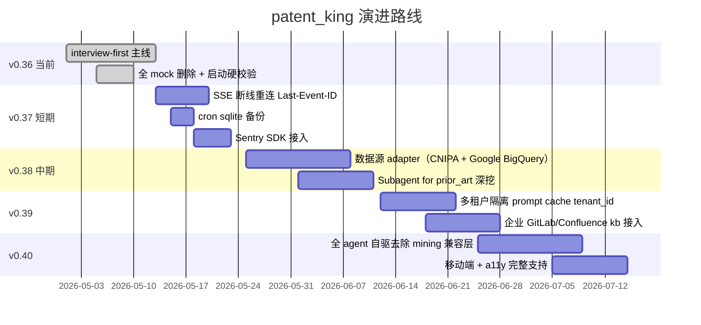

**关键里程碑**：

| 版本 | 主题 | 退出条件 |
| --- | --- | --- |
| v0.36（当前） | interview-first 全量上线 | 真用户 N ≥ 20 / 凭证 30 天稳定 / fallback < 30% |
| v0.37 | 可观测性补齐 | SSE 重连可用 / Sentry 上报 / 备份恢复演练 1 次 |
| v0.38 | 数据源 + Subagent | adapter 至少 2 个能用 / Subagent 召回 +20% |
| v0.39 | 多租户 + 企业 kb | tenant_id 隔离实证 / GitLab kb 1 个团队接入 |
| v0.40 | 第二代 agent | 删除 `mining.py` 老路径 / 移动端体验达标 |

---

> 本 HLD 与 [`docs/prd.md`](./prd.md) 配套：HLD 讲技术、PRD 讲产品。
