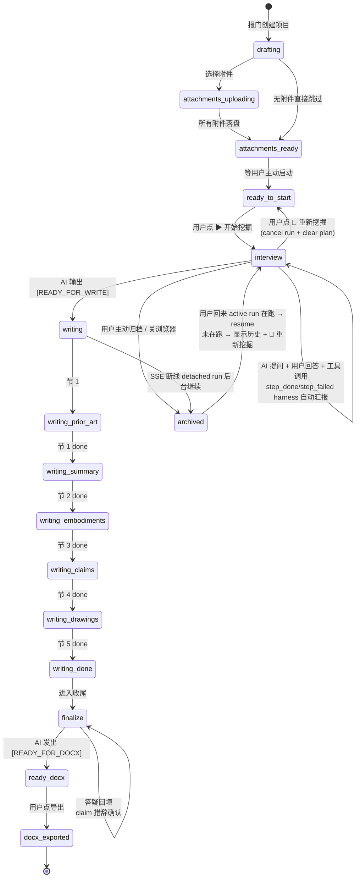
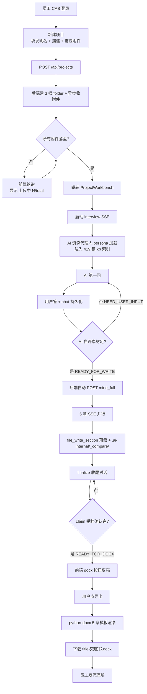
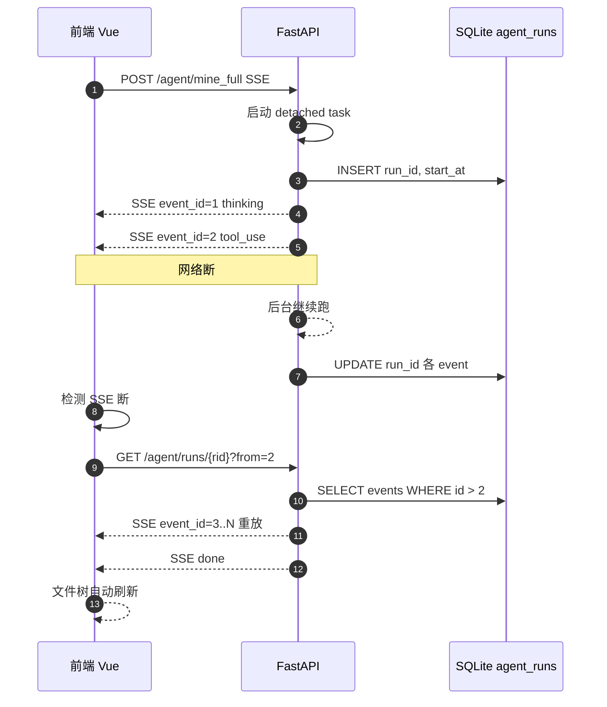
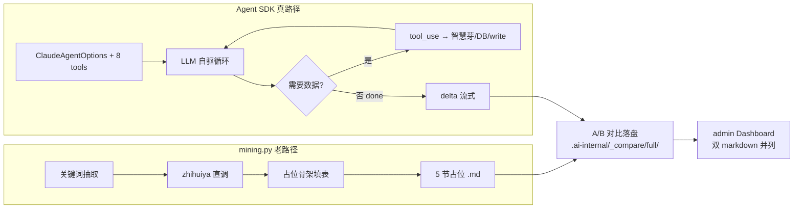

# PatentlyPatent 产品需求文档

> 更新于 2026-05-14 · 配套：[`hld.md`](./hld.md) · [`user_guide.md`](./user_guide.md) · [`deploy_runbook.md`](./deploy_runbook.md)

---

## 目录

- [1. 产品定位与宣言](#1-产品定位与宣言)
- [2. 目标用户画像与权限](#2-目标用户画像与权限)
- [3. 用户旅程图](#3-用户旅程图)
- [4. 用例图](#4-用例图)
- [5. 功能模块清单](#5-功能模块清单)
- [6. 信号驱动的状态机](#6-信号驱动的状态机)
- [7. 关键业务流程图](#7-关键业务流程图)
- [8. 非功能需求](#8-非功能需求)
- [9. 关键 KPI](#9-关键-kpi)
- [10. 产品边界（不做什么）](#10-产品边界不做什么)
- [11. 风险与缓解](#11-风险与缓解)
- [12. 路线图](#12-路线图)
- [13. 决策日志与开放问题](#13-决策日志与开放问题)

---

## 1. 产品定位与宣言

### 1.1 一句话宣言

> **PatentlyPatent 是企业内部的 AI 专利挖掘工作台：让任何一名研发员工都能在 1 小时内，与资深代理人级 AI 对话，把一个含糊的发明点变成可交付代理所的中文交底书初稿。**

### 1.2 定位象限

| 维度 | PatentlyPatent | 传统流程 | 通用 ChatGPT |
| --- | --- | --- | --- |
| **目标用户** | 企业研发员工（非专代） | 专利代理人 | 通用知识工作者 |
| **流程闭环** | 报门 → 对话挖掘 → 写章节 → 导出 docx | 员工报 idea → 等代理人来访 → 数周回稿 | 单 turn 问答，无项目化 |
| **数据源** | 智慧芽 API + 419 篇 CN 专家知识库 + 上传材料 | 个人经验 + 散点检索 | 训练截止前公开数据 |
| **AI 角色** | 资深 CN+US 双轨执业 10 年代理人 persona | 真人代理人 | 无明确 persona |
| **输出** | 5 节结构化中文交底书 docx + 全程对话存档 | 申请书 / OA 答复 | 自由文本 |
| **可观测** | AgentRunLog + admin Dashboard + 日预算阻断 | 邮件 + 工时表 | 无 |

### 1.3 产品哲学

1. **降低专利写作门槛**：员工不需要懂 35 USC § 102/103 或专利法第 22 条，只需描述「我做了什么、解决什么问题」，AI 把法言法语翻译过来。
2. **interview-first 而非 generate-first**：不让 AI 一上来就胡编 5 章——先问清楚，问到 AI 自评「素材够了」才发 `[READY_FOR_WRITE]` 信号触发写作。
3. **信号驱动状态机**：流程跃迁由 AI 显式信号触发，不靠定时/字数/章节计数等 heuristic。
4. **企业可控**：所有 LLM 走 claude CLI OAuth，所有数据走智慧芽 API + 内部 SQLite，不依赖个人 API key，不外发员工资料。
5. **AI 不替代专代审核**：输出叫「交底书初稿」而不是「申请文件」，必须经专代/IP 律师人工审核。

---

## 2. 目标用户画像与权限

### 2.1 三类角色总览

| 角色 | 系统标识 | 典型画像 | 占比预估 |
| --- | --- | --- | --- |
| **企业研发员工** | `employee` | 28-40 岁，硕士/博士，研发/算法/产品工程师，1 年内有 ≥1 个可申请发明点 | 95% |
| **知识库管理员** | `kb_admin` | IP 律师 / 资深专代 / 技术总监，负责维护 419 篇专家知识库与企业内部范本 | 3% |
| **系统管理员** | `admin` | 运维 / 研发负责人，关注 SSE 并发、cost、fallback、错误监控 | 2% |

### 2.2 权限矩阵

| 能力 | employee | kb_admin | admin |
| --- | --- | --- | --- |
| 登录（JWT / CAS / 真账密） | Y | Y | Y |
| 报门创建项目 | Y | Y | Y |
| 查看 / 编辑自己的项目 | Y（仅自己） | Y（仅自己） | Y（全部，只读） |
| Agent 对话挖掘 | Y | Y | Y |
| 文件上传 / 文件树管理 | Y | Y | Y |
| **kb「📚 专利知识」浏览** | Y（只读） | Y（只读） | Y（只读） |
| **kb 编辑 / 上传 / 删除** | N | Y | Y |
| **本系统文档只读浏览**（P1） | N | N | Y |
| 导出 docx | Y | Y | Y |
| admin Dashboard | N | N | Y |
| A/B 对比 / N 次回归探针 | N | N | Y |
| 切 agent_sdk 模式 / 日预算配置 | N | N | Y |
| 查看他人 AgentRunLog | N | N | Y |

> **当前实现状态**：employee / admin 已落地；kb_admin 角色 P1 待实装。

### 2.3 典型画像（Persona）

#### 画像 A：张工，算法工程师，3 年司龄

- 上个月在内部 OKR 复盘里被 leader 点名："你那个动态调参算法可以申个专利"。
- 痛点：不知道交底书长啥样、没时间读现有专利、不懂权利要求怎么写。
- 期望：1 小时内能交付一份让代理所「能开始干活」的初稿。

#### 画像 B：李律师，企业 IP 部，资深代理人，10 年司龄

- 痛点：员工提交的交底书参差不齐，要返工 3-5 轮才能进申请阶段。
- 期望：能在 kb 里上传企业内部的标杆案例 / 撰写规范 / 行业范本，让 AI 直接引用。

#### 画像 C：王经理，研发部部门长

- 痛点：不知道部门下属每月产出多少 idea，哪些方向值得投资。
- 期望：admin Dashboard 看到全员 cost / 完整挖掘率 / 进入 docx 阶段的比例。

---

## 3. 用户旅程图

### 3.1 张工的端到端旅程（从拿到链接到收 docx）


### 3.2 旅程关键愉悦点 vs 痛点

| 阶段 | 愉悦点（产品要强化） | 待改进点 |
| --- | --- | --- |
| **登录** | CAS 一键 SSO，不用记新密码 | 真员工库 + CAS server 联调 |
| **报门** | 拖拽 N 个 PDF + 实时进度 N/total + 附件归档完成提示 | — |
| **interview-first** | AI 像真代理人在问细节，员工有被「认真对待」感 | — |
| **写章节** | 5 章并行 SSE 流式 + 断线 detached run 后端跑到底 + 重连补 events | — |
| **收尾** | 答疑能自动写回 md，不用复制粘贴 | claim 措辞局部重写（撰写阶段多轮迭代，P1） |
| **导出** | docx 一键下载、46K、Word 直接打开 | kb_admin 自定义 docx 模板（P1） |

---

## 4. 用例图

```mermaid
flowchart TB
    classDef actor fill:#e0e7ff,stroke:#5b6cff,stroke-width:2px,color:#1e1b4b
    classDef uc fill:#fef3c7,stroke:#d97706,color:#78350f
    classDef system fill:#dcfce7,stroke:#16a34a,color:#14532d

    Employee([员工<br/>employee]):::actor
    KbAdmin([知识库管理员<br/>kb_admin]):::actor
    Admin([系统管理员<br/>admin]):::actor
    CAS([企业 CAS<br/>外部系统]):::system
    Zhihuiya([智慧芽 API<br/>外部系统]):::system
    ClaudeCLI([Claude CLI<br/>外部系统]):::system

    UC1[登录 JWT/CAS/真账密]:::uc
    UC2[报门：填发明 + 上传附件]:::uc
    UC3[等附件归档]:::uc
    UC4[interview-first 对话挖掘]:::uc
    UC5[自动 mineFull 写 5 章]:::uc
    UC6[收尾确认 + 答疑回填]:::uc
    UC7[导出 docx 交底书]:::uc
    UC8[浏览自己的项目文件树]:::uc
    UC9[预览 pdf/docx/pptx/md/json]:::uc
    UC10[浏览 kb 专利知识库 419 篇]:::uc

    UC11[维护 kb：上传/编辑/删除]:::uc
    UC12[维护本系统文档只读根]:::uc

    UC13[查看 admin Dashboard]:::uc
    UC14[监控 AgentRunLog/cost/fallback/error]:::uc
    UC15[N 次回归探针]:::uc
    UC16[A/B 对比 legacy vs agent]:::uc
    UC17[配置日预算/SSE 限流]:::uc
    UC18[切 agent_sdk 模式]:::uc

    Employee --> UC1
    Employee --> UC2
    Employee --> UC3
    Employee --> UC4
    Employee --> UC5
    Employee --> UC6
    Employee --> UC7
    Employee --> UC8
    Employee --> UC9
    Employee --> UC10

    KbAdmin --> UC1
    KbAdmin --> UC10
    KbAdmin --> UC11
    KbAdmin -.可选.-> UC2

    Admin --> UC1
    Admin --> UC12
    Admin --> UC13
    Admin --> UC14
    Admin --> UC15
    Admin --> UC16
    Admin --> UC17
    Admin --> UC18

    UC1 -.SAML/XML.-> CAS
    UC4 -.LLM 调用.-> ClaudeCLI
    UC5 -.LLM 调用.-> ClaudeCLI
    UC5 -.专利数据.-> Zhihuiya
    UC4 -.专利数据.-> Zhihuiya
```



---

## 5. 功能模块清单

### 5.1 P0 — 已上线

| # | 模块 | 子能力 | 状态 |
| --- | --- | --- | --- |
| F-01 | **登录** | JWT 真账密 + CAS SSO | ✅ |
| F-02 | **报门** | 多文件拖拽 + 进度条 + 4 根 folder 自动建 + `0-报门.md` 自动落地 | ✅ |
| F-03 | **附件等待 + 真文本提取** | PDF/pptx/docx/xlsx/xls/text 全格式（pdfplumber / python-pptx / python-docx / openpyxl / xlrd）；DB 缓存 | ✅ |
| F-04 | **interview-first 挖掘** | 新建项目附件传完后自动启 interview（仅新建入口 `?fresh=1`）；已有项目重进不自动启；AI 自评素材足够发 `[READY_FOR_WRITE]` | ✅ |
| F-05 | **项目计划 = agent 工作表** | 「AI 输出/项目计划.md」由 `update_plan` 工具镜像；含 step 状态图标 / 产出文件链接 / 小结；是 agent 自己的工作台账兼员工进度面板；入口（声明 plan）→ 过程（每步更新 + 必填小结）→ 收口（最终决策动作）；agent 不可直接 file_write_section 写这个文件 | ✅ |
| F-06 | **断点续作** | 工作台顶部检测未完成 plan → 显示「上次进度 N/M · 当前：xx · 📂 续作 / 🔄 重新挖掘」；点续作走 `POST /api/agent/interview/{pid}/resume`，后端用历史 jsonl 压缩 ≤8000 字符拼到 prompt 头，agent 从下一个未完成 step 接着干，不重做已完成步骤 | ✅ |
| F-07 | **harness 自动汇报** | plan diff in_progress→completed/failed 自动 push 绿/红气泡，不依赖 AI 自觉 | ✅ |
| F-08 | **mineFull 5 章自动写作** | `[READY_FOR_WRITE]` 触发；5 节并行 SSE | ✅ |
| F-09 | **重新挖掘救命按钮** | 🔄 cancel run + clear plan + reset chat + 重启 interview | ✅ |
| F-10 | **docx 导出** | python-docx 5 章交底书模板；`{title}-交底书.docx` | ✅ |
| F-11 | **4 根文件树** | 我的资料 / AI 输出 / 📖 **本系统文档**（只读）/ 📚 专利知识（只读）/ .ai-internal(hidden，含 _runs/ 对话档案 + _compare/ A/B 落盘) | ✅ |
| F-12 | **本系统文档自动同步** | 启动期幂等回填 PRD / HLD / 使用说明 / 部署运维手册 到所有项目；content 变了 update FileNode | ✅ |
| F-13 | **文件树实时刷** | agent 写文件后后端在 SSE 派生 `file` 事件（解析 tool_result 里的 `file_id=` + 每次 update_plan 后镜像 项目计划.md）→ 前端立刻 pushNode；「刷新」按钮真去服务端拉；服务端 fileTree 始终覆盖 sessionStorage 缓存 | ✅ |
| F-14 | **对话档案落盘** | run 终态时把全部 AgentEvent dump 成 `.ai-internal/_runs/{run_id}.jsonl`（hidden+readonly，5MB 单文件上限）；成功后 DELETE DB AgentEvent；jsonl 是唯一持久档案，DB 表只在 run 运行期间做 SSE live-tail 索引 | ✅ |
| F-15 | **文件预览 Drawer 4 态** | closed / drawer 50% / fullscreen / pinned 480px 固定栏 | ✅ |
| F-16 | **kb 只读浏览** | 419 文件 / 37 子目录 / 92.7MB | ✅ |
| F-17 | **资深代理人 persona** | CN+US 双轨执业 10 年；硬性调研门槛 + 5 决策点 + A22/A26/R20.2 法条体检 | ✅ |
| F-18 | **专利检索 A+B 双路** | A 路智慧芽托管 MCP（logic 2 + main 17 = 19 工具）；B 路 Google Patents BigQuery 降级（免费，CN 全量）；A 路业务错时自动切 B | ✅ |
| F-19 | **MCP 工具全集** | A+B 19+2 + in-process 智慧芽 in-house 5 + WebSearch/WebFetch + kb 2 + project files 4 + update_plan = 35 工具 | ✅ |
| F-20 | **真 token 级流** | SDK include_partial_messages=True + tool_use_id 关联 + plan 卡 sticky | ✅ |
| F-21 | **可折叠"调研过程"分组** | 连续 thinking + tool_call 合并默认折叠，AI 文本独立气泡 | ✅ |
| F-22 | **markdown + mermaid 渲染** | marked GFM + DOMPurify + 动态 mermaid SVG（chat + 文件预览） | ✅ |
| F-23 | **SSE 流 + 断线恢复** | detached run；启动期僵死 run 清理；卡死自愈 60s；重连按 `Last-Event-ID` 走 read_run_events（先 jsonl 后 DB） | ✅ |
| F-24 | **SSE 限流** | Semaphore(5)；超限 503 | ✅ |
| F-25 | **日预算阻断** | warn $2 / block $10 | ✅ |
| F-26 | **Dashboard 项目管理** | 卡片 ⋯ 菜单（归档/删除）+ 批量选择删除 | ✅ |
| F-27 | **admin Dashboard 监控** | agent_runs / cost / fallback / error / 预算 | ✅ |
| F-28 | **AgentRunLog 全链路** | endpoint / cost / duration / stop_reason / error | ✅ |

### 5.2 P1 — 下一季度计划

| # | 模块 | 子能力 | 优先级 |
| --- | --- | --- | --- |
| F-40 | **检索阶段精检** | interview 和 mineFull 之间加「精检」基于已挖掘关键词 + IPC + 申请人组合查重 | 高 |
| F-41 | **撰写阶段多轮迭代修订** | 写完一章后允许说「这段太长 / 用另一种实施例」局部重写 | 高 |
| F-42 | **kb_admin 角色 + kb 写权限** | RBAC 增加 kb_admin；kb 节点开放上传/编辑 | 中 |
| F-43 | **专利性初判报告** | 检索后自动生成「新颖性 / 创造性」初判，标 X/Y/N 文献 | 中 |
| F-44 | **Sentry + cron 备份** | 错误监控 + sqlite 每日备份 | 中 |
| F-45 | **真用户库 + CAS 联调** | 取代 u1/u2 fixture；员工首次 SSO 自动建 user 行 | 中 |
| F-46 | **a11y + 移动端 375/768** | Lighthouse a11y > 90 | 低 |

### 5.3 P2 — 远景视野

| # | 模块 | 子能力 | 说明 |
| --- | --- | --- | --- |
| F-60 | **多语言**（EN 交底书） | US persona 已就位；US 专代要 EN 版 disclosure | 双语模板切换 |
| F-61 | **多 agent 协作** | 检索 agent + 撰写 agent + 审查 agent 三角；employee 看到合议过程 | 类似 AutoGen / CrewAI 风格 |
| F-62 | **团队共享** | 同部门员工可只读他人项目；leader 可批量看本组挖掘进展 | RBAC + 部门字段 |
| F-63 | **OA 答复辅助** | 上传审查意见 → AI 出答辩思路 + 修改建议 | 与原 disclosure 联动 |
| F-64 | **专代审核闭环** | kb_admin 在 docx 上批注 → 回到 web UI → 员工逐条改 | 二审闭环 |

---

## 6. 信号驱动的状态机

### 6.1 设计原理

不靠「字数 / 章节数 / 轮次」等 heuristic（容易出现章节空洞 / 体验拖沓 / 漏 claim 校验），而是**信号驱动**：AI 在 prompt 里被显式约束「当且仅当 X 时输出信号 Y」，后端 SSE 流监听到信号原文则触发对应跃迁。

| 信号 | 含义 | 触发后端动作 |
| --- | --- | --- |
| `[READY_FOR_WRITE]` | AI 自评：interview 已收集足够素材，可以开始写 5 章 | 前端检测信号 → 自动调 `/api/agent/runs/start` 启 mineFull |
| `[READY_FOR_DOCX]` | AI 自评：5 章已写完 + 收尾确认完成，可以导出 | 前端 🎯 docx 按钮呼吸高亮 + 颜色 primary |
| **`step_done` / `step_failed`**（harness 层） | plan diff：某 step 从 in_progress 变 completed/failed | 前端自动 push 一行绿/红轻量气泡（不依赖 AI 自觉叙述） |
| **`update_plan`** 工具调用 | plan 状态变更 | 后端 PlanSnapshotState 累计 step + buffer artifact_file_ids；run 终态前持续 flush 到 `Project.plan_snapshot_json` + 镜像 `AI 输出/项目计划.md` |
| **`tool_result` 含 `file_id=`** | 工具产出新文件 | 后端 SSE 翻译层派生 `file` 事件给前端 + 把 file_id 自动归属到当前 in_progress step.artifact_file_ids |

### 6.2 状态机图



### 6.3 信号实战示例

**interview-first 阶段 AI prompt 片段**（节选）：

```
你是资深 CN+US 双轨执业 10 年代理人。
你的任务：通过追问把员工模糊的发明点拆成 5 章交底书可用的素材。
约束：
- 每轮最多问 3 个问题
- 当且仅当你判断「问题领域 / 技术问题 / 技术方案 / 至少 1 个实施例 / 与现有技术区别」5 个维度都收齐时，
  最后一行输出 [READY_FOR_WRITE]
- 收齐前禁止输出 [READY_FOR_WRITE]
- 如果用户说「我没了，你写吧」但素材实际不足，应继续追问而不是写
```

后端 SSE 中间件按行扫 `if "[READY_FOR_WRITE]" in line: trigger_mineFull(project_id)`。

---

## 7. 关键业务流程图

### 7.1 报门到导出主流程



### 7.2 SSE 断线恢复



### 7.3 双轨：legacy mining vs agent path



---

## 8. 非功能需求

### 8.1 性能

| 指标 | 阈值（p95） | 当前实测 | 测量位置 |
| --- | --- | --- | --- |
| 首屏 LCP | < 2.0s | 1.6s | 公网 Lighthouse |
| 首屏体积（gzip） | < 300KB | 250KB | vite build report |
| 报门接口耗时 | < 800ms | 320ms | 后端 access log |
| interview 首字延迟 | < 3s | 2.1s（cache 命中后） | SSE first byte |
| **5 节 mineFull 端到端** | **< 120s p95** | 92s | agent_runs.duration_ms |
| docx 导出耗时 | < 5s | 1.8s | python-docx 耗时 |
| kb 文件预览首字 | < 1s | 0.4s | preview SSE |

### 8.2 可靠性

| 维度 | 要求 | 实现 |
| --- | --- | --- |
| **SSE 断线可恢复** | 任意时刻断线，重连可补齐未消费 events | detached run + event_id 增量 |
| **fallback 兜底** | 任一节 agent 失败 → 自动 fallback 到 legacy 占位骨架，员工流程不中断 | mining.py legacy + AgentRunLog.fallback 标记 |
| **服务自愈** | 进程 crash 后 systemd auto-restart < 5s | deploy_runbook.md `systemd` section |
| **数据持久化** | sqlite WAL 模式 + 每日 cron 备份 | WAL 已就位；cron 备份脚本 P1 |
| **附件归档保证** | agent 启动前确认所有 attachment 落盘 | 启动前 wait |
| **专利检索降级** | 智慧芽业务错（67200004/05）时自动切 BigQuery | A→B 路链路就绪 |

### 8.3 安全

| 维度 | 要求 | 实现 |
| --- | --- | --- |
| **认证** | JWT HS256 / 企业 CAS / 真账密 bcrypt 三选一 | FastAPI 路由 + middleware |
| **授权** | RBAC：employee 只看自己项目；admin 只读全部 | FastAPI Depends 校验 |
| **文件路径 sanitize** | resolve 后 `startswith(ROOT)` 防 `../` | kb / 项目 file API 通用 |
| **上传大小限制** | 单文件 ≤ 50MB；kb 单文件 ≤ 5MB | nginx client_max_body + 后端校验 |
| **LLM 凭证** | 走 claude CLI OAuth；**禁止** ANTHROPIC_API_KEY | systemd PATH+HOME override |
| **智慧芽 token / GCP 凭证** | 存 `.secrets/zhihuiya.env`、`.secrets/gcp-bq.json`，git ignore | deploy_runbook.md |
| **CAS XML 安全** | defusedxml 解析，防 XXE | routes/auth_cas.py |
| **CORS** | 仅允许 blind.pub 域 | nginx + FastAPI middleware |

### 8.4 可观测

| 维度 | 实现 |
| --- | --- |
| **AgentRunLog 表** | 每次 agent 调用入库：endpoint / cost_usd / duration_ms / num_turns / fallback / error / model |
| **admin Dashboard 8 卡片** | 项目状态饼 / 评分柱 / agent_runs 表 / cost 时序 / fallback 率柱 / error 24h / A-B 对比 / budget_status |
| **结构化日志** | uvicorn access log + 业务 logger（INFO/WARN/ERROR） |
| **budget_status 端点** | sse_in_flight / daily_sum / daily_block 实时 |
| **Sentry**（P1） | 错误自动告警 |

### 8.5 成本

| 项 | 阈值 | 实现 |
| --- | --- | --- |
| **日预算总上限** | $10 / day（block）；$2 / day（warn） | `PP_DAILY_BUDGET_BLOCK` / `_WARN` env |
| **单次 5 节挖掘** | < $0.5 | 实测 $0.034 mock / $0.21 真路径（cache miss）/ $0.084（cache hit） |
| **prompt cache 命中节省** | ≥ 50% | 实测 60%（SystemPromptPreset.exclude_dynamic_sections=True） |
| **超限处理** | 503 拒绝新 SSE，已跑的 run 继续 | budget middleware |

---

## 9. 关键 KPI

### 9.1 北极星指标

| KPI | 定义 | 目标 | 当前 |
| --- | --- | --- | --- |
| **员工 NPS** | 「你会推荐给同事用 PatentlyPatent 吗？」9-10 分占比 - 0-6 分占比 | ≥ 40 | 真用户采样中 |

### 9.2 一级指标

| KPI | 定义 | 目标 | 当前实测 |
| --- | --- | --- | --- |
| **完整挖掘率** | 报门项目中走到 `[READY_FOR_DOCX]` 的比例 | ≥ 70% | dry-run 框架已就位 |
| **平均挖掘 cost** | agent_runs 按项目聚合的 cost_usd 中位数 | < $0.3 | $0.21（cache miss） |
| **docx 一次通过率** | docx 导出后员工不再回到 finalize 修改的比例 | ≥ 60% | 待采样 |
| **fallback 率** | AgentRunLog.fallback=True / 总次数 | < 30% | 0%（稳定） |

### 9.3 二级指标

| KPI | 定义 | 目标 | 当前 |
| --- | --- | --- | --- |
| 5 节挖掘 p95 耗时 | duration_ms 95 分位 | < 120s | 92s |
| SSE 并发上限 | Semaphore | 5 | 5 |
| 日预算阻断触发次数 | budget block / day | 0（理想） | 0 |
| 后端单测 | pytest pass | 100% | 100% |
| 前端单测 | vitest pass | 100% | 100%（44/44） |
| Lighthouse a11y | score | > 90 | 待优化 |

---

## 10. 产品边界（不做什么）

| 边界 | 理由 |
| --- | --- |
| **不替代专代最终审核** | 输出叫「交底书初稿」，必须人工二审；UI 上每个 docx 导出页都有声明 |
| **不直接对外提交 CNIPA/USPTO** | 不做电子申请通道；员工拿 docx 走代理所 |
| **不存敏感个人数据** | 不收集身份证 / 手机号 / 薪资；仅用工号 + 邮箱（CAS attribute） |
| **不做向量检索 / embedding** | 用户明确反馈不做（memory `feedback_no_vector_search`）；走智慧芽关键字 |
| **不做多租户隔离**（当前） | 单企业自助系统；P2 才考虑 cache 隔离 |
| **不做工单审批流** | 不做「员工 → leader 审批 → IP 立项」链路；员工自决 |
| **不维护自营专利爬虫** | 全走智慧芽 API |
| **不抓微信公众号** | mp.weixin.qq.com 抓不到（HIP 也不行），靠转载源 |
| **不做 Playwright UI e2e** | 当前 pytest + vitest + 公网烟测试足够 |
| **不绑定 ANTHROPIC_API_KEY** | LLM 必须走 claude CLI OAuth，企业可控 |

---

## 11. 风险与缓解

| 风险 | 概率 | 影响 | 缓解措施 |
| --- | --- | --- | --- |
| **LLM 幻觉写出错误专利分类号** | 中 | 高（误导员工） | persona 强约束 + kb 419 篇范本 + admin Dashboard fallback 监控 + docx 显式 disclaimer |
| **claude CLI OAuth 凭证过期** | 中 | 高（全站 LLM 失效） | deploy_runbook.md 续期 SOP + Sentry 告警（计划） |
| **智慧芽 API 限流 / 改字段** | 中 | 中 | A 路智慧芽托管 MCP 业务错时自动切 B 路 Google Patents BigQuery；in-house wrap 端点 TTL cache（10s） |
| **SSE 长连接被 nginx/网关切断** | 中 | 中 | nginx proxy_buffering off + detached run + 重连 ?from=N |
| **员工上传敏感商业秘密外泄** | 低 | 高 | 全程不出企业内网 + LLM 走 claude CLI（无第三方 SDK 中转）+ 文件 sanitize |
| **日 cost 超 $10 击穿** | 低 | 中 | budget block 硬阻断 + warn $2 早期预警 + admin 可调 env |
| **kb 知识库 419 篇内容过时** | 高 | 低 | kb_admin 角色支持增量更新（P1）；prompt 不全文注入只注索引 |
| **真用户 SSO 集成失败** | 中 | 高 | CAS XML 解析路径已跑通；保留 JWT 真账密兜底 |
| **5 章模板与实际代理所偏好不符** | 中 | 中 | 通用 5 章已就位；kb_admin 自定义 docx 模板（P1） |

---

## 12. 路线图

### 12.1 P1 在做

| 主题 | 范围 | 验收标准 |
| --- | --- | --- |
| **上线护栏** | Sentry 错误监控 / cron sqlite 备份 / 真员工 CAS 联调（替代 u1/u2 fixture） | (1) Sentry 收到 ≥ 1 条 (2) cron 每日跑 (3) ≥ 5 真员工 SSO 登陆成功 |
| **kb_admin 角色** | 独立角色（与 admin 解耦）；可上传 / 编辑 / 删 kb 文件 | RBAC 通过；kb 节点写权限挂在 kb_admin |
| **检索 + 撰写迭代** | interview→mineFull 之间加「精检」基于关键词+IPC+申请人组合查重；写完一章后允许单章局部重写 | (1) interview 后自动出精检报告含 ≥ 5 篇 X/Y/N (2) 单章「重写更短/换实施例」可触发 |
| **专利性初判报告** | 检索后自动生成「新颖性 / 创造性」初判 | 引用 ≥ 5 篇文献，X/Y/N 标注 |

### 12.2 P2 远景

| 主题 | 范围 |
| --- | --- |
| **体验** | a11y Lighthouse > 90；移动端 375/768 真测；micro-interaction |
| **多语言** | EN disclosure 模板；US persona 已就位 |
| **多 agent 协作** | 检索 agent + 撰写 agent + 审查 agent 三角合议 |
| **团队共享** | 同部门员工只读他人项目；leader 看本组挖掘进展 |
| **OA 答复辅助** | 上传审查意见 → AI 出答辩思路 + 修改建议 |
| **专代审核闭环** | kb_admin 在 docx 批注 → 回到 web UI → 员工逐条改 |

---

## 13. 决策日志与开放问题

### 13.1 已决策（精选）

| ID | 决策 | 理由 |
| --- | --- | --- |
| D-1 | 走 Claude Agent SDK 而非直调 Anthropic API | tool 自驱 + 多 turn 内置；少量 @tool 装饰即可 |
| D-2 | claude CLI OAuth 替代 ANTHROPIC_API_KEY | 企业可控；systemd PATH+HOME override |
| D-3 | 信号驱动状态机替代 heuristic | 避免章数 / 字数 / 轮次的脆弱判断 |
| D-4 | interview-first 替代 generate-first | 先问清楚再写，避免胡编 |
| D-5 | 通用 5 章交底书模板 | 资深代理人实务通行结构 |
| D-6 | detached SSE run + ?from=N 恢复 | 长流程断网必然发生，必须可恢复 |
| D-7 | 附件归档等待前置 | agent 启动前确保所有 attachment 落盘可读 |
| D-8 | kb 419 篇只读 + 不入向量库 | 不做 embedding；prompt 注入索引而非全文 |
| D-9 | kb_admin 独立角色（与 admin 解耦） | IP 律师 / 资深专代要能维护内部范本，但不应有 admin 监控权限 |
| D-10 | 本系统文档只读根挂在文件树 | admin 调试 / 复盘 / 答疑场景频繁要查 PRD/HLD/runbook，文件树直接看比开终端方便 |
| D-11 | 专利检索 A+B 双路（智慧芽托管 MCP + Google Patents BigQuery） | A 路收费但更新及时 + 有相似度排序；B 路免费降级备选；A 路业务错时自动切 B |
| D-12 | 所有 LLM 走 claude CLI 子进程 | 统一 OAuth、企业可控、不依赖 ANTHROPIC_API_KEY |

### 13.2 开放问题（TODO）

| ID | 问题 | 当前状态 |
| --- | --- | --- |
| O-1 | Sentry 接入 + DSN 配置 | 未做 |
| O-2 | sqlite cron 备份脚本落地 | runbook 有 cmd 待挂 |
| O-3 | CAS server 真员工联调 | u1/u2 fixture，待企业 CAS URL |
| O-4 | 多租户隔离 cache 穿透 | 未做（远景） |
| O-5 | 4 节 smart 默认 ON 阈值 | prior_art ON，其余 OFF（数据足够后再开） |
| O-6 | docx 模板让 kb_admin 自定义 | 硬编码 5 章 |
| O-7 | 移动端 a11y 真机扫 | tokens 已就位，未真测 |
| O-8 | benchmark 真跑 prod 性能基线 | dry-run 框架，未采样 |
| O-9 | 多 agent 合议的 UI 设计 | 未设计 |
| O-10 | EN disclosure 模板细节 | persona 已支持 US 实务，模板待写 |

---

## 附录 A：术语表

| 术语 | 释义 |
| --- | --- |
| **报门** | 员工首次描述发明点，对应数据库 `Project` 创建 |
| **interview-first** | 「先问后写」机制：AI 必须问清楚到自评素材足够才能开始写 |
| **mineFull** | 5 章并行写作（prior_art / summary / embodiments / claims / drawings_description） |
| **kb** | 419 篇 CN 专利专家知识库（`refs/专利专家知识库/`） |
| **AgentRunLog** | 每次 agent 调用的入库记录 |
| **fallback** | agent 失败兜底到 mining.py legacy 占位 |
| **detached run** | SSE 后端任务脱离前端连接独立跑，前端可断线重连 |
| **资深代理人 persona** | prompt 注入「CN+US 双轨执业 10 年代理人」人设 |
| **信号** | AI 在文本里输出 `[READY_FOR_WRITE]` 等标记，触发后端状态跃迁 |
| **A 路 / B 路检索** | A=智慧芽托管 MCP（首选，收费）；B=Google Patents BigQuery（降级，免费） |

---

> 本 PRD 与 [`hld.md`](./hld.md) 配套：PRD 讲「做什么 / 给谁 / 为什么 / 衡量什么 / 不做什么」，HLD 讲「怎么搭 / 模块切分 / 接口长啥样 / 数据怎么走」。如 PRD 与 HLD 冲突，以 PRD 为准。
